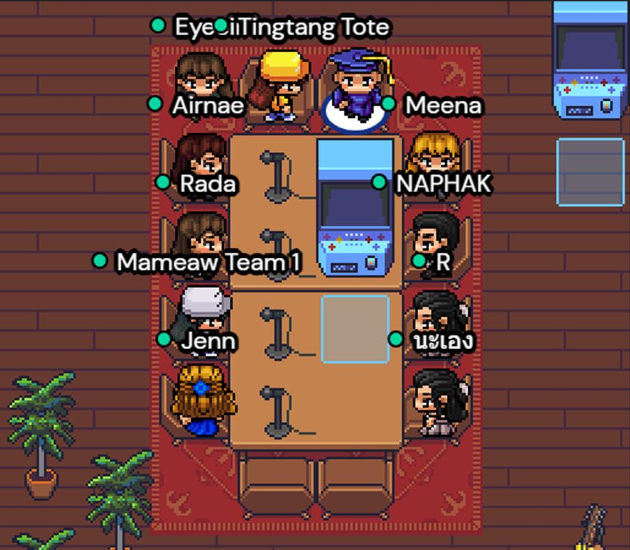

# Cloud Computing Architecture

## Slack

### cloudarchupc.slack.com

Es importante que os paséis por **#presentaciones** para que nos conozcamos mejor

Cada asignatura tendrá un canal que empezará por **#asign-** donde discutir dudas
y comentar el contenido

Por equipos, cread un canal con el nombre **#team-2X**

Por supuesto, siempre tendremos los buenos viejos **#general** **y #random**

## GitHub

### /upcschool-cloud-arch

En esta *organization* encontraréis el respositorio con el material necesario
para seguir el curso (**contenido**)

¡Esperamos vuestras **pull requests** al repo compartido para mejorar entre
todos el material!

## Workstation

**teamX-workstation.aprender.cloud**

Para facilitar la **colaboración**, cada equipo dispondrá de una workstation que permitirá de una forma sencilla interactuar contra los mismos recursos

* /vscode (IDE)
* /vscode/proxy/7681 (terminal)
* /firefox (navegador)

## AWS Academy

### awsacademy.instructure.com

Es la plataforma para formación reglada de AWS. La utilizaremos
principalmente para tener **acceso a entornos de laboratorio**
gratuítos.

Inicialmente tenéis un **crédito de $100 dólares**, que debería
ser suficiente para completar los ejercicios propuestos en el
curso.

## Talent

### talent.upc.edu

Es la plataforma oficial de la UPC School para gestionar los cursos

Incluye un **sistema de mensajería** que puede utilizarse. O no

Los **vídeos de las sesiones** serán publicados en ella al día siguiente
de llevarse a cabo la clase

También podréis consultar **las notas** de cada examen y la nota final

## Plataforma de colaboración

### gather.town

Es una innovadora aproximación a la videoconferencia que
facilita mucho las **dinámicas de grupo**, fundamentales en
un posgrado práctico como este

## Notas

Por la dinámica general de la UPC y sobre todo porque trabajaréis en equipo, 
**la asistencia es obligatoria** (80% del total de horas)

Cada asignatura tendrá **uno o dos exámenes**, dependiendo de su extensión

Al finalizar el posgrado, **cada equipo** presentará un trabajo final

## Proyecto de final de posgrado

Conforme avance el curso, **cada equipo elegirá un tema** que le interese
y profundizará en él

El resultado de este último elemento se presentará al resto de la clase

## Tutores

Cada equipo tendrá un tutor asignado. Su responsabilidad principal consistirá
en **ayudar a definir el proyecto** de final de posgrado y facilitar la resolución
de dudas

## El guión de la película

Trabajamos en una empresa clásica cuyos mejores días ya han pasado: **cada vez es menos
competitiva** y tiene problemas para seguir el ritmo de innovación de la competencia

Despidieron al antiguo director ejecutivo, y **el nuevo CEO quiere cambiar la cultura**
existente por una más ágil e innovadora

El departamento de IT ha recibido el mandato de evolucionar **desde los data centers 
on-premises existentes al cloud público**

