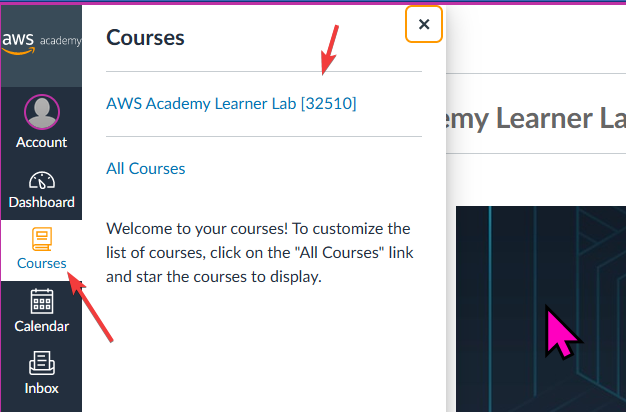
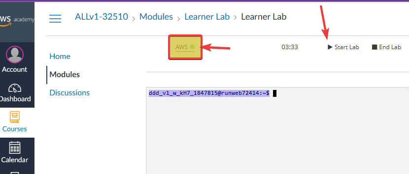
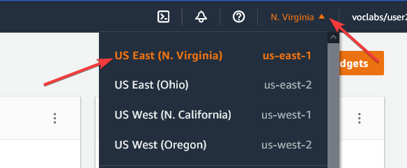
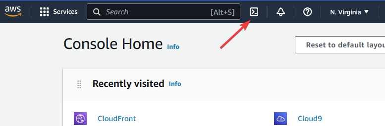

# Despliegue de una workstation

En este laboratorio utilizaremos la automatización para crear una red y desplegar en ella un servidor
que nos proporcionará el soporte necesario para poder trabajar en equipo.

## Inicio

* Accede al [AWS Academy](https://awsacademy.instructure.com/)
* Utiliza el botón de *Courses* para abrir el *Learner's lab*



* Selecciona *Modules* si no está activado, y después pulsa en *Learner's lab*


* Activa el laboratorio pulsando en el botón de *play* (marcado con una flecha) y cuando el semáforo aparezca en verde pulsa sobre el link de *AWS* (marcado con un rectángulo



* Asegúrate de que estás en Virginia (*eu-east-1*)



* Activa el servicio de *CloudShell*



* Ahora tienes acceso a una terminal desde la que puedes crear tu infraestructura. Primero pega los siguientes comandos para instalar `terraform`:

```bash
sudo yum install -y yum-utils
sudo yum-config-manager --add-repo https://rpm.releases.hashicorp.com/AmazonLinux/hashicorp.repo
sudo yum -y install terraform

terraform version
```

* Descarga el código necesario para crear el servidor

```bash
git clone https://github.com/ciberado/workstation
cd workstation/src
```

* Elige un nombre de usuario único y fácil de recordar

```bash
NAME=PON_AQUI_LO_QUE_TU_QUIERAS
```

* Elige una región donde quieras crear el servidor.

```bash
REGION=us-east-1
```

* Pide que se inicialice el proyecto y que despliegue la aplicación.

```bash
terraform init
terraform apply -var owner=$NAME -var region=$REGION -auto-approve
```


