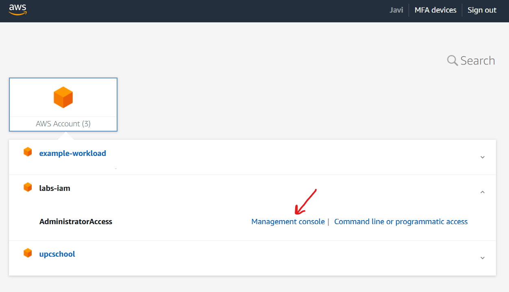

# IAM labs

Hemos creado una cuenta para facilitaros la experimentación con el sistema de permisos de AWS. En ella podéis, por ejemplo, hacer lo siguiente:

* Utilizar la región de **Irlanda**.
* Trabajar con los recursos del IAM, incluyendo policies, grupos, usuarios y roles.
* Acceder a S3, si las credenciales utilizadas otorgan este permiso.
* Crear pequeñas instancias (tipo .nano y .micro) para poder comprobar cómo funciona el sistema de roles asignados a EC2.

El resto de permisos están bloqueados utilizando una característica de Organizations llamada Service Control Policies. Más adelante os explicaremos cómo funciona todo esto.

## Login

* Visitad https://d-9367415feb.awsapps.com/start para iniciar sesión utilizando la experiencia de single sign-on que soporta el Identity Manager.
* Usad vuestro nombre de usuario de estudiantat. Por ejemplo, si mi dirección es `javi.moreno@estudiantat.upc.edu`, mi nombre de usuario será `javi.moreno`.
* Seguid las indicaciones para resetear el password y activar el MFA.
* Elegid el acceso por consola a la cuenta de AWS que os aparece.

## Actividades

### Gestión de usuarios y permisos

* Utilizando tu usuario de administración, crea un grupo y asignarles permisos de `S3FullAccess` con la policy correspondiente. 
* Crea un par de usuarios de trabajo y asignad los usuarios al grupo.
* Utiliza el link de login directo de la cuenta (https://664687075440.signin.aws.amazon.com/console) para identificarte como uno de esos usuarios en la consola web
* Comprueba que puedes acceder a S3 creando un bucket
* Comprueba que no puedes crear máquinas virtuales
* Vuelve a utilizar tu usuario de administración
* Genera AccessKey/Secret key para el usuario de trabajo
* Utilizando la terminal de tu workstation (o tu portátil, si instalas el CLI de AWS)
    * Configura las credenciales con `aws configure` para asignar el AK/SK de tu usuario de trabajo
    * Utiliza `aws s3 ls` para comprobar que puedes listar el bucket creado anteriormente

### EC2 y roles

* Utilizando tu usuario de administración, crea un role (de tipo EC2) para una aplicación ficticia y asígnale dos policies: `S3FullAccess` y `AmazonSSMManagedInstanceCore`. Esta última te permitirá conectarte a la máquina más adelante.
* Lanza una instancia de tipo `t3.micro` con Amazon Linux en la subnet pública de la *default vpc* y asígnale el role que has creado antes (encontrarás la opción en la sección *Advanced* del wizard).
* Conéctate a la máquina usando el botón de `connect` y la opción `session manager`.
* Comprueba que gracias al role puedes ejecutar `aws s3 ls` y ver el bucket que creaste en el laboratorio anterior.
* Quita el role a la instancia (o la policy de `S3FullAccess` al role), espera unos segundos y reintenta el comando. Verás que ya no tienes acceso a S3.

