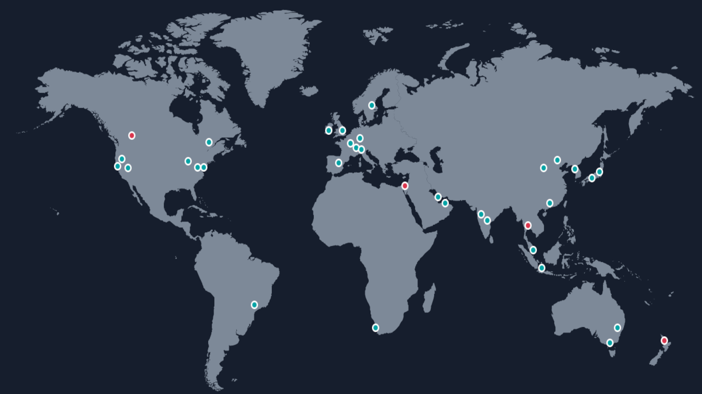
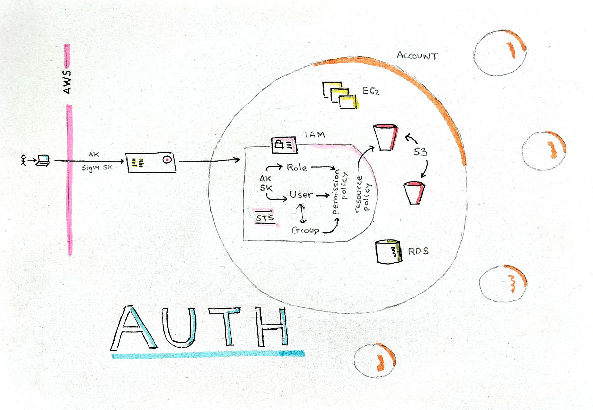

# AWS Basic Concepts

## AWS Global Infrastructure

* **Region**: a deployment of AWS technology in a particular location of the world.
* **Availability Zone**: One or more adjacent datacenters, working as unit. Often, a region
is made by at least three AZs, working together under a single control plane with a latency
smaller than 1ms.
* **Edge Location**: (or *point of presence*) is a collection of more than 400 smaller
data centers intended to provide capilarity for several services (DNS, CDN, etc).

## Authentication and Authorization

* **Account**: the administrative umbrella under a set of related resources (intended, for example,
to run a particular application) are created and managed.
* **IAM**: Identity Access Management. The *authentication* and *authorization* service of a particular *account*.
* **Access Key**: a code associated to a particular authenticated identity.
* **Secret Key**: a sensible token associated to a particular *access key*, intended to
be used for signing the requests sent to AWS API.
* **User**: the *IAM* representation of a human in a particular *account*.
* **Group**: a set of *users*, providing an easier way to set up simple authorization structures.
* **Role**: a security identity that can be attached to many different resources (*users*, *groups* and *services*).
* **Permission policy**: a list of authorizations that can be attached to *users* or *roles*.
* **Resource policy**: a list of authorizations that can be attached to a few *services* (like S3 or DynamoDB).
* **STS**: Security Token Service. It generates all temporal Access Keys and Secret Keys (for roles).

## Credentials configuration

* OS environment variables  
    (`AWS_ACCESS_KEY_ID` and `AWS_SECRET_ACCESS_KEY`)
* `~/.aws/credentials` file
* IAM Roles for tasks
* EC2 instance profile (role)
