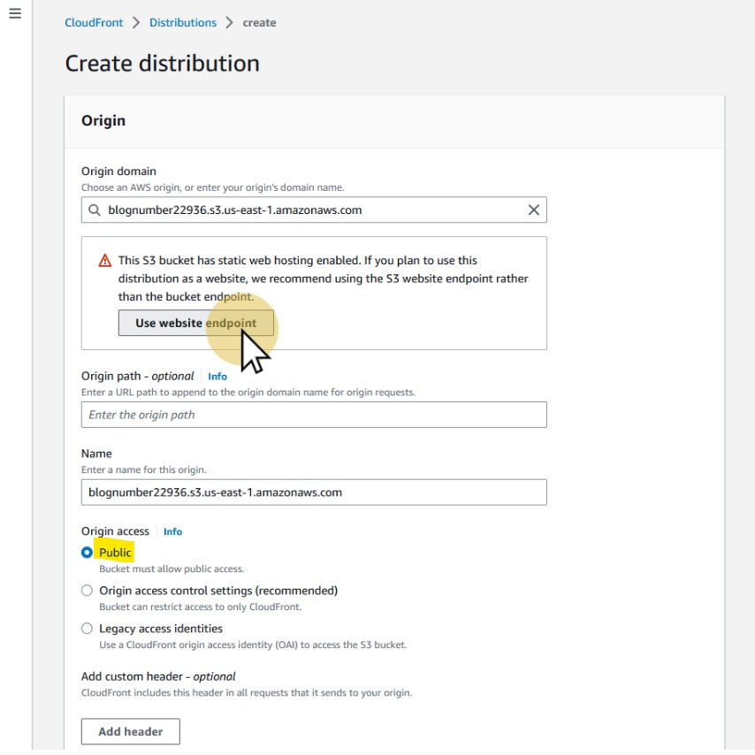

# Desplegando con CloudFront

* Abre el servico de CloudFront y pulsa en el botón "Create a CloudFront distribution".

---

* El nuevo wizard (a principios de 2023) simplifica mucho la configuración, que de hecho no es en
realidad tan sencilla como parece.

---

* Selecciona el origen de los ficheros, en este caso tu *bucket* de S3 con el website.

---

* El wizard detecta que estamos utilizando S3 como un servidor web, y nos recomienda aprovechar su gestión de cabeceras. Pulsa
en el botón "Use website endpoint" para hacerlo.

---

* Nadie debería utilizar `http` jamás, así que pulsa en la opción correspondiente para redirigir siempre a `https`

---

* Suele ser una buena idea activar el método `OPTIONS` para poder utilizar [CORS](https://developer.mozilla.org/es/docs/Web/HTTP/CORS) de
manera apropiada. Hazlo pulsando en la opción correspondiente, aunque no nos pararemos a configurar los detalles de las cabeceras a
inyectar.

---

**CHALLENGE**: ¿Qué significa el acrónimo *CORS*? ¿Cuándo resulta necesario configurarlo?

---

* *Origin request policy* es un mecanismo por el que podemos asegurar que los recursos ofrecidos por CloudFront con origen
en S3 solo serán servidos a través de la CDN. En general, es una buena práctica activarlo para entornos de producción.

---

**CHALLENGE**: ¿Por qué puede ser buena idea dejar esta opción desactivada en entornos de pruebas y desarrollo?

---

* Nuestro producto se vende globalmente, y queremos ofrecer la mejor experiencia para todos los clientes. Por ello, activa la
opción "Use all edge locations"

---

* Opcionalmente, crea un *bucket* para almacenar los logs de acceso a CloudFront y configúralo pulsando en el botón *on*
de la opción "Standar Logging".

---

**CHALLENGE**: En el futuro el auditor de seguridad que nos han asignado para la revisión anual se sorprende de que el log
de acceso a S3 contenga tan pocas entradas. ¿A puede ser debido y qué no ha entendido dicho auditor?

---

* ¡Vamos! Pulsa en el botón "Create distribution"

---

* Tendrás que esperar unos minutos mientras se coordina la red global de CloudFront (situada en las *edge locations*) para
servir tu contenido.

---

* Una vez completado el proceso, copia el valor que aparece bajo "Distribution domain name"

---

* Abre esa dirección en tu navegador y deberías acceder con latencias bajas a la web del producto.
