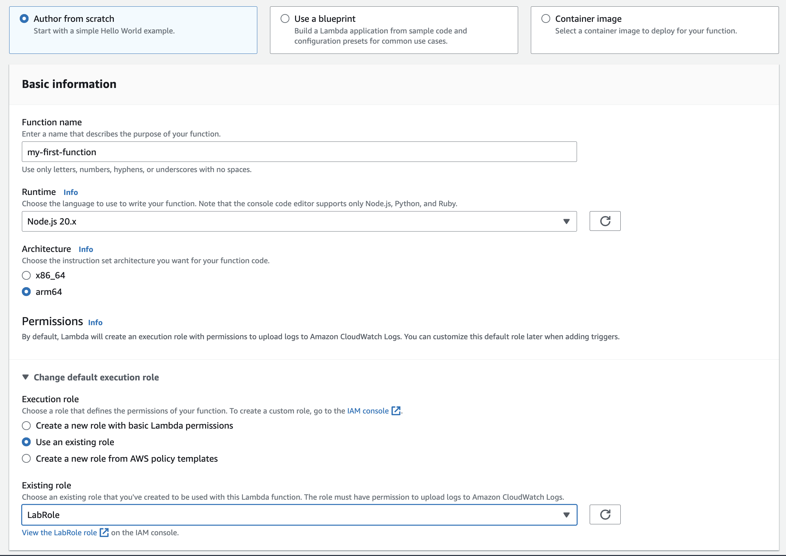
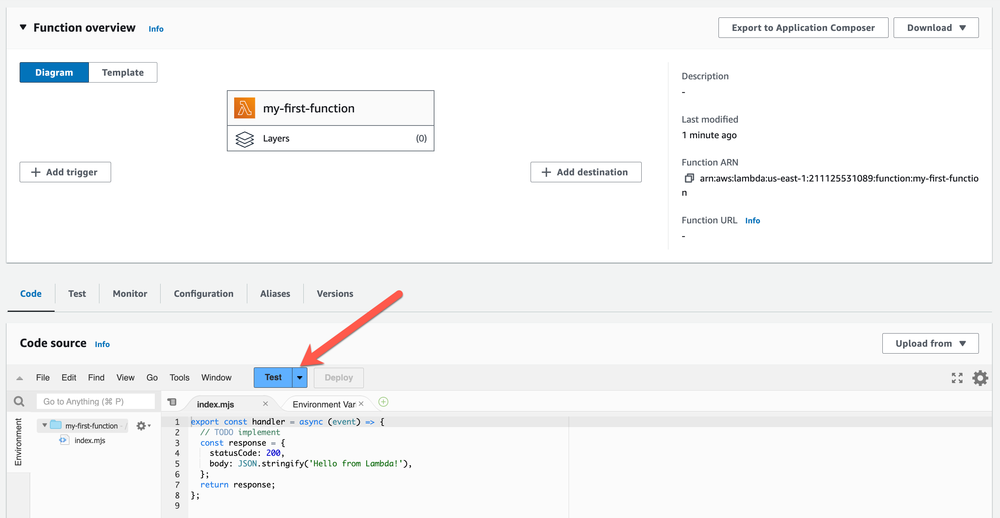
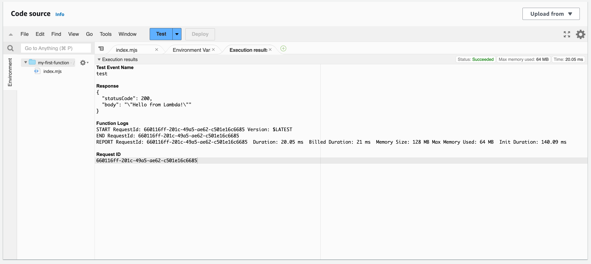

# Lab 01 - Crear y testear tu primera función de Lambda

1. Ir la consola de AWS --> AWS Lambda

2. Crear una nueva función desde 0.

- Información básica:

  - Runtime: Node 20.x
  - Architectura: arm64
  - Role: LabRole

3. Apretar el botón de test con un evento de prueba

Para que funcione, primero apretan test una vez y crean el evento de prueba y luego lo hacen otra vez para testear.

Van a ver los resultados en la consola

