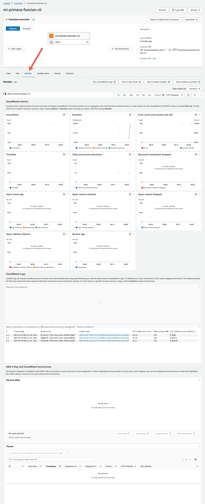

# Lab 01 - Amazon CloudWatch

## Mirar Logs

1. Ir la consola de AWS --> Amazon Cloudwatch --> Logs --> Log groups

2. Buscar la funcion de Lambda que acaba de ejecutar.

```
/aws/lambda/mi-primera-funcion-cli
```

3. En los log streams mirar los logs


4. Modificar la funcion de Lambda de CLI para que imprima "Hola mundo" en la pantalla

```
exports.handler = async function(event, context) {
  console.log("EVENT\n" + JSON.stringify(event, null, 2));
  console.log("Hola mundo")
  return
}
```

Desplegar la funcion y testear.
Mirar los logs y ver que paso.

### Logs con la AWS CLI

En la AWS CLI podes mirar los logs con el siguiente comando

Primero obtenes los logs streams:

```
aws logs describe-log-streams --log-group-name /aws/lambda/mi-primera-funcion-cli
```

Luego con el nombre del log stream que quieras abris el log:

```
aws logs get-log-events --log-group-name '/aws/lambda/mi-primera-funcion-cli' --log-stream-name '2023/02/02/[$LATEST]4ae4578cbf804e5c88bc6387f1bd949d'
```

También podes obtener los logs cuando invocas a la funcion de Lambda:

```
aws lambda invoke --function-name mi-primera-funcion-cli out --log-type Tail --query 'LogResult' --output text |  base64 -d
```

## Mirar las metricas

1. Ir la consola de AWS --> Amazon Cloudwatch --> Metrics --> All Metrics

2. Seleccionar Lambda para ver las metricas especificas para este servicio


3. Elegir metricas por nombre y seleccionar las metricas de la funcion que nos interesa


Podemos graficarlas y modificar los valores.

Una cosa importante a tener en cuenta es que cada valor tiene diferentes unidades y todas juntas en la grafica no tienen sentido.

## Observar una funcion de Lambda

Desde la consola de Lambda también se puede acceder a toda esta información sobre la funcion.



Explorar esta pantalla y ver como obtener la información anterior.
