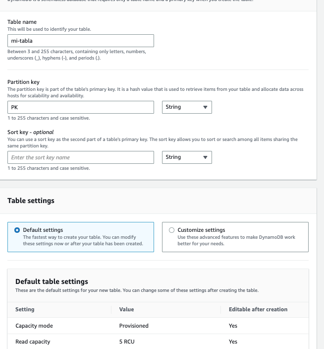
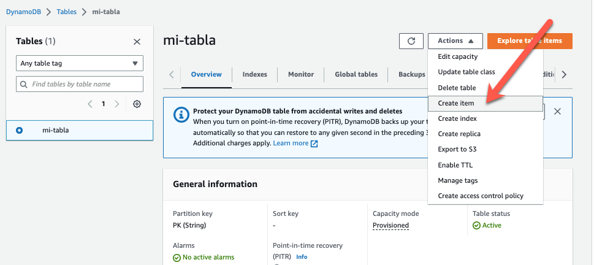

# Lab 01 - Crear una tabla de DynamoDB desde la consola

1. Ir la consola de AWS --> Amazon DynamoDB --> Create table

2. Create table

- Información básica:

  - Table name: mi-tabla
  - Partition key: PK / string
  - Table settings: Default

3. Agregar algunos items

Y verlos en la tabla.
