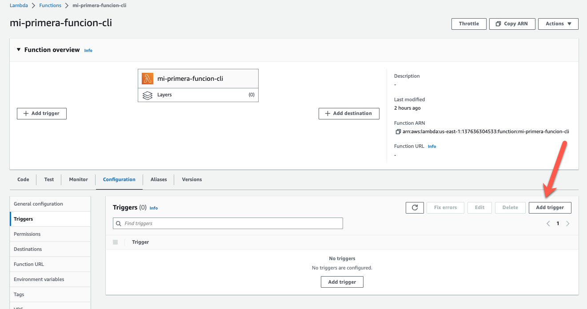
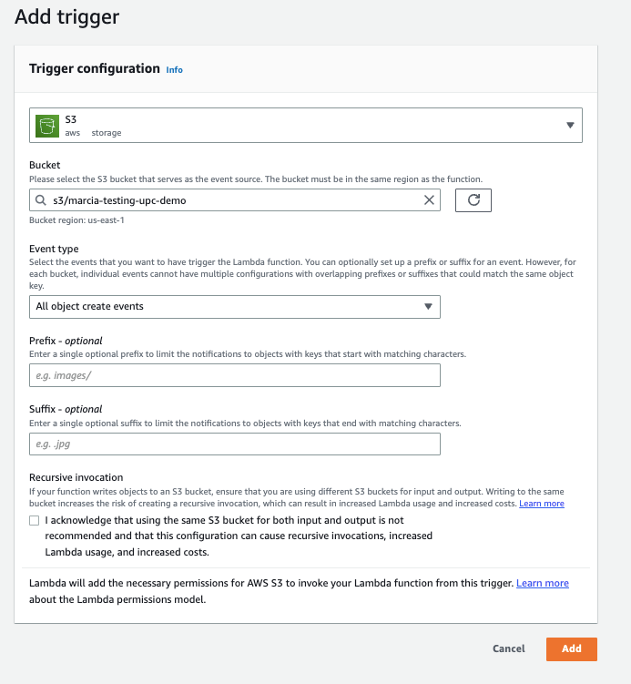

# Lab 01 - Crear un trigger para la función de Lambda

Modificar la función de Lambda que creamos antes (mi-primera-funcion-cli) para que se ejecute cuando se crea un nuevo archivo en un bucket de S3.

1. Crear un bucket de S3

```
aws s3 mb s3://RANDOM_NAME
```

Recuerden que los buckets de S3 tienen que ser unicos en el mundo!

2. Modifica la función de Lambda para que se dispare cuando un archivo se agrega al bucket



Y luego configurar el trigger para que cuando se cree un archivo en el bucket se dispare la funcion.



3. Testearlo. Subir un archivo al bucket y ver que pasa.

```
touch test.txt
aws s3 cp test.txt s3://$RANDOM_NAME
```

4. Mira como es el objecto de evento en la funcion ahora

```
{
    "Records": [
        {
            "eventVersion": "2.1",
            "eventSource": "aws:s3",
            "awsRegion": "us-east-1",
            "eventTime": "2023-02-07T18:59:44.748Z",
            "eventName": "ObjectCreated:Put",
            "userIdentity": {
                "principalId": "AWS:AROASAC6DK2KUZJ3W25TB:user2379919=Marcia_Villalba"
            },
            "requestParameters": {
                "sourceIPAddress": "34.209.27.114"
            },
            "responseElements": {
                "x-amz-request-id": "BYYH638Q95XJRK5F",
                "x-amz-id-2": "zysp43UTs3AMwBPmxOR1DdJPELyMKe8LYJcgiMskjiwBRpCyS28CKrIjnr4uoGoPFljgIL/eWB20ZydWXNDKVJlXvdPNmnwc"
            },
            "s3": {
                "s3SchemaVersion": "1.0",
                "configurationId": "3b2452d9-8dc5-4f45-8e38-e9e17aea9f2c",
                "bucket": {
                    "name": "XXXX",
                    "ownerIdentity": {
                        "principalId": "A1P9OBI5B532JO"
                    },
                    "arn": "arn:aws:s3:::XXXX"
                },
                "object": {
                    "key": "test.txt",
                    "size": 0,
                    "eTag": "d41d8cd98f00b204e9800998ecf8427e",
                    "sequencer": "0063E29FA0B5263AC3"
                }
            }
        }
    ]
}
```
