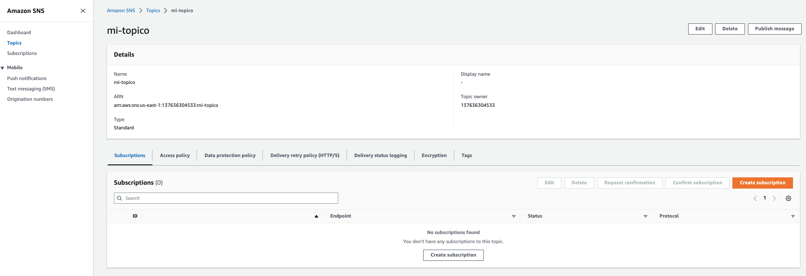

# Lab 01 - Crear un SNS topic y subscripcion

Crear un Topico de AWS SNS y una subscripcion para que cuando haya un mensaje en el topico te envie un correo.

1. Crear un topico

```
aws sns create-topic \
    --name mi-topico
```

Podemos validar que fue creado en la consola de AWS --> SNS --> Topics



2. Crear subscription

```
aws sns subscribe \
    --topic-arn arn:aws:sns:us-east-1:XXXX:mi-topico \
    --protocol email \
    --notification-endpoint my-email@example.com
```

Go to your email account and confirm the subscription

3. Publicar un mensaje en el topico para testear

```
aws sns publish \
    --topic-arn "arn:aws:sns:us-east-1:xxxx:mi-topico" \
    --message 'hola mundo'
```

Checkear el correo.
