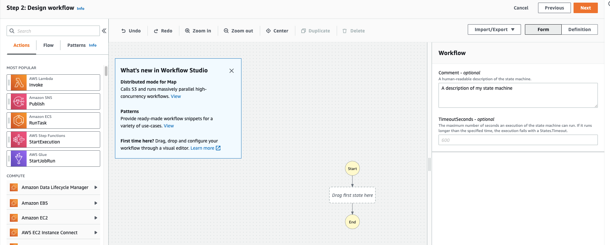
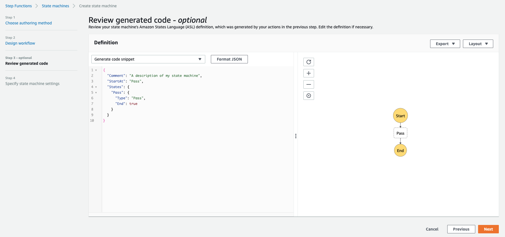
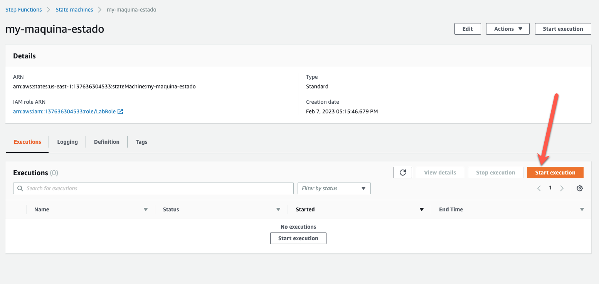

# Lab 01 - Crear una máquina de estados

1. En la consola de AWS ir a Step Functions --> State machines --> Create state machine

2. Seleccionar "Design your workflow visually"
   Y el tipo "Standard"

Luego deberias ver algo asi

3. En "Flow" podemos arrastrar el estado de "Pass" y darle al boton de "Next"

4. Revisar el código generado

5. Configurar las maquina de estado:

- Nombre - my-maquina-estado
- Rol: LabRole

Y darle a crear.

6. Ahora podes empezar una ejecución

7. Mira lo que pasa en la consola.
