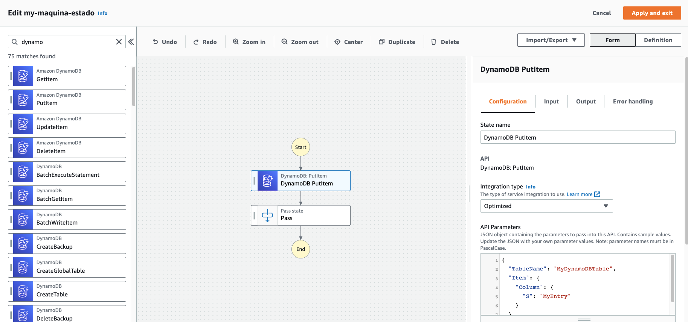
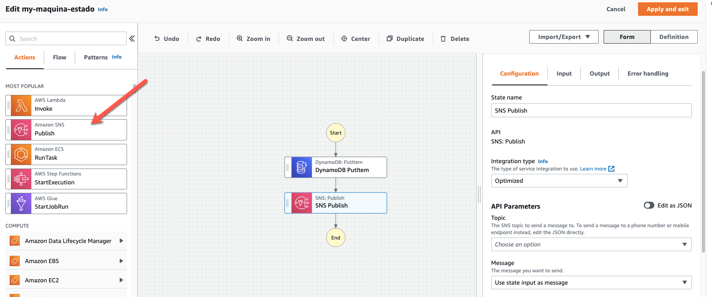

# Lab 02 - Modificar la máquina de estado

## Guardar información en DynamoDB

1. Editar la máquina de estado que creamos en el lab anterior. Y abrimos la opción de editarlo con el Workflow studio.

2. Buscamos en las opciones de operaciones DynamoDB Put Item y lo arrastramos en la pantalla.



3. Configuramos la integración - API Parameters

```
{
  "TableName": "mi-tabla-cli",
  "Item": {
    "PK": {
      "S": "test-A"
    },
    "Fecha": {
        "S": "DATE"
    }
  }
}
```

4. Ahora podes guardar la maquina de estado y ejecutarla.
   En la base de datos podes ver el nuevo item.

## Enviar una notificación

1. Editar la máquina de estado que creamos en el lab anterior. Y abrimos la opción de editarlo con el Workflow studio.

2. Buscamos en las opciones de operaciones SNS Publish y lo arrastramos en la pantalla.



3. Configuramos los API Parameters de la integración

- Topic: seleccionar el topico que creamos anteriormente `mi-topico`
- Message: "use state input as a message"

4. Ahora podes guardar la maquina de estado y ejecutarla.

   En la base de datos podes ver el nuevo item y ver que tenes un nuevo correo.
