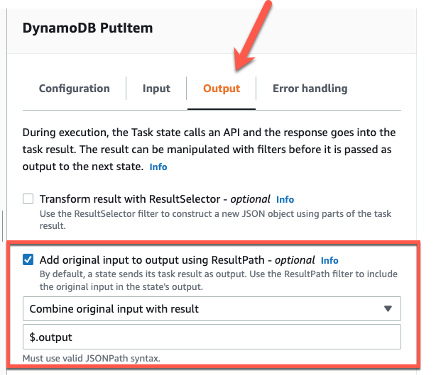
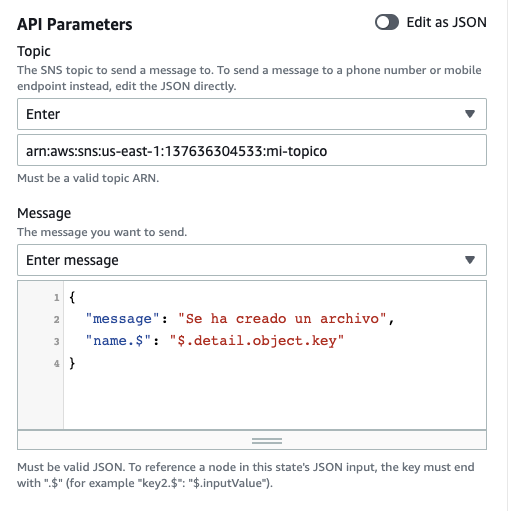

# Lab 03 - Parametros, inputs y outputs

En esta tarea vas a tener que probar muchas veces la maquina de estado, ejecutarla, modificarla y verificar que funciona.
También la idea es que te sientas más comodo con la consola y con la documentación de AWS.

## Obtener parametros del input de la máquina de estados

Configurar que dado un evento de este estilo (es el evento que envia S3 - más de eso en el próximo lab) a la máquina de estados:

```
{
  "version": "0",
  "id": "b1038275-8e8d-b4de-4457-7d3bf399361b",
  "detail-type": "Object Created",
  "source": "aws.s3",
  "account": "137636304533",
  "time": "2023-02-14T13:05:04Z",
  "region": "us-east-1",
  "resources": [
    "arn:aws:s3:::<bucket name>"
  ],
  "detail": {
    "version": "0",
    "bucket": {
      "name": "<bucket name>"
    },
    "object": {
      "key": "test.txt",
      "size": 0,
      "etag": "d41d8cd98f00b204e9800998ecf8427e",
      "sequencer": "0063EB8700A58F1F62"
    },
    "request-id": "C6C6VY14N0P1SGGY",
    "requester": "137636304533",
    "source-ip-address": "186.53.164.134",
    "reason": "CopyObject"
  }
}
```

Se guarden en la base de datos la PK el nombre del archivo y el otro atributo "Fecha" la fecha de creación del archivo.

_Tip_
Para eso hay que investigar un poco sobre [Parameters y Path ($)](https://docs.aws.amazon.com/step-functions/latest/dg/input-output-inputpath-params.html).

#### Solución

Modificar la tarea que llama a DynamoDB asi. Para eso vamos a usar los parameters que nos da Step Functions y la flexibilidad del path $.

Modificar el código de los parametros que recibe DynamoDB de esta forma, para obtener el nombre del objecto y la fecha del input de la máquina de estado:

```
{
  "TableName": "mi-tabla-cli",
  "Item": {
    "PK": {
      "S.$": "$.detail.object.key"
      },
    "Fecha": {
      "S.$": "$.time"
    }
  }
}
```

## Pasar parametros de un estado a otro

Ahora tenes que hacer mensaje que se envie en la notificación sea:

```
{"message":"Se ha creado un archivo","name":"filename.txt"}

```

_Tip_
Para eso hay que investigar un poco sobre [ResultPath](https://docs.aws.amazon.com/step-functions/latest/dg/input-output-resultpath.html).

#### Solución

1. En la tarea de DynamoDB cambiar en output esta configuración:



De esta forma vamos a tener el input de la máquina de estados que contiene el nombre del objecto, en la salida de la tarea que llama a DynamoDB. Sino hacemos esto vamos a ver en el output de la tarea de DynamoDB, solamente lo que nos devuelve esta tarea y ahi no esta el nombre del objecto que fue subido a S3.

2. Luego modificar la configuración de la tarea de SNS donde se envia un mensaje.


