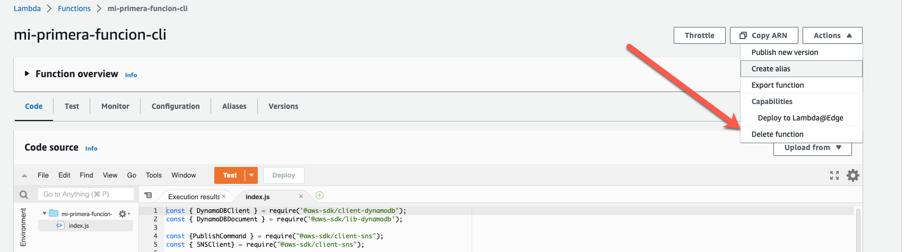
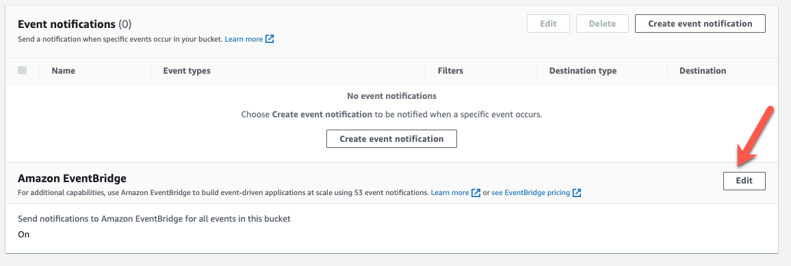
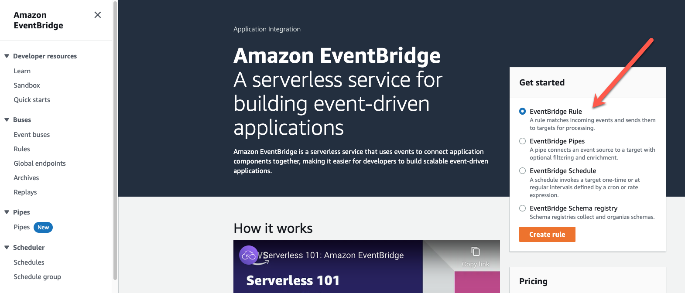
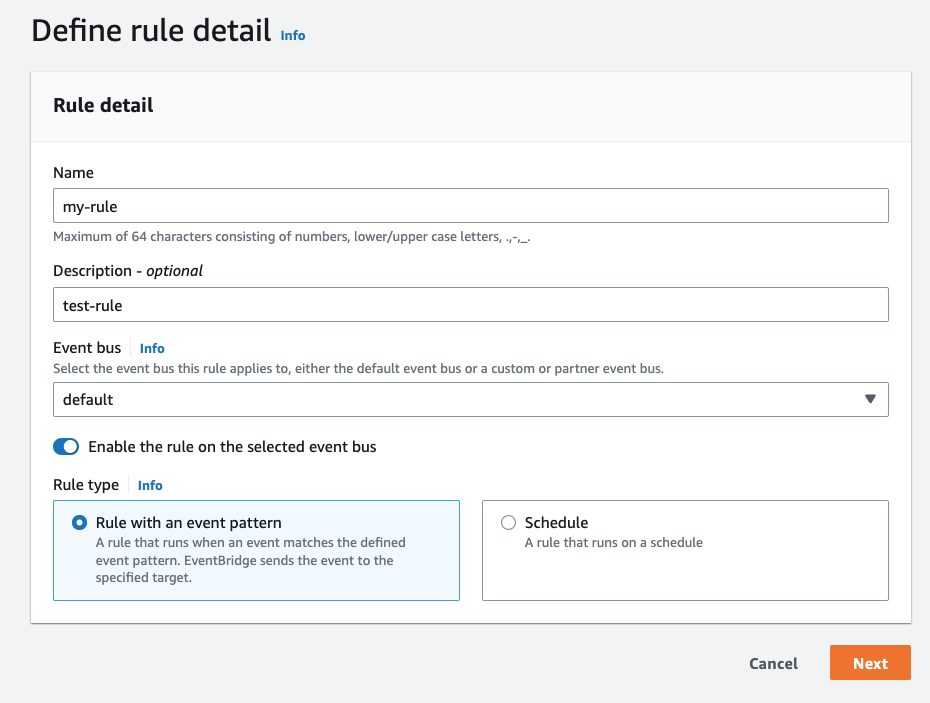
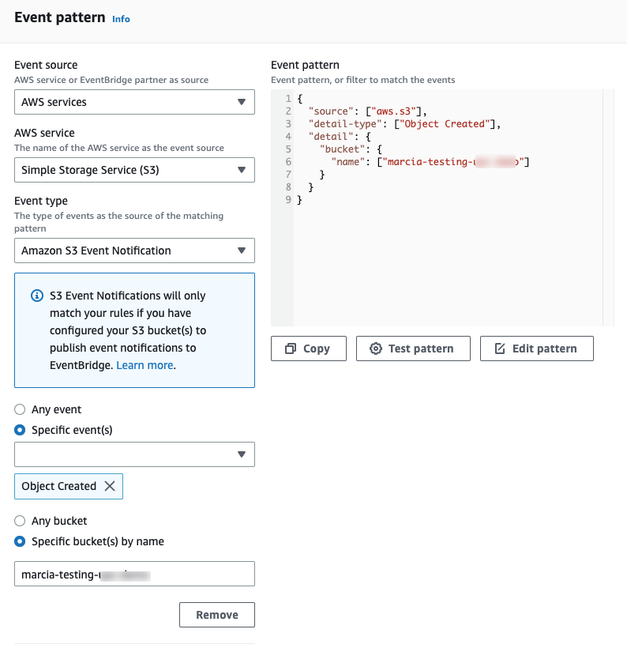
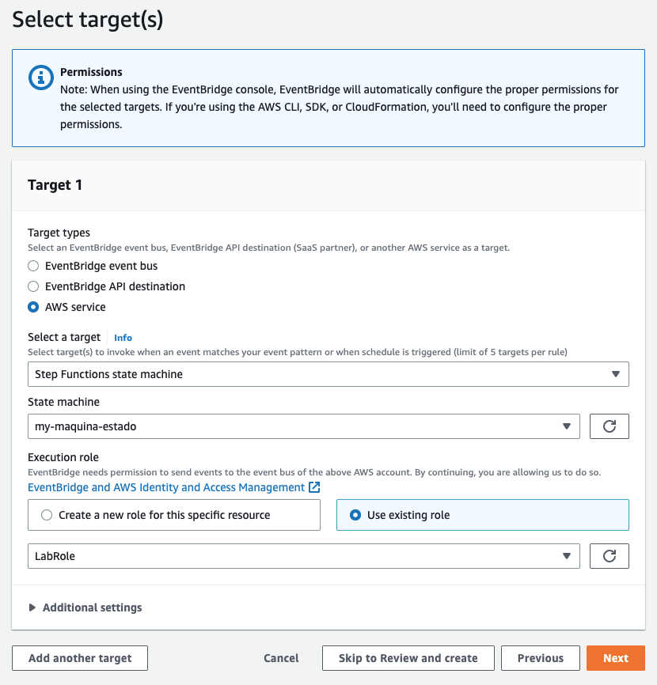

# Lab 01 - Crear una regla en EventBridge que se active cuando se crea un objecto en S3

Antes de empezar vamos a borrar a la función de Lambda que creamos que se dispara cuando se sube un archivo a S3.

Ahora estamos listos.

1. Ir al bucket de S3 y cambiar la propiedad de **Amazon EventBridge** de Off a On.

De esta forma el bucket va a enviar los eventos de cuando un archivo se crea, actualiza o elimina a EventBridge.

2. Ir al servicio de EventBridge y crear una regla desde la consola.

3. Configurar los detalles de la regla.

4. En la siguiente pantalla hay que definir el evento.

Para eso vas a elegir como **Event Source**, **AWS events or EventBridge partner events**

Y luego podemos generar el evento de ejemplo para configuralo a nuestras necesidades. Pero esto vamos a saltarlo y vas a seguir bajando en la pantalla hasta **Creation method**, donde vas a elegir **Use Pattern form**

En la parte de **Event Pattern** podemos buscar el patron del evento cuando se crea un nuevo objecto en S3. Ahi van a tener que especificar el nombre del bucket que crearon.

5. Ahora van a elegir el target. Para eso hay que elegir que van a usar una maquina de estados. Y buscar la que acaban de crear.
   Para el rol siempre es `LabRole`

6. Listo

Ahora pueden agregar tags y lo que necesiten y completar el proceso.

6. Testear la regla.

Para testar la regla, suban un archivo al bucket de S3 y vean que pasa.

Se deberia ejecutar la regla, la maquina de estados, guardar info en DynamoDB y enviar un correo.

Las reglas tambien tienen metricas, pueden ver cuantas veces se invoco una regla y como funciono desde CloudWatch o desde la regla misma.
