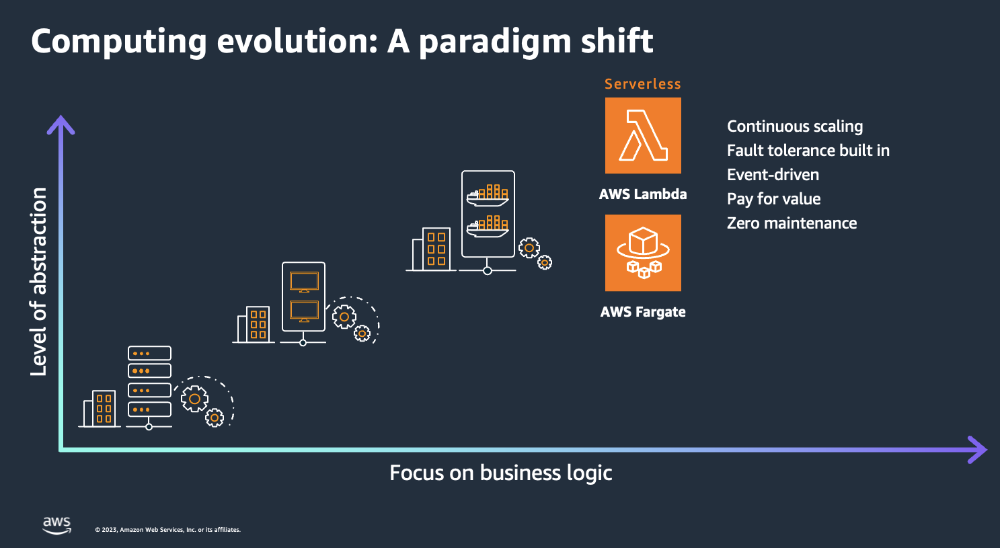
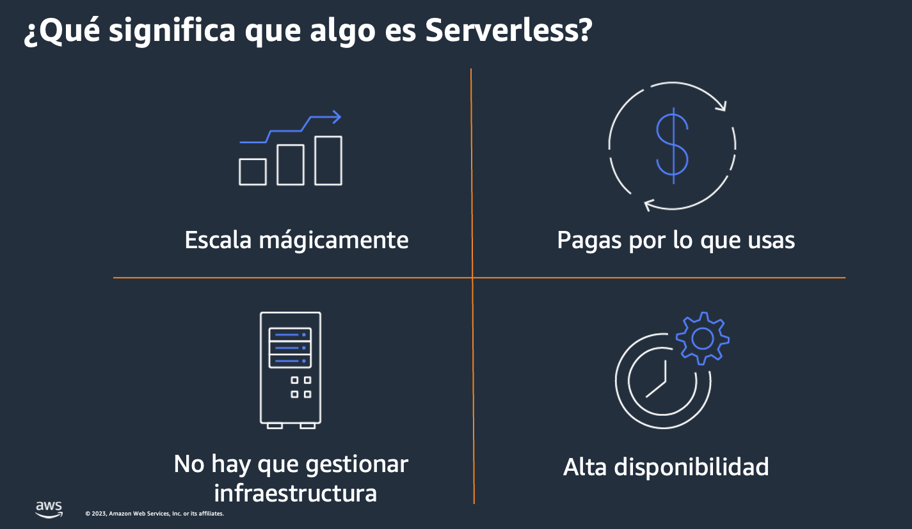
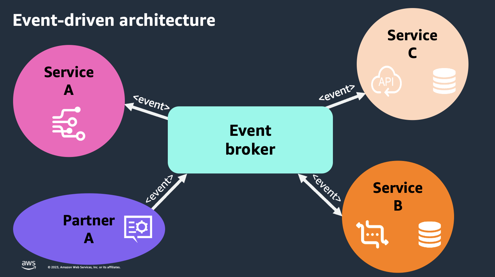

## Introducción a Serverless

[Quiz - What you understand when someone says Serverless?](https://www.menti.com/alc7zp5asbsx)

## Computing evolution: A paradigm shift

## The start of serverless

- November 13, 2014
  AWS introduces the preview of AWS Lambda, an event-driven computing service for dynamic applications

- April 9, 2015
  AWS Lambda becomes generally available for production use

- March 14, 2006
  Amazon S3 launched as the first generally available AWS service

- November 3, 2004
  Amazon Simple Queue Service (Amazon SQS) beta
  Production on July 13, 2006 (17 years ago)

- August 25, 2006
  Amazon Elastic Compute Cloud (Amazon EC2) beta
  Production on October 23, 2008

## What it means that something is serverless?

## What is serverless?

Consider “serverless” as:
A mindset, an approach, a practice, a culture, a way of working
Focus on business value, rather than the enabling technology

**Benefits:**

- Faster time to market from prototype to production
- Rapid, continuous experimentation and feedback
- React and deliver business changes with a product mindset
- Serverless = the best way to build and run modern applications

**“Serverless” architecture is an operational model**
Minimize taking on ongoing operational tasks, outsource system administration tasks
Every non-serverless component = ongoing ops responsibility
Optimize for long-term maintainability
Serverless does not mean "No Ops“!

AWS as your platform (engineering) team
Build “in” the cloud, not just “on” it

## Event Driven Architectures

## Serverless/EDA trade-offs

- Different way of designing applications
- More moving pieces
- Harder to understand dependencies
- Eventual consistency
- Different testing/monitoring/observability
- Relying on platform capabilities and security

## Serverless Best practices

- Consider “serverless” as a mindset
- Focus on business value, rather than the enabling technology
- Optimize for long-term maintainability
- Build “in” the cloud, not just “on” it
- Concentrate on the flow of data and events = EDA
- Create enabling platform teams
- Think serverless first

[Quiz - What services can be serverless?](https://www.menti.com/al3zmcim2d7h)

## Video de la clase (Marzo 2024)

[Mira el video de este modulo](https://www.youtube.com/watch?v=7niFTyvO-rI)

## More information and material about serverles

[Check this file](materiales.md)
