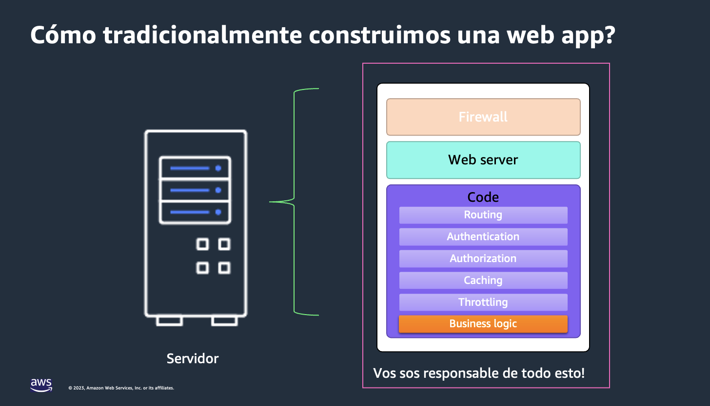
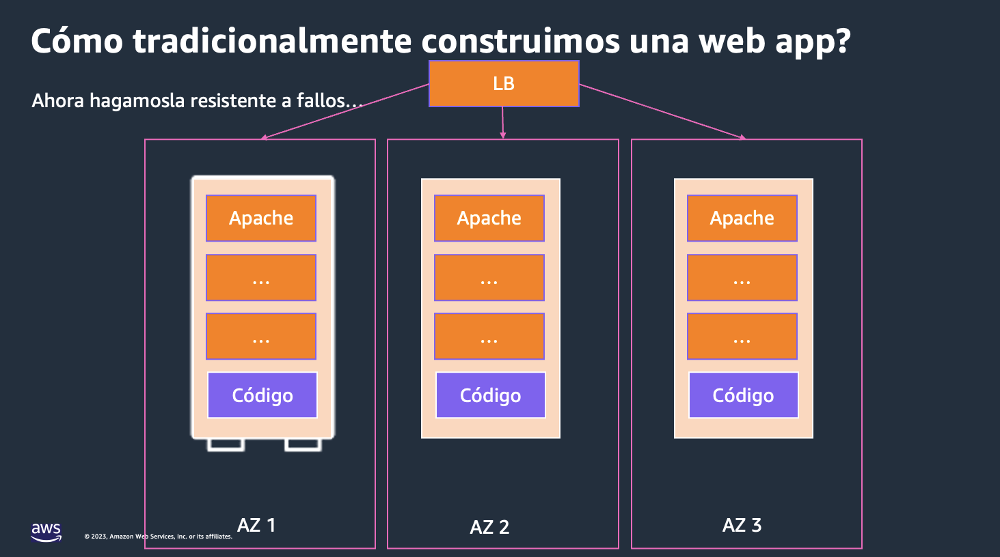
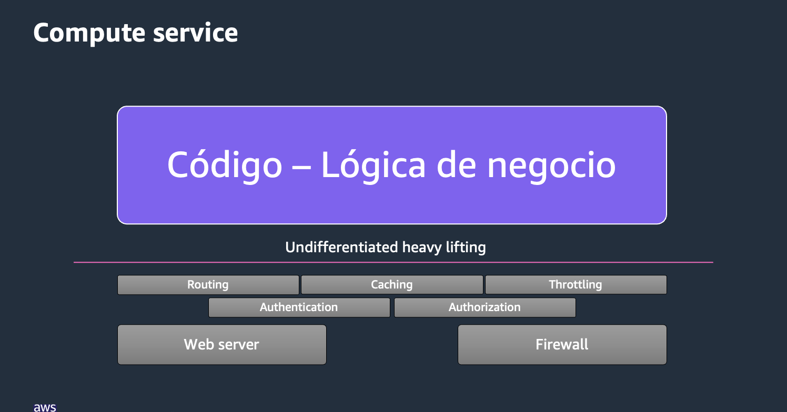
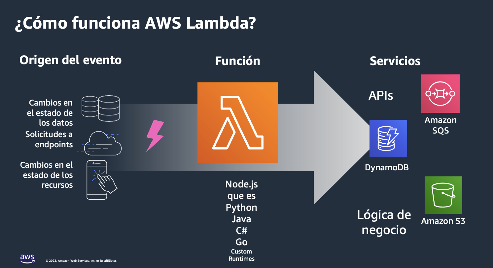
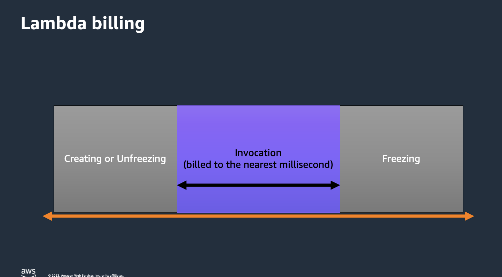

# Lambda 101

## How we traditionally build a web app?



Now lets make it resistant to failures



## The most important thing of our apps



## What is AWS Lambda?

“AWS Lambda ejecuta código.... sin aprovisionar o administrar servidores
... Sólo tenés qué subir tu código y Lambda se encarga de todo lo requerido para ejecutar y escalar tu código con alto disponibilidad.
Podes configurar tu código para que automáticamente se ejecute desde otros Servicios de AWS o llamarlo directamente desde cualquier web o móvil app”

**AWS — Definición de Lambda**

### Security

AWS manages security for you by maintaining the data centers, patching and securing the servers and operating systems, providing Identity and Access management tools for your infrastructure, and helping you encrypt your data in transit and at rest. AWS helps you with security in many others ways too, but you get the idea.

### How AWS Lambda works?



### Lambda billing

You are only billed for what you use. Billing for a Lambda function starts when the execution environment is created or unfrozen and ready to run your code. Billing stops when the execution environment is placed in a frozen state. Many times, this is a matter of milliseconds depending on what you are doing in your code. The nice thing is, Lambda function billing rounds to the nearest millisecond.



#### Lambda billing (us-east-1 ARM)

- $0.0000133334 per GB-second
- $0.20 per 1 Million requests
- Free tier
  - 1 M invocations per month
  - 400,000 GB-Seconds of compute per month

## Anatomy of a Lambda function

```
let response;
exports.handler = async (event, context) => {
  try {
    response = {
      'statusCode': 200,
      'body': JSON.stringify({
         message: 'hello world’,
       })}
  } catch (err) {
     console.log(err);
     return err;
  }
  return response;
};
```

- Handler() function - Function to be executed upon invocation
- Event object - Data sent during Lambda function invocation
- Context object - Methods available to interact with runtime information (request ID, log group, more)

## Labs

- [Create a new Lambda function from the console](../../labs/12-lambda/12-01-lab.md)

- [Create a new Lambda function using AWS CLI](../../labs/12-lambda/12-02-lab.md)

## Quiz

[Quiz – How we can know that the function run?](https://www.menti.com/alkjt1c7ewun)

## More information and material

[Check this file](materiales.md)
