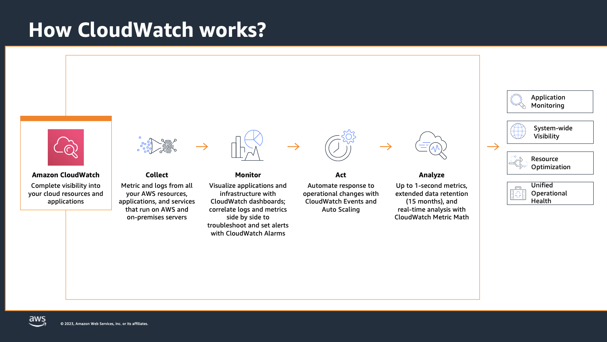

# Amazon CloudWatch 101

## Observability

Observability consist of the three pillars: Metrics, Logs and Traces – and importantly providing contextual linking between these 3 pillars.

- Metrics gathers numerical data about things you want to track for your application. Think of request rate, or error rate, or also business metrics, such as number of orders placed, or payments received
- Logs are timestamped records of events…. something happening. A failure, an error, something informational such as a state change,. Logs may have metrics included with them.
- Traces are a single user or transaction journey through a number of separate applications or parts of your application.

For example. if I am alerted on a metric, I should be able to see the associated logs and traces with a few clicks and easily navigate between the different components of my application. If I can do that, I can spend less time working out what’s actually wrong, and have more time fixing the problem.

### Observability in AWS

AWS has two main services to help with observability. Amazon CloudWatch and AWS X-Ray.
CloudWatch is a service that collects monitoring and operational data in the form of logs, metrics, and also events. It also gives you a nice unified view across your AWS resources, applications, and services. You can set up alarms to alert you if something is important, you can visualize your logs and metrics side by side, you take automated actions based on what appears in your logs, or traces which all help to troubleshoot issues

AWS X-Ray is the AWS tracing service, it helps developers analyze and debug production applications, and is particularly helpful for those built with multiple distributed components so you can see transaction, or user journeys across the different components.

## How CloudWatch works?

### Cloudwatch logs

- Centralize logs from all your systems and applications
  Collect and store logs
  Perform queries over structured logging

- Metric Filters
  Build metrics based on log filters
  Jump to logs that generated metrics

- Export logs to Amazon ElastiCache or S3
  Explore with Kibana or Athena/QuickSight

### Cloudwatch metrics

- Natively integrates with AWS Services
  Many AWS services sends metrics to CloudWatch automatically

- CloudWatch Dashboards
  Operational visibility and insights

- Alarms
  CloudWatch Alarms allow you to automate actions based on predefined patterns
  CloudWatch Events

### X-Ray

- Analyze and debug issues quickly
- End-to-end view of individual services
- Visualize service calls
- Identify performance bottlenecks
- Pinpoint issues
- Identify errors

## Lab

[Find the metrics and logs for the function that you just executed](../../labs/13-cloudwatch/13-01-lab.md)

## More important metrics for Lambda

Invocation metrics

- Invocation
- Errors
- Throttles

Performance metrics

- Duration

Concurrency metrics

- Concurrent executions

## More information and material

[Check this file](materiales.md)
