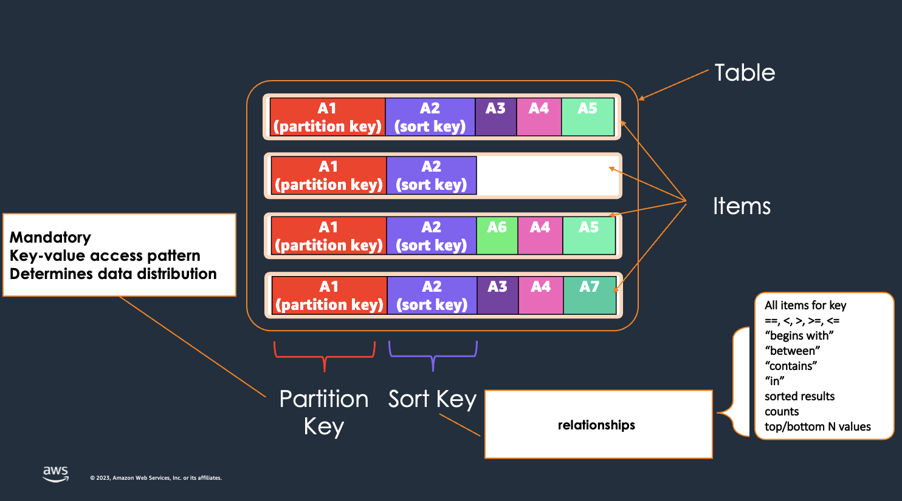
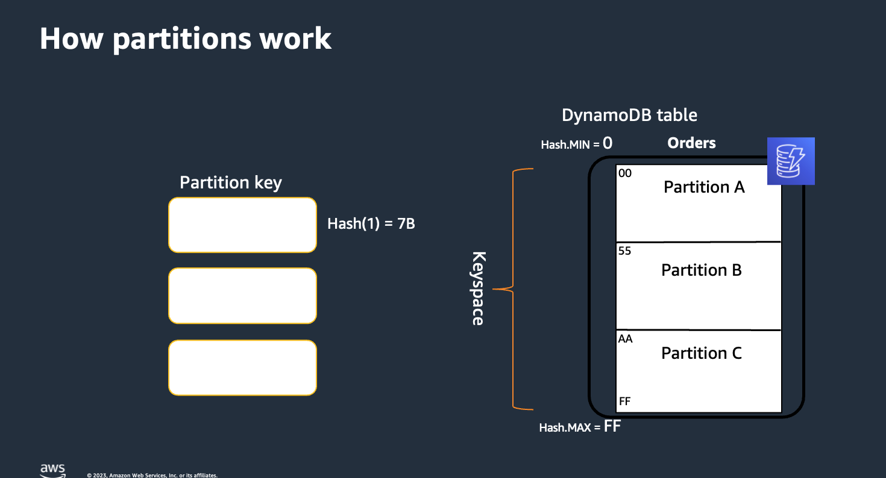

## DynamoDB 101

[Quiz - What characteristics you look for in a serverless database?](https://www.menti.com/alp3wrzyjxus)

## What is DynamoDB?

Amazon DynamoDB is a fast, flexible, serverless NoSQL database service that delivers single-digit millisecond performance at any scale.

### How DynamoDB helps with event driven applications

1. Simpler data access methods
2. Generates events

## DynamoDB data model

Key-value
Wide column

## Important concepts

### DynamoDB Operations

**Item based operations**
Specify exact value of primary key

- Put Item
- Get Item
- Update Item
- Delete Item

**Query**
Specify exact value of partition key and optionally a sort key condition
Optional filter conditions on non-key attributes
Returns 0 or more items from an item collection
Will consume RCUs to read items that match the sort key condition as single aggregated result.

**Scan**
Specify filter conditions on non-key attributes
Returns all items from the table that match filter expression
Will consume RCUs to read all items on the table

## Lab

- [Create a DynamoDB table using the console](../../labs/21-dynamodb/21-01-lab.md)
- [Create a DynamoDB table using the AWS CLI](../../labs/21-dynamodb/21-02-lab.md)

## More information and material

[Check this file](materiales.md)
