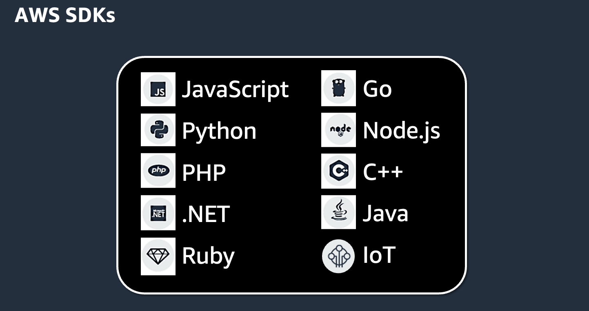

## AWS SDK 101

## Ways to interact with AWS

- AWS Management Console
- Command Line Interface (AWS CLI)
- Software Development Kits (SDKs)
- Infrastructure as Code (IaC)

## Lab

- [Use AWS SDK to put items in the DynamoDB table that we created](../../labs/22-aws-sdk/22-01-lab.md)

## More information and material

[Check this file](materiales.md)
