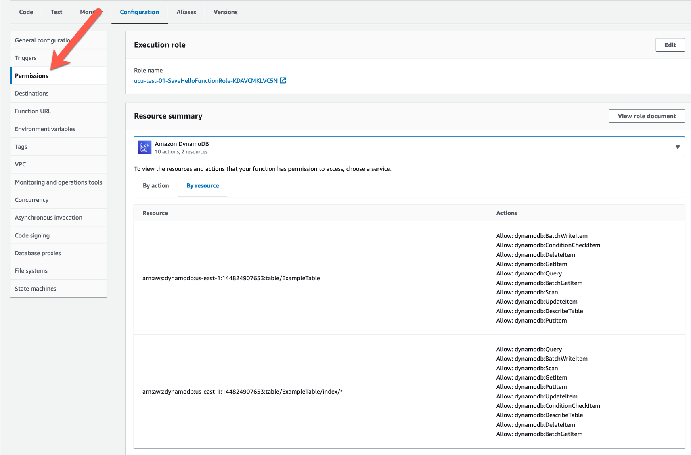

## Seguridad y permisos

All AWS Resources are created without permissions.

### Adding permissions to a Lambda function using AWS Console



### Adding permissions to Lambda function using AWS CLI

```
aws lambda create-function --function-name my-function \
--zip-file fileb://function.zip --handler index.handler --runtime nodejs18.x \
--role arn:aws:iam::123456789012:role/lambda-ex
```

### More information and material

[Check this file](materiales.md)
