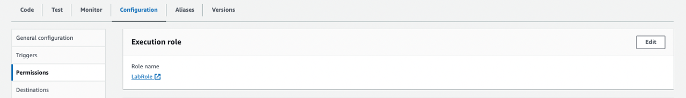
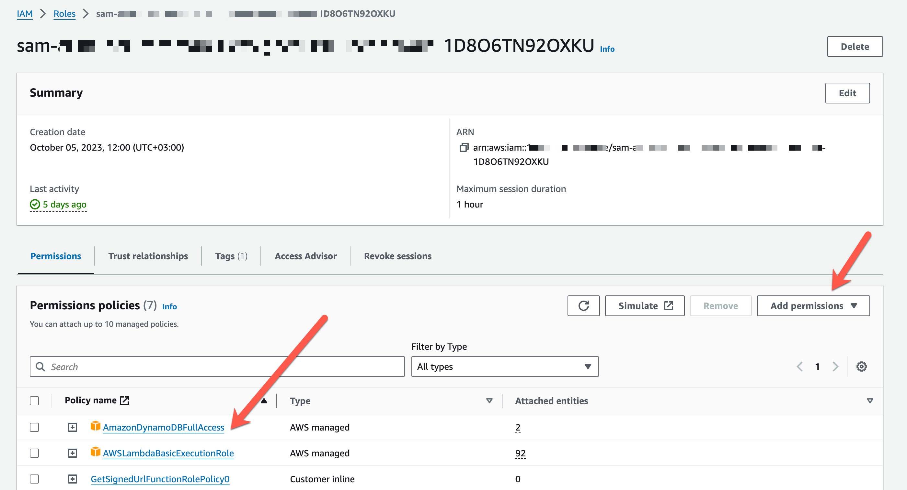

# Seguridad y permisos

All AWS Resources are created without permissions.

Pero como estamos en una cuenta de AWS Academy no nos vamos a enfrentar a ese problema, ya que la cuenta trae un rol con un montón de permisos ya definidos, LabRol. Y ese es el rol que vamos a usar en todos los ejecicios.



## Adding permissions to a Lambda function using AWS Console

Si queremos darle permisos a una función de Lambda podemos hacerlo desde la consola de AWS.


## Policies and roles

- IAM roles son dados a los servicios/recursos de AWS y se le dan permisos especificos para que puedan hacer cosas en AWS.
- Los roles pueden ser asumidos por quien los necesita para hacer una tarea en AWS.
- Los roles tienen una o más politicas o IAM policies. Estas son las que determinan los permisos para el rol.

### Policies

Hay varios tipos de policies, pero las que nos intersan son las Identity-based policies, que controlan que puede hacer una identidad (usuario, rol, o grupo).
Dentro de estas politicas tenemos:

- Managed policies – estas pueden ser proporcionas por AWS o creadas por uds y reutilizadas en diferentes roles.
- Inline policies – policies que se agregan directamente a un usuario, rol, o grupo. No se pueden reutilizar.

```
{
    "Version": "2012-10-17",
    "Statement": [
        {
            "Effect": "Allow",
            "Action": ["dynamodb:getItem"],
            "Resource": ["arn:aws:dynamodb:us-east-1:XXX:table/mi-tabla-cli"]
        }
    ]
}
```

Si queremos agregarlas o verlas desde IAM podemos.



### Give permissions from AWS CLI when creating the function

1. Creamos el rol - [create-role](https://awscli.amazonaws.com/v2/documentation/api/latest/reference/iam/create-role.html).
2. (Si usamos politicas creadas por nosotros). Creamos las politicas [create-policy](https://awscli.amazonaws.com/v2/documentation/api/latest/reference/iam/create-policy.html)
3. Le agregamos los permisos que queremos al rol (agregar politicas).Se hace con [attach-role-policy](https://awscli.amazonaws.com/v2/documentation/api/latest/reference/iam/attach-role-policy.html)
4. Creamos la función de Lambda con ese rol

```
aws lambda create-function --function-name my-function \
    --zip-file fileb://function.zip \
    --handler index.handler \
    --runtime nodejs20.x \
    --role arn:aws:iam::123456789012:role/lambda-ex
```

### Add permissions from AWS CLI to an existing function

1. (Si usamos politicas creadas por nosotros). Creamos las politicas [create-policy](https://awscli.amazonaws.com/v2/documentation/api/latest/reference/iam/create-policy.html).
2. Le agregamos los permisos que queremos al rol (agregar politicas).Se hace con [attach-role-policy](https://awscli.amazonaws.com/v2/documentation/api/latest/reference/iam/attach-role-policy.html)

```
aws iam attach-role-policy \
    --policy-arn arn:aws:iam::aws:policy/AmazonDynamoDBFullAccess \
    --role-name <nombreDelRolDeLaFuncion>
```

### More information and material

[Check this file](materiales.md)
