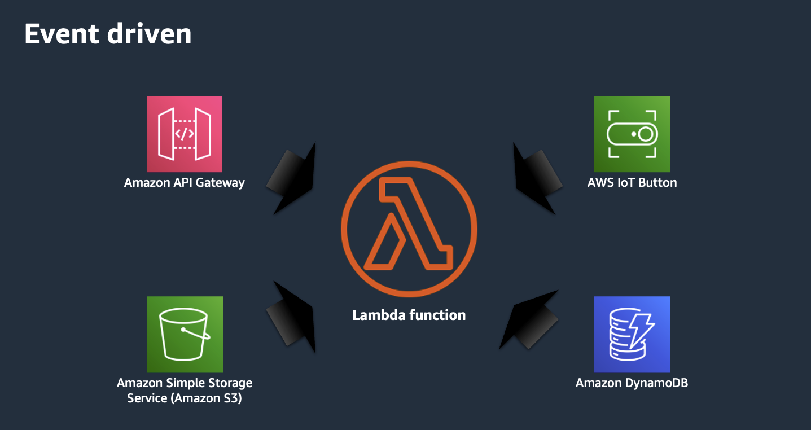
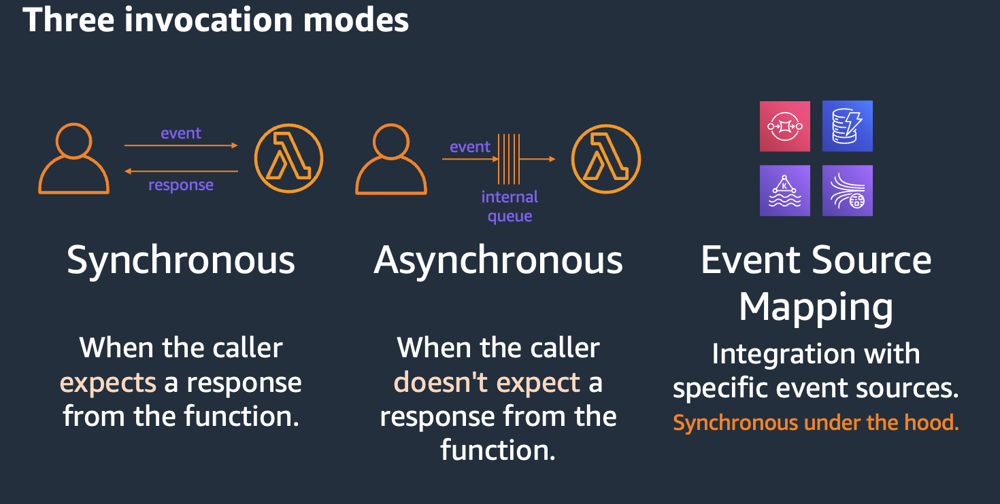

## Lambda Triggers

[Quiz- Cómo podemos ejecutar una función de Lambda?](https://www.menti.com/alteozvxxbwb)

### Arquitectura orientada a eventos

All AWS Resources are created without permissions.

### Lambda invocation mode

#### Syncronous invocation mode

When a caller expects a response from the function.
Errors are returned to the caller.
Returns throttles when you hit the concurrency limit.
Usually is when cold start is noticed

Eg. Amazon API Gateway, AWS AppSync, AWS Step Functions

#### Asynchronous invocation mode

When the caller doesn't expect a response from the function.
Caller gets an ack from the Lambda function.
An interal queue persist the message up to 6 hours and retries.

Eg. Amazon SNS, Amazon EventBridge, AWS S3

#### Event Source Mapping

Integration with specific event sources.
This integration is syncronous under the hood. It pulls messages from the source and then does sync invokes.

With this method you can do batching, error handling, and more.
Each event source has different capabilities.

Eg. Amazon SQS, DynamoDB streams, Amazon Managed Kafka, Amazon Kinesis Data Streams

## Lab

- [Lab 01 - Crear un trigger para la función de Lambda](../../labs/24-lambda-trigger/24-01-lab.md)
- [Lab 02 - Modificar el código para que escriba en la tabla de DynamoDB](../../labs/24-lambda-trigger/24-02-lab.md)

## More information and material

[Check this file](materiales.md)
