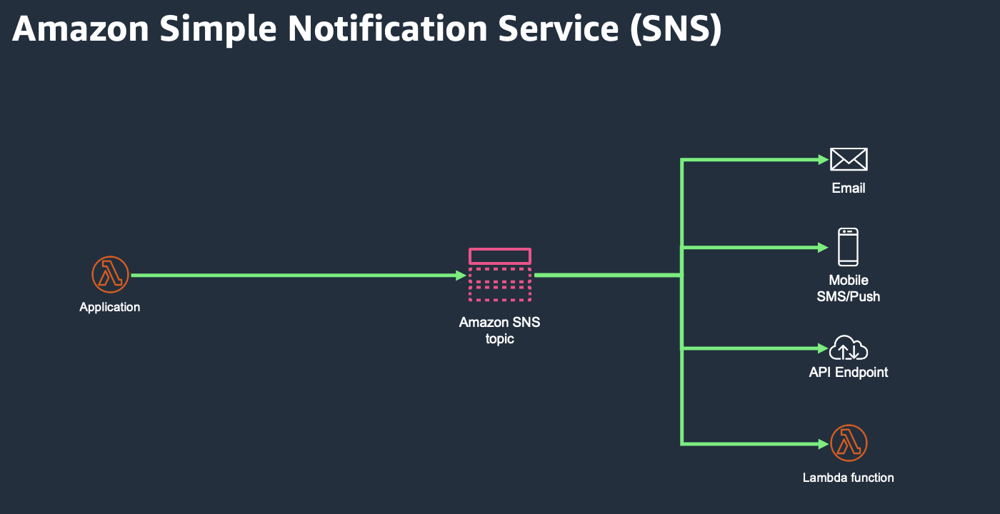
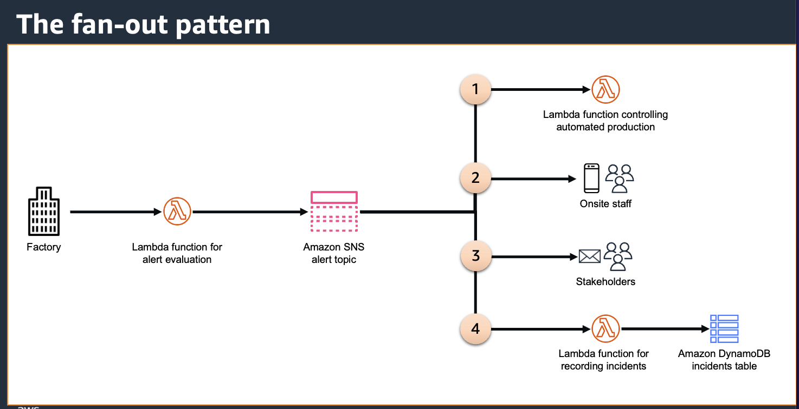
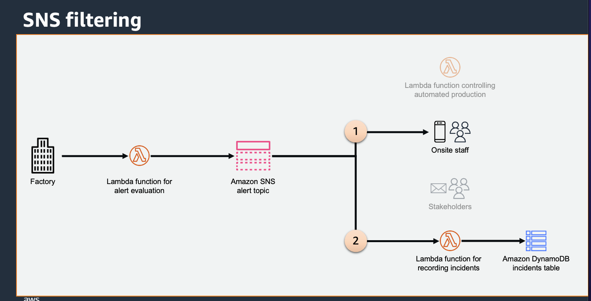

## Amazon SNS 101

### Amazon SNS

Amazon Simple Notification Service (SNS) is a fully managed messaging service for both application-to-application and application-to-person communication.

SNS starts with a topic. A developer can create a topic to use as a point of communication for their application. Next, subscribers subscribe to the topic.

These subscribers can be application to application with AWS Lambda, Amazon SQS, Amazon Kinesis Firehoses, or third-party HTTP and HTTPS endpoints.

These subscribers can also be application to person through email, SMS, or mobile push notifications.

A single topic can have many different subscribers and types of subscribers. These subscribers can be internal or external, depending on the permissions set by the developer.

With the topic in place, and the subscribers … subscribed. The application can now send a single message to the topic and have it relayed asynchronously to every listening subscriber. This pub/sub architecture provides many powerful use cases in event driven architecture.

### Fan out pattern

Let’s say I have an event in my application that triggers multiple independent processes internally and externally to my application. For example, I receive a system alert from an IoT sensor on my factory floor. I need to 1) stop the automated production line, 2) notify onsite staff immediately, 3) notify stakeholders, 4) save a record of the report.

In this example, my IoT device sends a message through an API endpoint that invokes a Lambda function. The Lambda function evaluates the message and publishes a message to the alert SNS topic. This message then invokes a subscribed Lambda function that shuts down operations and another Lambda function records the incident in an Amazon DynamoDB table. SMS messages are immediately sent to any phone numbers subscribed to the topic which alerts the onsite staff. Finally, my stakeholder’s email addresses are also subscribed to the topic and they will have an email waiting for them in the morning.

### Decoupling applications

Decoupling applications to increase application reliability and uptime. When building applications, it is easy to get caught in the trap of functions calling functions and building in unneeded dependencies in an application. This is no different when using serverless. An anti-pattern in serverless development is to invoke one Lambda function from another Lambda function.

### SNS Filtering

SNS offers many features to help move events through your application. One feature is the ability to filter events. To explain this, let’s go back to our factory floor example. Let’s say the system detects some issues but there is not a need to shut down operations. In this case a warning is sent to the alert topic. This will still alert the on-site staff, and record the incident in the log. However, using filters, I do not invoke the Lambda to shut down operations and the stakeholders will not have an email waiting for them.

### SNS Throughput

- A standard topic has a maximum per second throughput that is virtually unlimited
- Best effort ordering: occasionally, messages might be delivered in an order different from which they were published.
- FIFO topics will maintain strict ordering but can still handle up to 300 messages per second.

## Lab

- [Lab 01 - Crear un SNS topic y subscripcion](../../labs/31-sns/31-01-lab.md)
- [Lab 02 - Enviar una notificación cuando se sube un nuevo archivo](../../labs/31-sns/31-02-lab.md)

## More information and material

[Check this file](materiales.md)
