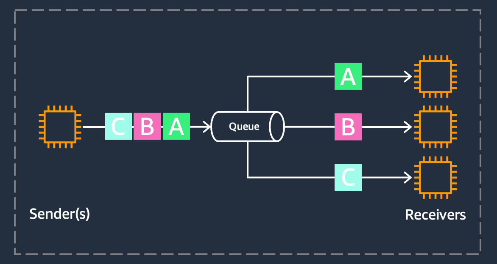
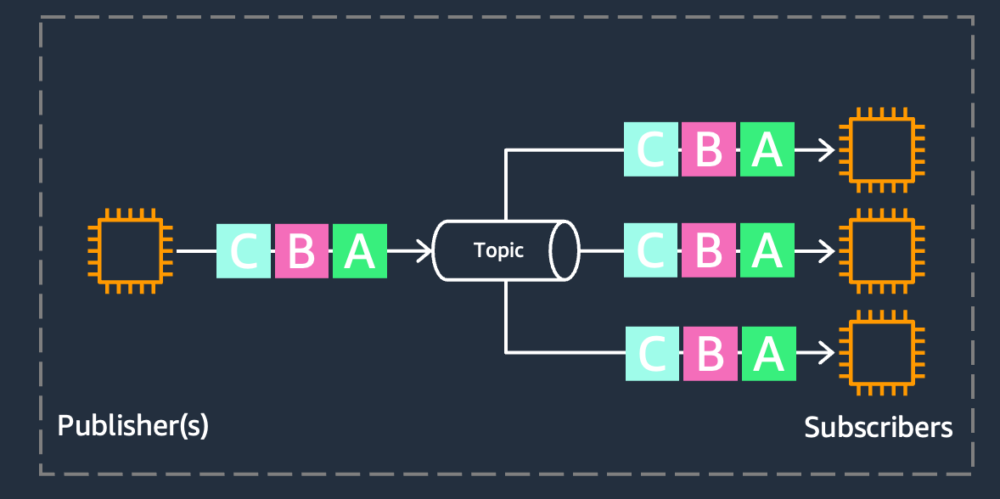
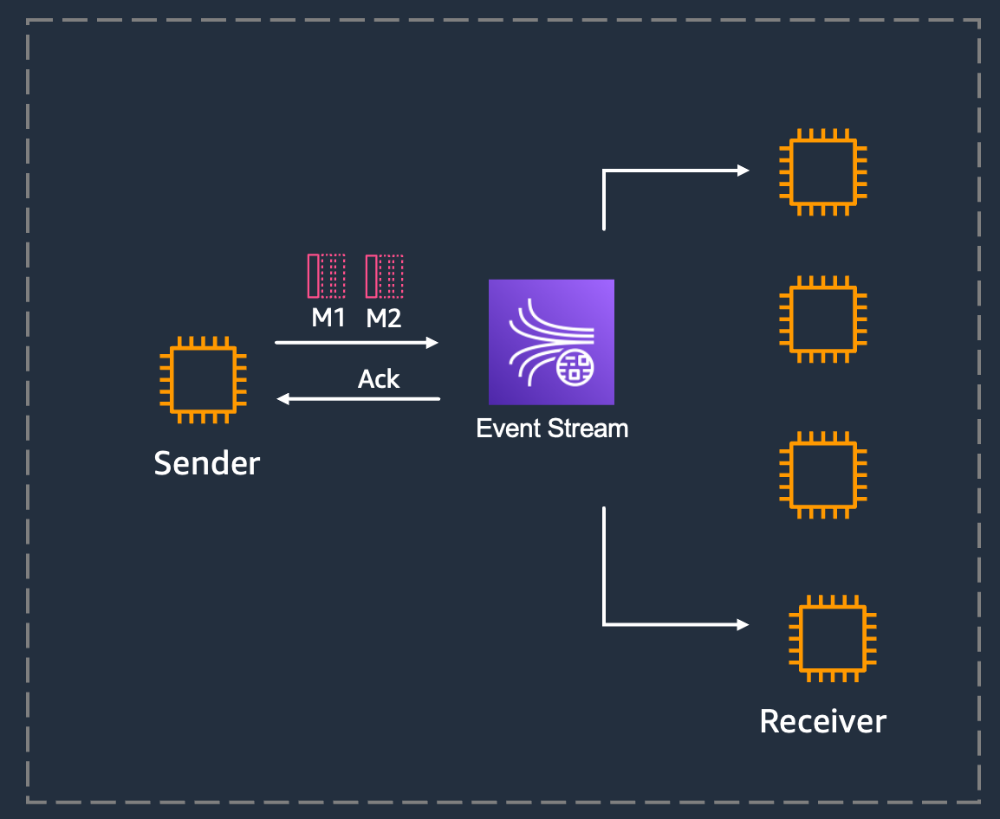
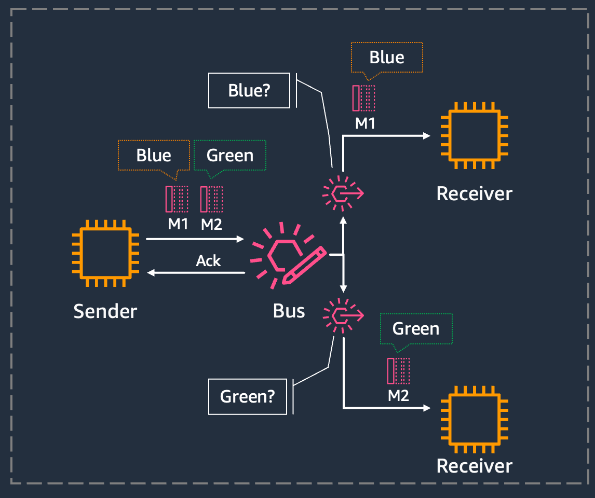
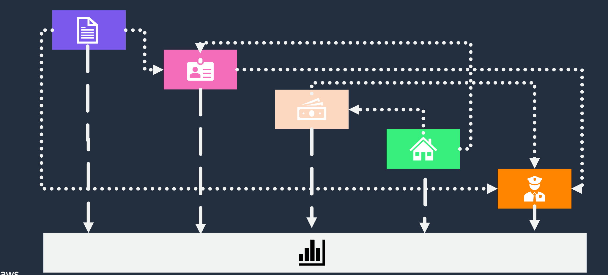
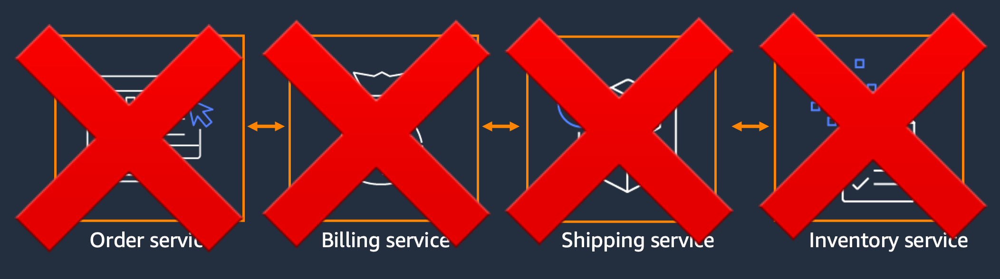

## Arquitecturas orientadas a eventos

### Patrones más comunes

**Point to point - Queues**

**Pub / Sub - Topics**

**Event streaming**

**Event bus**

## Introducción a arquitecturas orientadas a eventos

**Evento:** Una señal de que el estado de un sistema ha cambiado

Un evento es un cambio de estado o una actualización, como un artículo que se coloca en un carrito de compras en un sitio web de comercio electrónico. Los eventos pueden incluir el estado (el artículo comprado, su precio y una dirección de entrega) o los eventos pueden ser identificadores (una notificación de que se envió un pedido).

### Componentes principales

Las arquitecturas basadas en eventos tienen tres componentes:

- productores de eventos
- enrutadores de eventos
- consumidores de eventos.

Un productor publica un evento en el router, que filtra y envía los eventos a los consumidores. Los servicios productor y consumidor de eventos están desacoplados, lo que permite ampliarlos, actualizarlos e implementarlos de forma independiente.

### Beneficios de las EDA

Beneficios de una arquitectura basada en eventos

**Escale y falle de forma independiente:**
Al desvincular sus servicios, solo conocen el enrutador de eventos, no entre sí.
Esto significa que sus servicios son interoperables, pero si un servicio falla, el resto seguirá funcionando.

El enrutador de eventos actúa como un búfer elástico que se adapta a los aumentos repentinos de las cargas de trabajo.

**Desarrolle con agilidad:** Ya no necesita escribir código personalizado para sondear, filtrar y direccionar los eventos; el enrutador de eventos filtrará automáticamente los eventos y los enviará a los consumidores. El router también elimina la necesidad de una fuerte coordinación entre los servicios al productor y al consumidor, lo que acelera el proceso de desarrollo.

**Audite con facilidad:** Un enrutador de eventos actúa como una ubicación centralizada para auditar su aplicación y definir políticas. Estas políticas pueden restringir quién puede publicar y suscribirse a un enrutador y controlar qué usuarios y recursos tienen permiso para acceder a sus datos. También puedes cifrar tus eventos tanto en tránsito como en reposo.

**Reduzca los costos:** Las arquitecturas basadas en eventos se basan en la tecnología push, por lo que todo sucede a pedido cuando el evento se presenta en el router. De esta manera, no pagas por checkear de forma continua para comprobar si hay un evento. Esto significa menos consumo de ancho de banda de red, menos uso de la CPU, menos capacidad de flota inactiva y menos apretones de manos SSL/TLS.

### Ejemplo: Porqué necesitamos microservicios desacoplados?

Si trabaja con monolitos, sabrá que, en la mayoría de los casos, las implementaciones afectan a todo a la vez. Si despliegas todo el código en un servidor, las partes individuales de la aplicación se ven afectadas de una sola vez.
Los monolitos tienen mala reputación, pero los terminamos usando porque son fáciles de construir y razonar sobre ellos.

El problema es que los monolitos no escalan (tanto en rendimiento como en tamaño del equipo). Si tiene sistemas grandes con docenas o cientos de ingenieros para crear funciones en paralelo, debe pasar al modelo de microservicios.

Por eso, hemos estado avanzando hacia arquitecturas impulsadas por microservicios.
Los sistemas distribuidos de microservicios son mucho más complejos

Los microservicios permiten una mayor agilidad y escalabilidad para sus cargas de trabajo, lo que permite que cada servicio escale y falle de forma independiente.

Sin embargo, puede resultar más difícil coordinar y depurar estos sistemas, tanto en términos de agregar código y funciones nuevos, de observabilidad y monitoreo, como de saber lo que sucede en su carga de trabajo.

La resiliencia de las aplicaciones también se puede incrementar con una arquitectura de microservicios desacoplados. Ya que si tenemos muchos microservicios que dependen unos de los otros, cuando falla uno, fallan todos.

## More information and material

[Check this file](materiales.md)
