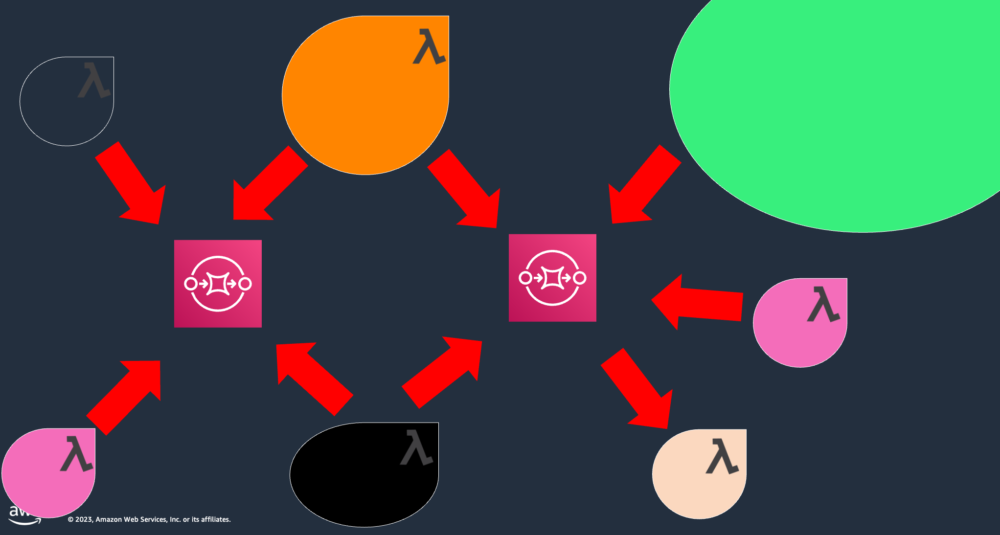

## Orquestación de tareas

### Cómo coordinar tareas?

Por ejemplo: Quiero reservar unas vacaciones en el Gran Cañón...
... pero cancelar mis reservas si no puedo alquilar un auto.

Cómo lo hago de forma serverless y orientado a eventos?!
Cómo lo hago de forma que escale, que sea mantenible?

**Coordinación mediante método de llamada**

Podrías simplemente vincular tus funciones, y eso no está mal, pero eso no te da funciones modulares e independientes, cada una de las cuales hace una cosa bien.

**Coordinación mediante encadenamiento de funciones**
Si invocas una Lambda desde otra y lo haces de forma sincrónica, eso no se escala, porque puede que quiera llamar a otra, a otra, y así sucesivamente.

Así que lo haces de forma asíncrona, lo que en realidad es un mejor diseño, pero luego el manejo de errores se vuelve difícil. Incluso la detección de errores requiere un montaje adicional.

**Coordinación por base de datos**
Además, puede hacer un seguimiento de su estado escribiéndolo en una base de datos (por ejemplo, Amazon DynamoDB u otra base de datos relacional) o incluso puede usar SQL, especialmente si necesita transacciones. La gente está haciendo esto y está obteniendo buenos resultados, pero una vez más, pero aún queda mucho trabajo por hacer.

**Coordinación por colas**
Otro enfoque es pasar tu estado y control a través de colas o eventos. Una vez más, esto implica una gran cantidad de gestión. Si la función que lee la cola falla, tienes que detectarlo y volver a escribir el estado del mundo en la cola, y si quieres que se agote el tiempo de espera y volver a intentarlo, tendrás que hacerlo tú mismo.

### Coordinar tareas

### Patrón de orquestación

Tenemos una entidad central que controla una máquina de estados donde podemos definir las tareas a coordinar...

**Máquina de estado**
Describe una colección de datos computacionales, pasos divididos en estados discretos
Tiene un estado inicial y siempre un estado activo (durante la ejecución)
El estado activo recibe la entrada,realiza alguna acción y genera resultados
Las transiciones entre estados se basan en resultados de estado y reglas que definimos

## More information and material

[Check this file](materiales.md)
