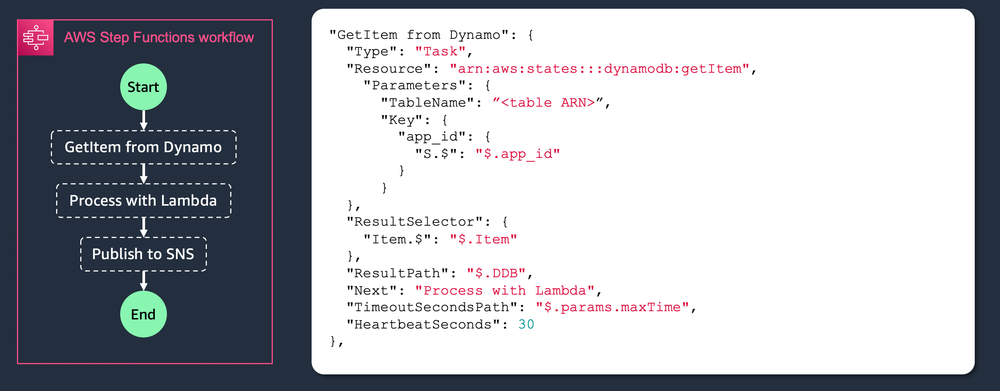

## AWS Step Functions

AWS Step Functions proporciona máquinas de estado totalmente administradas en la nube.
Step Functions le permite coordinar varios servicios de AWS en máquinas de estado serverless para que pueda crear y actualizar aplicaciones rápidamente.

Con Step Functions, puede diseñar y ejecutar flujos de trabajo que combinen servicios como AWS Lambda, AWS Fargate y Amazon SageMaker en aplicaciones con muchas funciones.

Puedes escribir flujos de trabajo resilientes con gestión de errores integrada y soporte para reintentos. Además, Step Functions puede proporcionar un historial de ejecución audible con supervisión visual de las ejecuciones de su máquina de estado, lo que le permite rastrear y depurar visualmente cuando sea necesario.

### Máquinas de estado en Step Functions

Un workflow creado en AWS Step Functions:

- Está construido con una máquina de estado
- Se compone de pasos llamado estados
- Se define usando Amazon States Language (ASL)
- Se puede utilizar para orquestar varios servicios de AWS

Una máquina de estados, describe una colección de pasos computacionales divididos en estados discretos.

Tiene un estado inicial y siempre un estado activo (durante la ejecución) El estado activo recibe entradas, realiza alguna acción y genera salidas

Las transiciones entre los estados se basan en las salidas de estado y las reglas que definir

### Por ejemplo: procesamiento de imágenes

- Haz una miniatura
- Identifica las características
- Almacenar metadatos de imágenes


### Tipos de estados

- **Task**: Execute work
- **Choice**: Add branching logic
- **Wait**: Add a timed delay
- **Parallel**: Execute branches in parallel
- **Map**: Process each of an input array's items with a state machine
- **Succeed**: Signal a successful execution and stop
- **Fail**: Signal a failed execution and stop
- **Pass**: Pass input to output

#### Task state

A Task state ("Type": "Task") represents a single unit of work performed by a state machine.

The Task state performs work. This could be calling an AWS Lambda function, which is a very common use case. But you can also use Task states to wait for a polling worker process, running basically anywhere, to pick work up from a Step Function, perform some computation, and return a result back to the workflow. And, a Task state can also be used to invoke APIs in other AWS services that Step Functions is integrated with.



#### Parallel state

The Parallel state ("Type": "Parallel") can be used to create parallel branches of execution in your state machine.

A Parallel state provides each branch with a copy of its own input data.
If any branch fails, the entire Parallel state fails.
Upon failure, use a Wait state so that cleanup work happens after the Lambda function has finished.


#### Choice state

A Choice state ("Type": "Choice") adds branching logic to a state machine.


#### Map state

The Map state ("Type": "Map") can be used to build dynamically parallel fanout and scatter-gather patterns in minutes.


### Step Function triggers

You can configure several services to invoke state machines.
Services that you can configure to invoke Step Functions include:

- AWS Lambda, using the `StartExecution` call.
- Amazon API Gateway
- Amazon EventBridge
- AWS CodePipeline
- AWS IoT Rules Engine
- AWS Step Functions

### Integraciones de Step Functions

#### Integraciones optimizadas


Customized by Step Functions to provide additional functionality and UI elements in Workflow Studio.
Support for 17 AWS services.
No performance benefit over SDK integrations.

`arn:aws:states:::serviceName:apiAction.[serviceIntegrationPattern]`

#### Integraciones optimizadas

Use standard AWS API calls directly in your workflows.
Write less custom code: reduces need for Lambda functions.
Support for over 200 AWS services and over 10,000 API actions.

`arn:aws:states:::aws-sdk:serviceName:apiAction.[serviceIntegrationPattern]`

### Service integration patterns

- Request response: Step Functions will wait for an HTTP response and then progress to the next state.Step Functions won’t wait for a job to complete
- Run a Job (.sync): Call a service and have Step Functions wait for a job to complete.
- Wait for callback: Call a service with a task token and have Step Functions wait until that token is returned with a payload.

#### Request response

When you specify a service in the "Resource" string of your task state, and you only provide the resource, Step Functions will wait for an HTTP response and then progress to the next state. Step Functions will not wait for a job to complete.


The following example shows how you can publish an Amazon SNS topic.

```
"Send message to SNS":{
   "Type":"Task",
   "Resource":"arn:aws:states:::sns:publish",
   "Parameters":{
      "TopicArn":"arn:aws:sns:us-east-1:123456789012:myTopic",
      "Message":"Hello from Step Functions!"
   },
   "Next":"NEXT_STATE"
}
```

This example references the `Publish API` of Amazon SNS. The workflow progresses to the next state after calling the Publish API.

#### Run a job (.sync)

For integrated services such as AWS Batch and Amazon ECS, Step Functions can wait for a request to complete before progressing to the next state. To have Step Functions wait, specify the "Resource" field in your task state definition with the .sync suffix appended after the resource URI.


For example, when submitting an AWS Batch job, use the "Resource" field in the state machine definition as shown in this example.

```
"Manage Batch task": {
  "Type": "Task",
  "Resource": "arn:aws:states:::batch:submitJob.sync",
  "Parameters": {
    "JobDefinition": "arn:aws:batch:us-east-2:123456789012:job-definition/testJobDefinition",
    "JobName": "testJob",
    "JobQueue": "arn:aws:batch:us-east-2:123456789012:job-queue/testQueue"
  },
  "Next": "NEXT_STATE"
}
```

Having the .sync portion appended to the ARN means that Step Functions waits for the job to complete. After calling AWS Batch submitJob, the workflow pauses. When the job is complete, Step Functions progresses to the next state.

#### Wait for callback (.callbackToken)

Callback tasks provide a way to pause a workflow until a task token is returned. A task might need to wait for a human approval, integrate with a third party, or call legacy systems.
For tasks like these, you can pause Step Functions until the workflow execution reaches the one year service quota, and wait for an external process or workflow to complete.


### Input and output processing

- A Step Functions execution receives a JSON text as input and passes that input to the first state in the workflow.
- Individual states receive JSON as input from the previous state and usually pass JSON as output to the next state.
- The output of the workflow’s last state becomes the result of the Step Functions execution.
- ASL provides tools to filter, manipulate and transform input and output between states.


#### Anatomy of a task state


**InputPath**
Use the InputPath filter to select a portion of the JSON state input to use.
Specify which part of the JSON to use with a JSONPath expression.
If not provided, state gets raw input, as-is.
If null, state gets an empty JSON {}.


**Parameters**
Use the Parameters fields to create a collection of key-value pairs that are passed as input to an AWS service integration.
The values can be static, or they can be selected from the filtered input using a JSONPath expression.
When the value is selected with a JSONPath expression, the key name must end in “.$”.


**ResultSelector**
Use the ResultSelector filter to construct a new JSON object using parts of the task result.
The values can be static, or they can be selected from the task result using a JSONPath expression.
When the value is selected with a JSONPath expression, the key name must end in “.$”.


**ResultPath**
Use ResultPath to add the result into the original state input.
The specified path indicates where to add the result.
If unspecified or $, the result becomes the output and the input is discarded.
If null, state’s input becomes state’s output and task’s output is discarded.
If a JSONPath expression, the result will be inserted into the state input.


**OutputPath**
Use OutputPath to filter the final result before it becomes the state’s output


#### Context object


#### Intrinsic functions


### Workflow types

|                               |                             Standard                              |                                                              Express                                                              |
| :---------------------------: | :---------------------------------------------------------------: | :-------------------------------------------------------------------------------------------------------------------------------: |
|       Maximum duration        |                             365 days                              |                                                             5 minutes                                                             |
|     Execution start rate      |                       Over 2,000 per second                       |                                                      Over 100,000 per second                                                      |
|     State transition rate     |                 Over 4,000 per second per account                 |                                                         Nearly unlimited                                                          |
|            Pricing            | Priced by state transition Eg. $0.025 per 1,000 state transitions |               Priced by number and duration of executions. Eg. $1.00 per 1M requests + $0.0600 per GB-hour (tiered)               |
|           Free Tier           |                      4.000 state transitions                      |                                                           No free tier                                                            |
|      Execution semantics      |                  Exactly-once workflow execution                  | Asynchronous Express Workflows: At-least-once workflow execution. Synchronous Express Workflows: At-most-once workflow execution. |
|     Service integrations      |                Supports all service integrations.                 |                                                Supports all service integrations.                                                 |
| Service integrations Patterns |                       Supports all patterns                       |                                 Does not support Job-run (.sync) or Callback (.wait For Callback)                                 |
|          Invocation           |                   Asynchronous invocation only                    |                                              Asynchronous and synchronous invocation                                              |

#### Examples of use cases

**Standard workflows**

- IT automation
- Report generation
- Order processing
- Payment and billing processing
- ML model training
- ETL and big data orchestration (AWS Glue, Amazon EMR)
- Media processing (video, image, audio)

**Express workflows**

- Event driven microservices orchestration
- High volume data processing
- IoT data ingestion
- Order / cart validation
- Payment reconciliation

## Lab

- [Lab 01 - Crear una máquina de estados](../../labs/34-step-functions/34-01-lab.md)
- [Lab 02 - Modificar la máquina de estado](../../labs/34-step-functions/34-02-lab.md)
- [Lab 03 - Parametros, inputs y outputs](../../labs/34-step-functions/34-03-lab.md)

## More information and material

[Check this file](materiales.md)
