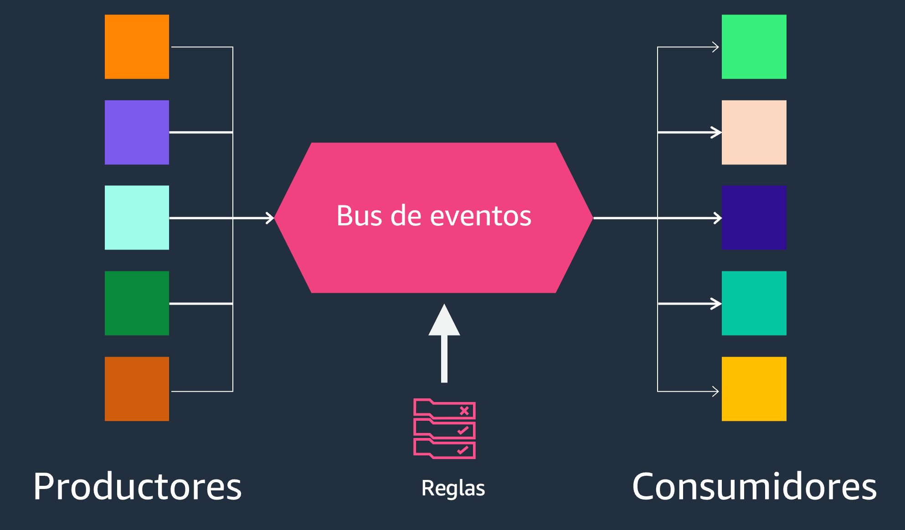
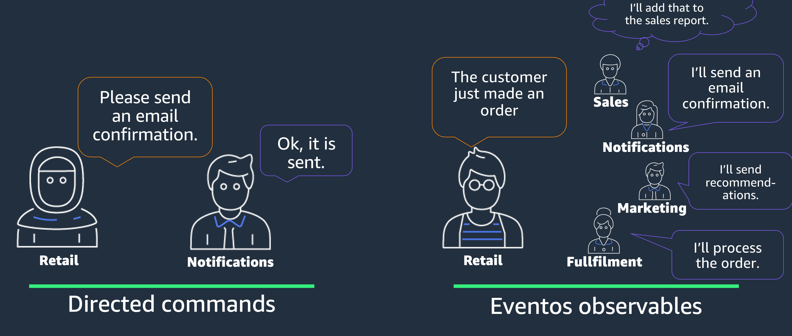
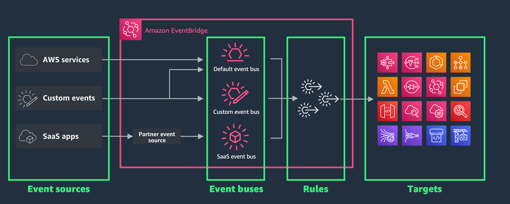
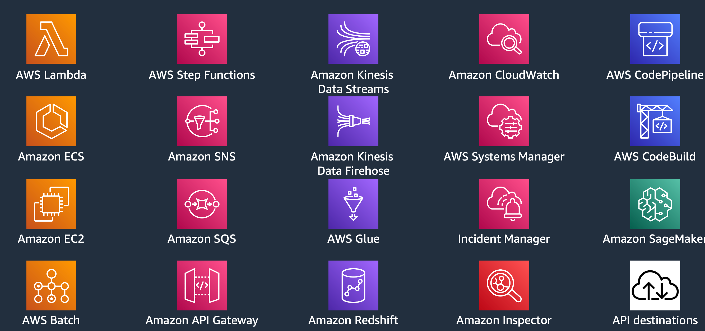
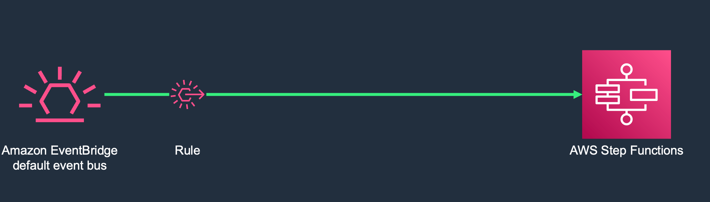
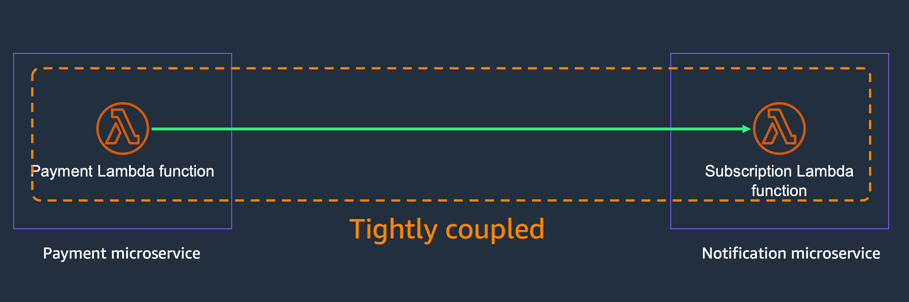
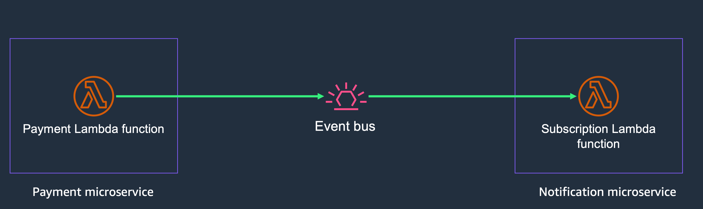
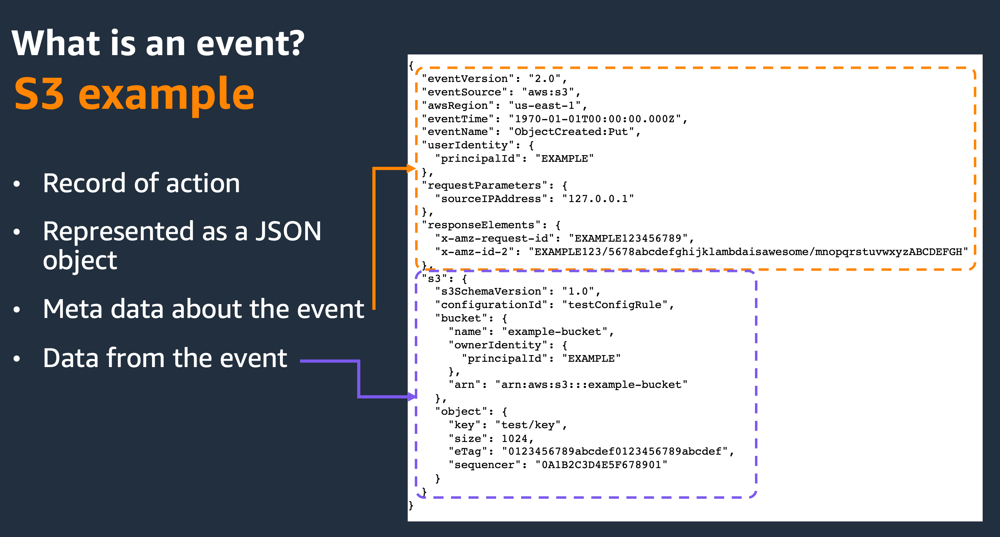
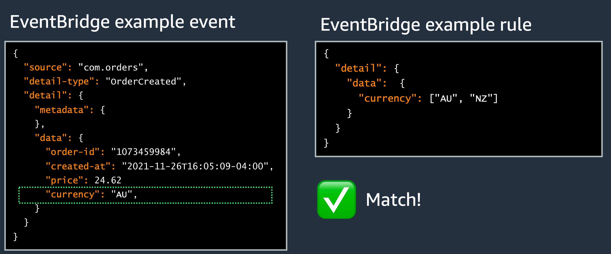

## Amazon EventBridge

### Qué es un bus de eventos?

Ya vimos que un evento es una señal de que el estado de un sistema ha cambiado.

Un bus de eventos tiene eventos diferentes que fueron generados por distintos productores de eventos. Un evento entra el bus, y el bus lo redirecciona a los consumidores de ese evento.

Estos eventos pueden venir de servicios internos de AWS, de servicios SaaS como Salesforce o Zendesk, o pueden venir de tus aplicaciones.

En resumen el bus de eventos se encuentra en el medio, entre los productores y los consumidores, lo que permite que los productores no tengan que conocer a todos los consumidores, y los consumidores no se tienen que registrar como subscriptores.

### Eventos vs Commandos

Los eventos son observables y no son dirigidos

### Amazon EventBridge

Es un bus de eventos totalmente Serverless

Paga solo por los eventos que procesas
Escala automáticamente
Sin inversiones iniciales, licencias continuas, ni costes de mantenimiento
No se necesitan conocimientos especializados

Tiene integracion con más de 20 servicios y API destinations

### Llamar una máquina de estado

Using EventBridge, data can be sent to any number of targets. For example, a common pattern is to invoke an AWS Step Function workflow. When a rule targeting a Step Function workflow matches an event in the EventBridge bus, the workflow is invoked directly by the EventBridge service and the event is passed in as the input. Using this pattern, developers can build asynchronous, event-driven applications using real time data.

### Desacoplar microservicios y sistemas

Developers are also able to decouple their applications to increase application reliability.

When designing applications, even using serverless, developers can often make the mistake of tightly coupling their applications. For example, two Lambda functions. One handles payments, the other handles subscriptions. It would be very easy for my application to first take the payment using the first Lambda function.

By doing it this way, I have tightly coupled this portion of my application.

If my subscription fails, then there is a chance the payment process might get messed up as well.
This causes my application to be brittle.

A better option is for the payment service to drop a request on an EventBridge bus requesting a subscription to be created. If the subscription Lambda fails or is unavailable, the payment Lambda can still go about its business.

This brings about another feature of Amazon EventBridge. If a target service fails, EventBridge can be configured to retry after a certain period of time. If the process still continues to fail, the event can then be dropped into a dead letter queue for troubleshooting as needed.

### What is an event for EventBridge?

### And howevents matches rules?

A rule matches incoming events and sends them to targets for processing.

A single rule can send an event to multiple targets, which then run in parallel.

Rules are based either on an event pattern or a schedule.

- An event pattern defines the event structure and the fields that a rule matches.
- Rules that are based on a schedule perform an action at regular intervals.

## Lab

- [Lab 01 - Crear una regla en EventBridge que se active cuando se crea un objecto en S3](../../labs/42-eventbridge/42-01-lab.md)

## More information and material

[Check this file](materiales.md)
