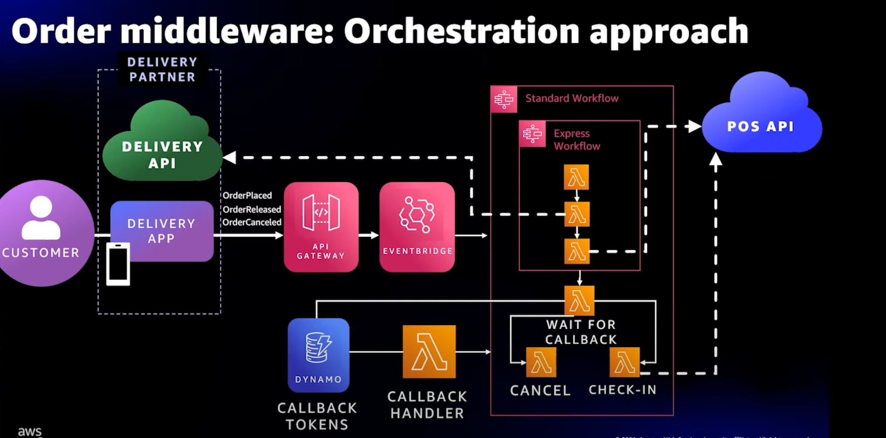
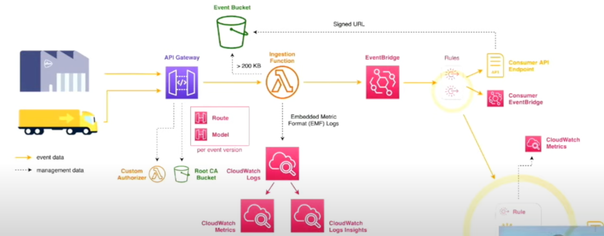
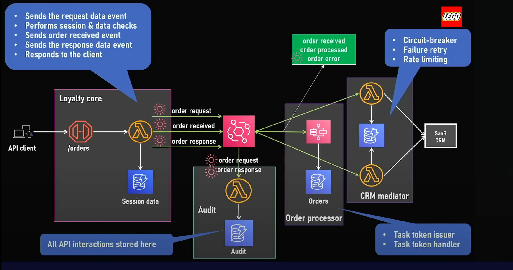
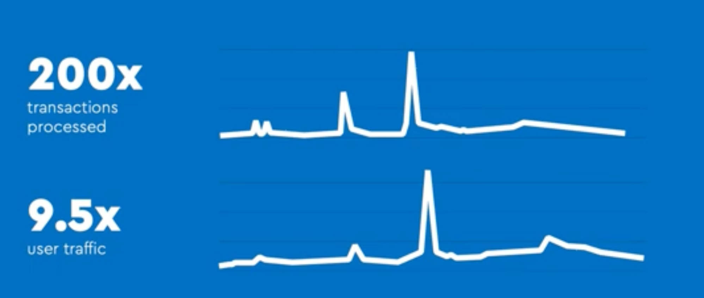
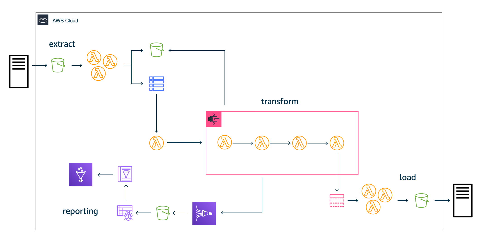
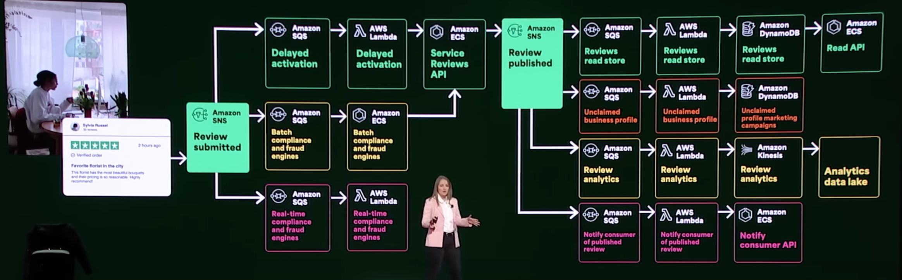

# Arquitecturas de ejemplo

Aca les dejo algunas arquitecturas de ejemplo que usan arquitecturas orientadas a eventos. Pero hay muchísimas más. Les dejo al final una lista con donde encontrar más.

## Taco Bell ordering process is EDA and Serverless First

1 Billion orders per year

[Learn more about their architecture here](https://www.youtube.com/watch?v=U5GZNt0iMZY)

## PostNL parcel management is EDA

1.1 million parcels per day

[Learn more about their architecture here](https://www.youtube.com/watch?v=nyoMF1AEI7g)

## Lego EDA architecture for e-commerce

1.1 million parcels per day

Challenge of lots of spikes in special days like Black friday.

[Learn more about their architecture here](https://youtu.be/6iKTZwT1vp8)
[Learn more about their architecture here](https://youtu.be/HcbnrJdNBRI)
[Learn more about their architecture here](https://www.youtube.com/watch?v=_g6DA9WM7RE)
[Learn more about their architecture here](https://youtu.be/20KBtJOxUpw)

## Liberty mutual Serverless transaction processing

Processes 100 million transactions per month
Reduced computing costs per million transactions to $60
Decreased application build time to 3 months from 1 year

[Learn more about their architecture here](https://aws.amazon.com/solutions/case-studies/liberty-mutual-case-study/)

## Trustpilot EDA architecture

47 millions of reviews only in 2021

[Learn more about their architecture here](https://youtu.be/RfvL_423a-I)
[Learn more about their architecture here](https://youtu.be/829PZR1Esb4)

## More architectures

- [Serverlessland.com](https://serverlessland.com/event-driven-architecture#who-is-building-eda)
- [This is my architecture playlist](https://www.youtube.com/playlist?list=PLhr1KZpdzukdeX8mQ2qO73bg6UKQHYsHb)
- [AWS Reinvent 2023](https://www.youtube.com/playlist?list=PL2yQDdvlhXf_hIzmfHCdbcXj2hS52oP9r)
