# Lab 8.1 - Cloudwatch

## Storytelling

A raiz del boom de Pokemon Go, nuestra empresa ha decidido publicar un servicio web que ofrece información relativa a la Pokedex. De esta manera, el CEO puede publicitar su empresa dentro de los circulos de jugadores de Pokemon. 

Resulta que la aplicación está gustando, aunque algunas personas se quejan de errores puntuales. Dado que no tenemos ningún sistema de monitorización activado no podemos encontrar la causa de estos errores.

Dada la situación, el CTO nos ha pedido implementar mecanismos para monitorizar y detectar los errores de nuestra aplicación. 


## Objetivos
Es esta práctica, aprenderemos a monitorizar aplicaciones e infraestructura, utilizando las herramientas SaaS que nos ofrece AWS. 
Aprenderemos los principios básicos de Cloudwatch para el análisis de métricas y logs. También veremos las posibilidades que nos oferece CloudWatch Alarms junto con EventBridge para el tratamiento de eventos inesperados.

## Creación del entorno

En esta práctica partiremos de un entorno simple con una única VM EC2. Esta máquina virtual tiene instalado un servidor NGINX con una web estática generada a partir del framework Angular.

Primero, clonaremos el repositorio con la aplicación:

```bash
$ git clone https://github.com/TheMatrix97/pokedex-tf-app
$ cd ./pokedex-tf-app/src
```

Desplegamos nuestra aplicación con Terraform

```bash
$ terraform init && terraform apply
```
Si todo ha ido bien, el script de terraform nos devolverá el host de nuestra aplicación, desplegada en una nueva instancia EC2.

Accediendo vía web, deberíamos ver algo parecido a esto:

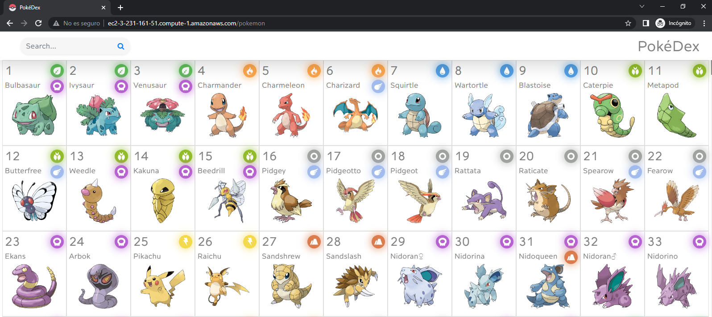


## Lab

1-

Antes de nada, activaremos el "monitoreo detallado" para poder obtener datos de monitorización en intervalos de 1 minuto para incrementar el número de datos que recibimos.
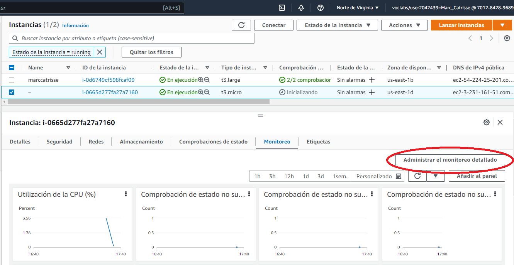

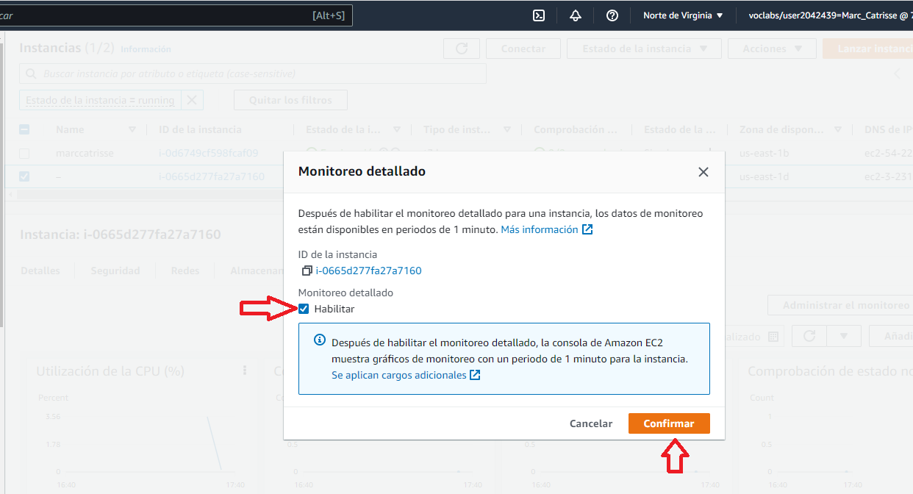

Como podéis ver en la pestaña monitoreo dentro del panel de EC2, podemos ver un pequeño resumen de las métricas disponibles.

2- 

Navegaremos hacia **CloudWatch > Métricas > Todas las métricas**. Dónde podemos hacer una búsqueda por 'id' de instancia para poder obtener todas las métricas asociadas a nuestra aplicación. 

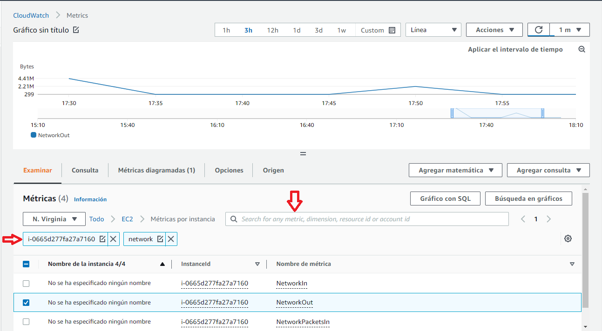

Hacer una revisión de las métricas disponibles, ¿echáis en falta alguna?
Como podéis ver, aquí faltan métricas importantes. En concreto, todas aquellas que nos podemos encontrar a nivel de sistema operativo, 
como por ejemplo, el espacio disponible de disco. 
Para ello, tenemos que instalar **CloudWatch Agent**

### Instalación de CloudWatch Agent

3-

A continuación, instalaremos CloudWatch Agent en nuestra máquina. Para ello, introduciremos **AWS Systems Manager**, que nos permite la instalación de paquetes de forma remota sin acceder vía SSH.

3.1-

Haciendo uso del buscador, accederemos al servicio de **AWS Systems Manager** (https://us-east-1.console.aws.amazon.com/systems-manager/home?region=us-east-1)

3.2-

Una vez ahí, buscaremos la opción `Run command` bajo el apartado `Administración de nodos`

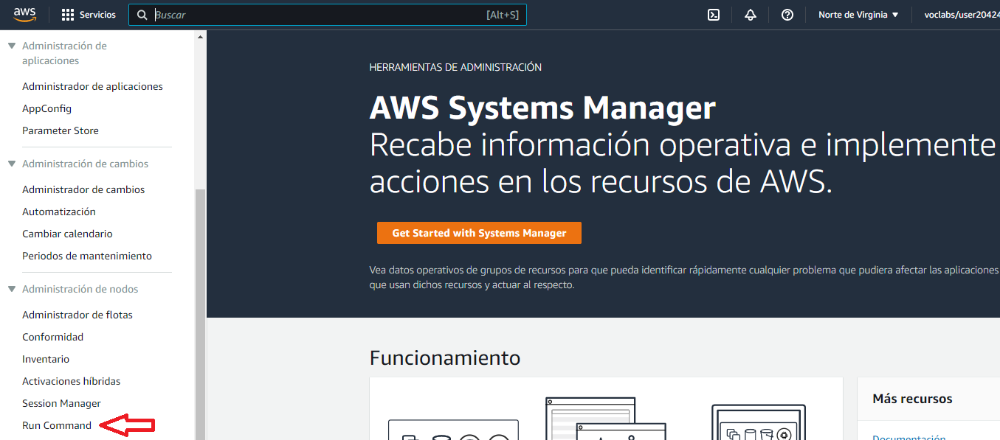

3.3-

Buscaremos el paquete `AWS-ConfigureAWSPackage`, lo seleccionamos y nos vamos a la parte inferior a configurar las opciones.

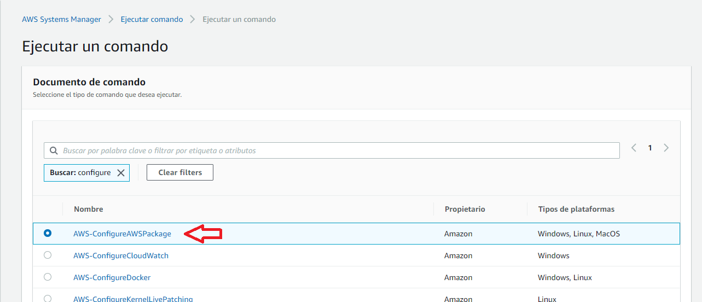

3.4-

Indicamos el paquete a instalar con su versión: `AmazonCloudWatchAgent`, `latest`

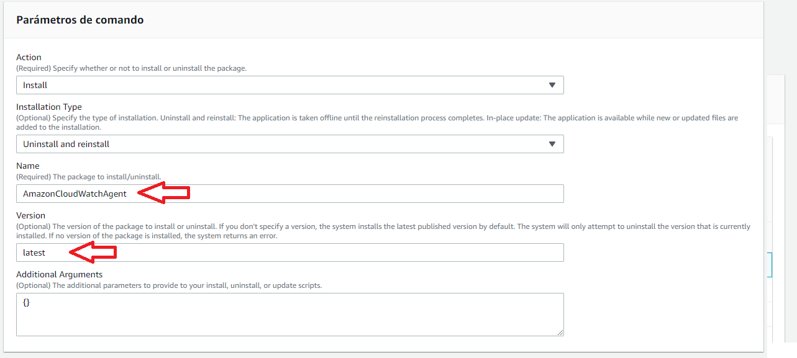

3.5 -

Seguidamente, seleccionamos el `target`, que en nuestro caso será la instancia `PokeApp`, y ejecutamos el comando.

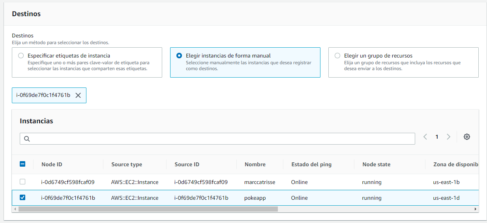

Si todo ha ido bien, veremos que el comando acaba con estado `correcto`, haciendo click sobre el ID de la instancia podemos acceder a los logs de ejecución para verificar que todo ha ido bien.

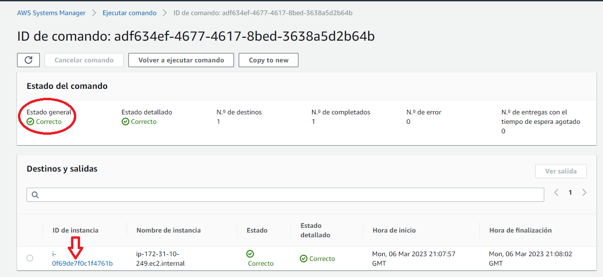


Ahora mismo, nuestra instancia de EC2 dispone del agente de CloudWatch, pero no tiene ningún tipo de configuración. A continuación, vamos a definir una configuración para obtener los logs del servidor web Nginx junto a métricas relevantes. Puedes consultar la [Documentación](https://docs.aws.amazon.com/AmazonCloudWatch/latest/monitoring/CloudWatch-Agent-Configuration-File-Details.html) para más información acerca del significado de cada campo.
```json
{
  "logs": {
    "logs_collected": {
      "files": {
        "collect_list": [
          {
            "log_group_name": "NginxAccessLog",
            "file_path": "/var/log/nginx/access.log",
            "log_stream_name": "{instance_id}",
            "timestamp_format": "%d/%b/%Y:%H:%M:%S %z"
          },
          {
            "log_group_name": "NginxErrorLog",
            "file_path": "/var/log/nginx/error.log",
            "log_stream_name": "{instance_id}",
            "timestamp_format": "%Y/%m/%d %H:%M:%S"
          }
        ]
      }
    }
  },
  "metrics": {
    "aggregation_dimensions": [
      ["InstanceId"]
    ],
    "append_dimensions": {
      "InstanceId":"${aws:InstanceId}"
    },
    "metrics_collected": {
      "cpu": {
        "measurement": [
          "cpu_usage_idle",
          "cpu_usage_iowait",
          "cpu_usage_user",
          "cpu_usage_system"
        ],
        "metrics_collection_interval": 10,
        "totalcpu": true
      },
      "disk": {
        "measurement": [
          "used_percent",
          "inodes_free"
        ],
        "metrics_collection_interval": 10,
        "resources": [
          "*"
        ]
      },
      "diskio": {
        "measurement": [
          "io_time"
        ],
        "metrics_collection_interval": 10,
        "resources": [
          "*"
        ]
      },
      "mem": {
        "measurement": [
          "mem_used_percent"
        ],
        "metrics_collection_interval": 10
      },
      "swap": {
        "measurement": [
          "swap_used_percent"
        ],
        "metrics_collection_interval": 10
      }
    }
  }
}
```
4.1 - 

Accederemos a **AWS Systems Manager > Almacén de parámetros > Crear el parámetro**, para crear la configuración que posteriormente enviaremos al agente. Dentro del campo **Valor** añadiremos la configuración en Json que podemos encontrar en el paso anterior.
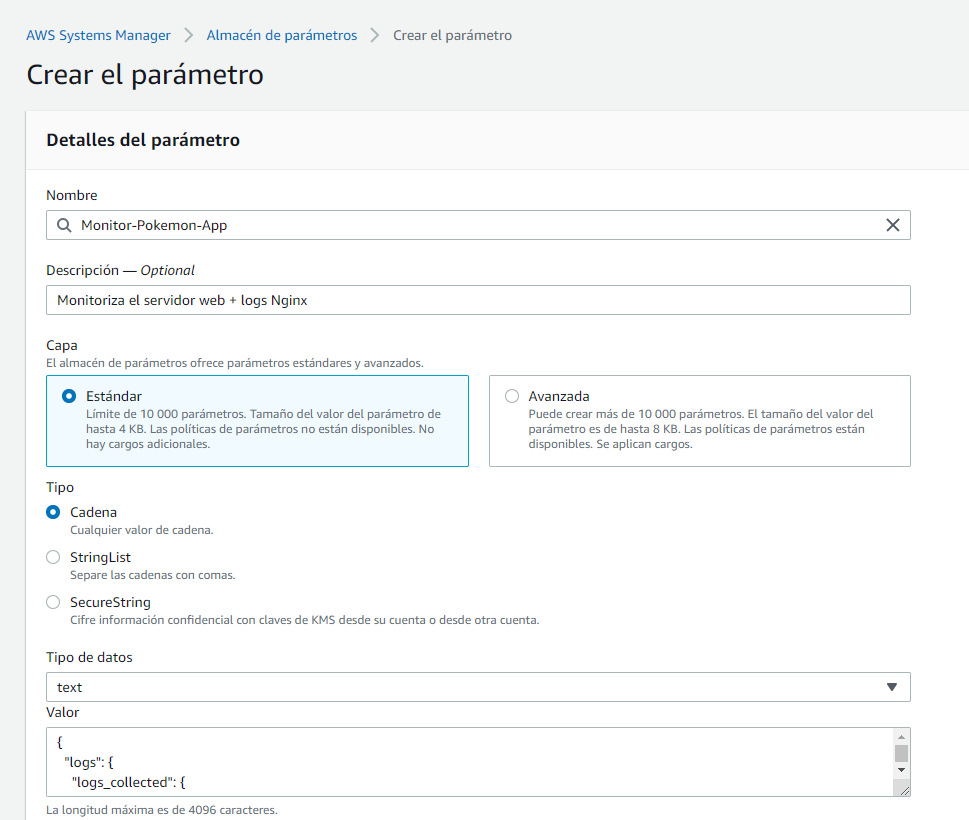

4.2 - 

Seguidamente, lanzaremos el comando de actualización de la configuración entrando en el apartado **AWS Systems Manager > Run command > AmazonCloudWatch-ManageAgent**. Dónde debemos incluir el nombre del parámetro que hemos creado anteriormente e indicar nuestra instancia PokeApp como `target`.


### Monitorización de logs de aplicación

5.1 -

En este punto, si todo ha ido bien, deberíamos de ver que nuestro agente de CloudWatch está exportando correctamente los logs del servidor web.
**CloudWatch > Grupos de registro > NginxAccessLogs**
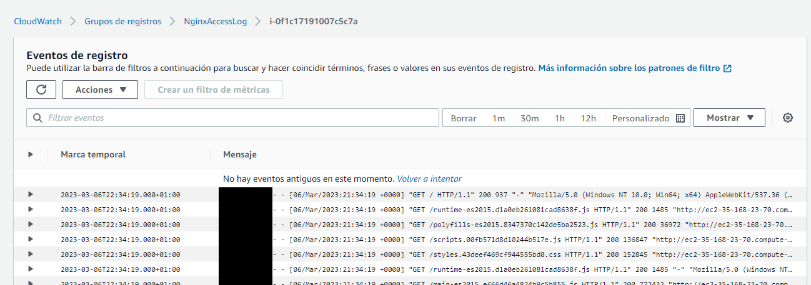
En el campo mensaje podemos observar el contenido de la línea de logs exportada. Además, como podéis observar, se parsea el `timestamp` de cada entrada para poder filtrar por tiempo, acorde a la configuración que hemos visto anteriormente.

5.2 -

Nuestra aplicación tiene una parte que no acaba de funcionar bien, parece que se trata de una funcionalidad que aún no está del todo operativa. Es el `endpoint` `/digimon`. Prueba a acceder y observa como aparecen los logs de las peticiones devolviendo errores `500`.


### Métricas derivadas de logs

5.3 -
A continuación, `crearemos una métrica` que nos indique el número de errores 500 en los logs. Para ello accedemos a **CloudWatch > Grupo de registros > NginxAccessLogs > Acciones > Crear un filtro de métricas**
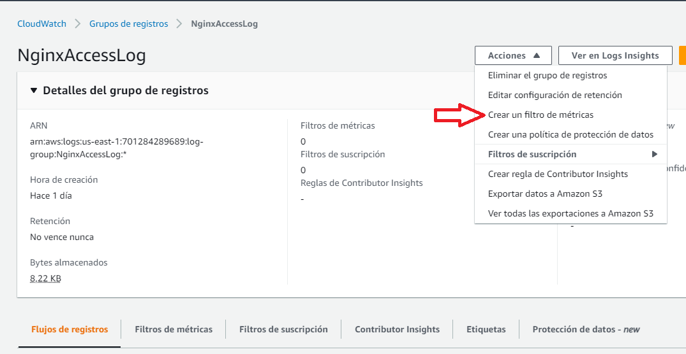

A continuación, introducimos el patrón a utilizar, en nuestro caso será `[ip, id, user, timestamp, request, status_code=500, size]`, de manera que solo se contabilizaran las entradas con error 500, añadiendo un valor de 1 a la métrica, tal como se muestra a continuación:
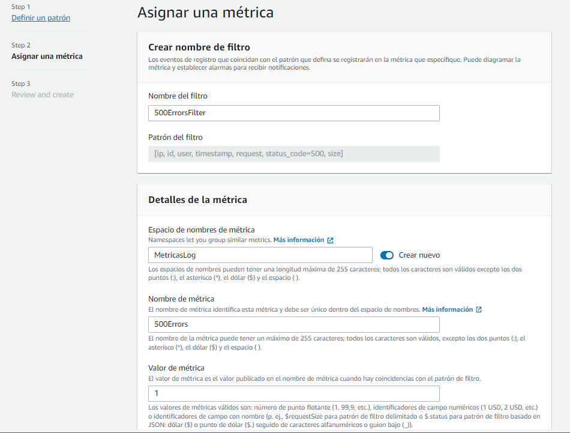

**¿Puedes encontrar un comando de AWS CLI para crear un filtro de métricas?**

<details><summary>Solución</summary>

```bash
# Create a filter
aws logs put-metric-filter \
  --log-group-name NginxAccessLog \
  --filter-name 500Errors \
  --filter-pattern "[ip, id, user, timestamp, request, status_code=500, size]" \
  --metric-transformations \
  metricName=Metric500Test,metricNamespace=MetricasLog,metricValue=1,defaultValue=0
```

</details>

5.4 - 

Si accedemos al apartado de consultas, podremos observar que la métrica captura correctamente el número de errores 500.

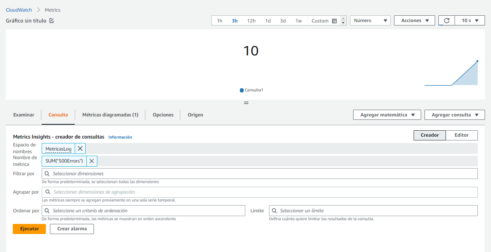

### Alarmas
En este apartado crearemos una alarma a partir de la métrica que hemos definido anteriormente, lanzando una alerta si se detecta un número determinado de errores en un intervalo de tiempo predefinido.

6.1 -

Para ello, accederemos a **CloudWatch > Alarmas > Crear Alarma**, seleccionaremos la métrica que hemos creado antes, en nuestro caso, `500Errors`. Configurando la condición de activación con los siguientes parámetros:
* Estadística: Suma
* Período: 1 minuto
* Tipo de límite: Estático
* Condición: Mayor (>) 10

6.2 -

Seguidamente, definiremos la acción a ejecutar, en nuestro caso, lo configuraremos para que envíe un mensaje cuando la condición se cumpla, mediante SNS.


**Importante**: En este punto, tendremos que ir nuestro correo electrónico para confirmar la subscripción al tema de SNS que hemos creado.

En este punto, deberíamos de poder acceder a **CloudWatch > Alarmas** y ver la Alarma que acabamos de crear.

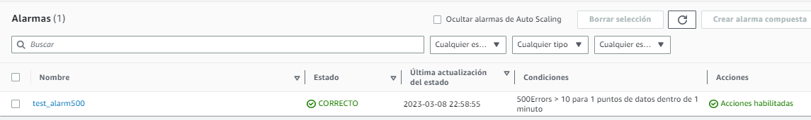

6.3 -

Vamos a intentar hacer que salte la alarma, vamos a acceder repetidamente al endpoint `/digimon` de nuestra pokeapp para generar errores 500 y hacer saltar la alarma.

En un minuto, deberíamos de ver como nuestra alarma pasa a modo alarma y recibimos un mail parecido a este:

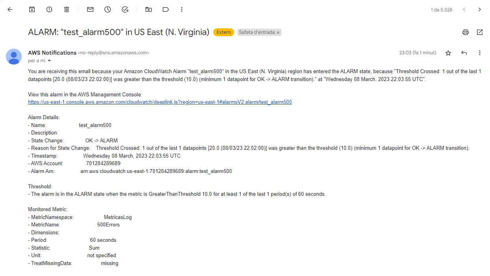


## Bonus 1 (Opcional)
Crea un panel que refleje las métricas **USE** de la instancia **PokeApp** para poder monitorizarla fácilmente. Al final deberías de acabar con un panel como el que se muestra a continuación  
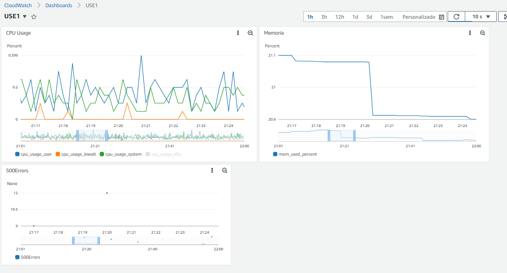

En este se deberan reflejar las siguientes métricas:
* **Utilization**: (CPU) -> cpu_usage_user, cpu_usage_iowait, cpu_usage_system
* **Saturation**: (Memoria) -> mem_used_percent
* **Errors**: Número de errores 500

Es recomendable utilizar un **periodo de 1 minuto** para visualizar las métricas

## Bonus 2 (opcional)

Si os habéis fijado, la PokeApp está abierta a todo el mundo, por lo que es muy probable que hayamos recibido alguna request de algún bot no deseado... A continuación, vamos a utilizar **Logs Insight** para consultar nuestros logs y obtener todos aquellos que provienen de una ip diferente a la nuestra, a ver si encontramos algún bot!

Acceder a la herramienta y **CloudWatch > Logs Insights** y con la ayuda de la [documentación](https://docs.aws.amazon.com/AmazonCloudWatch/latest/logs/CWL_QuerySyntax.html), encontrar una consulta que os permita listar todas las peticiones del `NginxAccessLog` que provengan de una IP diferente a la vuestra.


<details><summary>Solución</summary>

```text
fields @timestamp, @message
| filter @message not like "<ip>"
| sort @timestamp desc
```

</details>


