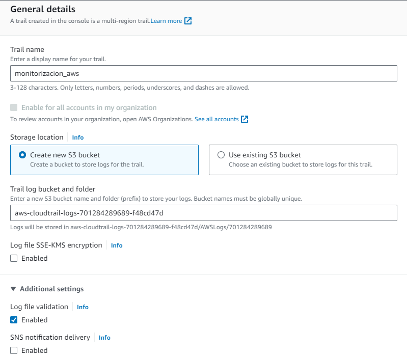
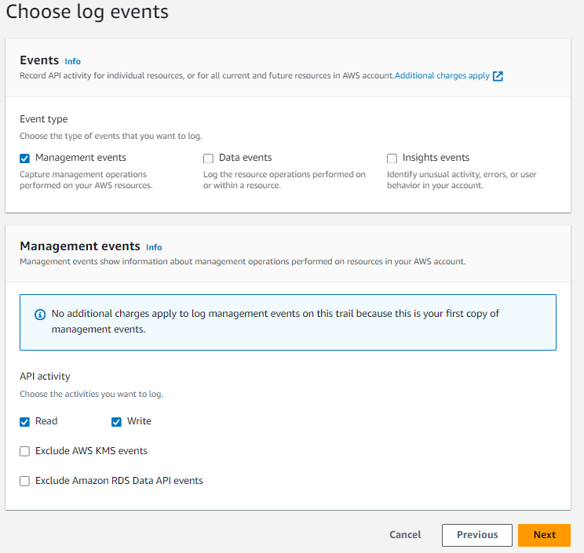
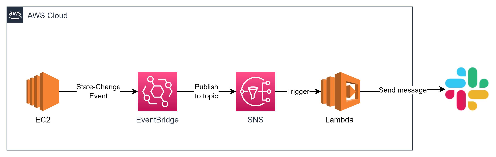

# Lab 8.2 - CloudTrail

## Objetivos
En esta práctica, aprenderemos a monitorizar la utilización de la API de AWS, mediante CloudTrail. 
Aprenderemos los principios básicos de CloudTrail y herramientas asociadas para lanzar consultas contra el servicio. Finalmente, aprenderemos como crear un pipeline de eventos con EventBridge, para que se nos notifique vía Slack cada vez que ocurra cierto evento.

## Storytelling
En el equipo de la empresa se ha detectado un gran número de bajas por depresión y estrés. A raíz de este hecho, el departamento de RRHH ha pedido instalar una pantalla en la oficina que proyecte imágenes aleatorias de gatitos 24/7. Según un estudio de la Universidad de Leeds, ver videos e imágenes de animales puede ayudar a reducir el estrés hasta un 50% (https://biologicalsciences.leeds.ac.uk/school-biomedical-sciences/news/article/273/what-are-the-health-benefits-of-watching-cute-animals).
Para este caso de uso, se ha manifestado la necesidad de desplegar una API que nos proporcione imágenes de gatitos aleatorias. 

Nuestro compañero Juan ha encontrado una API en GitHub que parece que cumple con el caso de uso (https://github.com/TheMatrix97/suspicious-api-js). La despliegan y pasado unos meses, descubren que el coste operativo de AWS se ha duplicado. ¿De quién ha sido la culpa? ¿Está relacionado con la API que desplegó Juan? No lo sabemos. ¿Cómo podemos prepararnos para estas situaciones y evitar que se vuelvan a repetir? En esta práctica aprenderemos como utilizar CloudTrail para poder monitorizar el uso que hacen usuarios y aplicaciones de nuestro entorno de AWS.

## Lab

### Configuración CloudTrail

1- Primero, crearemos una traza de CloudTrail en nuestra cuenta, para almacenar y posteriormente consultar la actividad en nuestra cuenta de AWS

1.1 - Buscamos el servicio de CloudTrail en el buscador integrado de AWS


1.2 - Abrimos el menú de la izquierda y accedemos al panel de CloudTrail


1.3 - En el panel, podremos observar el historial de eventos recientes registrados por CloudTrail, estos no se guardan y se pierden pasados 90 días. Si queremos almacenar los eventos y poder acceder a estos pasado el límite de días, debemos crear un registro o `trail`. Haremos click a la opción `Create trail` para crear uno.


1.4 - Indicamos el nombre del `trail` a crear, desactivando el cifrado SSE-KMS (para este laboratorio no será necesario).



1.5 - Seguidamente, indicaremos que solo queremos almacenar los eventos de administración, de tipo lectura y escritura. Hacemos click a siguiente, revisamos los datos y finalmente crearemos el `trail`



1.6 - En este punto, si vamos al panel de CloudTrail (`Cloudtrail > Dashboard`), veremos que nuestro registro de seguimiento se ha guardado correctamente. Además, podremos ver que se ha creado un Bucket S3 nuevo para persistir todos los datos de la traza.


### Consultas via CLI

Para consultas rápidas, podemos utilizar el comando `aws cli lookup-events`, aunque, este solo nos devolverá datos que hayan ocurrido en un intervalo de 90 días. 
Por ejemplo, podemos consultar los eventos que hagan referencia a un Login de la Consola:

```bash
aws cloudtrail lookup-events --lookup-attributes AttributeKey=EventName,AttributeValue=ConsoleLogin
```
Ten en cuenta que podemos filtrar la petición con el parámetro `query`, para que nos devuelva solo los campos que nos interesan. Por ejemplo:

```bash
aws cloudtrail lookup-events --lookup-attributes AttributeKey=EventName,AttributeValue=ConsoleLogin --query 'Events[].[Username,EventTime,CloudTrailEvent]'
```
Para cada evento de tipo `ConsoleLogin` devuelve la persona que ha hecho login, el timestamp y el evento de cloudtrail en string, con formato JSON.


Revisa la documentación de AWS referente al método `lookup-events` (https://docs.aws.amazon.com/cli/latest/reference/cloudtrail/lookup-events.html) e intenta escribir un comando de CLI que devuelva información referente a los eventos de creación de un bucket S3 (`CreateBucket`), con el siguiente formato de salida:
```json
[
    [
        "<Username>",
        <Timestamp>,
        [
            "<Nombre del Bucket>"
        ]
    ],
```
<details><summary>Solución</summary>

```bash
aws cloudtrail lookup-events --lookup-attributes AttributeKey=EventName,AttributeValue=CreateBucket --query 'Events[].[Username,EventTime,Resources[].ResourceName]'
```
</details>

Debería de como mínimo aparecer el S3 Bucket que hemos creado para almacenar el `trail` que hemos creado anteriormente.

### Consultas via Athena

Hacer consultas de CloudTrail vía CLI nos puede servir para un momento determinado, pero como habéis visto, la información es difícil de procesar, además de estar limitada a 90 días.

Si os acordáis, anteriormente hemos creado una traza de CloudTrail que guarda datos en un Bucket en formato comprimido `.gz`. Con Athena podemos consultar estos datos utilizando SQL.

3.1 - Primero, crearemos una tabla de Athena a partir de la traza.


3.2 - A continuación, accedemos al servicio de Athena para ver y consultar la tabla que acabamos de crear.


3.3 - Accedemos al Editor de consultas (`Query Editor`), pero antes, debemos configurar el Bucket de resultados.


3.4 - Ahora, ya podemos consultar las trazas con SQL básico des del editor de consultas (`Amazon Athena > Query editor`). Puedes crear una consulta que devuelva los intentos de login a la consola de AWS (`ConsoleLogin`), incluyendo los campos:
 * Cuenta
 * Información del navegador
 * IP de origen
 * Timestamp

Ordenado por Timestamp, de mayor a menor. Recuerda que puedes acceder a la información de las columnas de la tabla


<details><summary>Solución</summary>

```sql
select useridentity.principalid, useragent, sourceipaddress, eventtime from cloudtrail_logs_aws_cloudtrail_logs_xxxx where eventname = 'ConsoleLogin' order by eventtime desc;
```

</details>

### Ejemplo práctico

Recibimos una llamada del departamento de finanzas, la factura de este mes de AWS se ha disparado. Revisando los informes de costes, podemos ver que precio aumenta considerablemente posterior al despliegue de la API de que encontró nuestro amigo Juan. Vamos a descubrir que ha pasado exactamente.

Primero, desplegaremos la API mediante Terraform

4.1 - Clonaremos el repositorio de Terraform

```bash
$ git clone https://github.com/TheMatrix97/suspicious-api-tf
```

4.2 - Desplegamos la aplicación

```bash
$ cd ./suspicious-api-tf/src
$ terraform init && terraform apply
```
Podremos ver el DNS público de esta instancia en la salida del Terraform: `instance_public_dns = "ecx-x-xxx-xx-xxx.compute-1.amazonaws.com"`

4.3 - Esperamos un minuto a que se acabe de desplegar y accedemos vía web. Deberíamos obtener el siguiente mensaje:
```txt
Hello World! Try /cat to receive a cool kitty image
```
4.4 - Parece que la API que ha propuesto nuestro compañero funciona tal y dice. Accedemos a `/cat` para ver si nos devuelve una foto de un gato...


4.5 - La aplicación ha hecho algo más sin darnos cuenta? Revisa las llamadas a la API con CloudTrail utilizando Athena para identificar un comportamiento indebido. Enumera la actividad inusual generada por la aplicación

<details><summary>Solución</summary>

```sql
select eventtime, eventname, requestparameters from '<cloudtrail table>' where useridentity.arn like '%i-<id_instance_api>%' order by from_iso8601_timestamp(eventtime) desc;
```

Ejemplo:
```sql
select eventtime, eventname, requestparameters from cloudtrail_logs_aws_cloudtrail_logs_701284289689_76f6d4a1 where useridentity.arn like '%i-0fe770cb48ec0c411%' order by from_iso8601_timestamp(eventtime) desc;
```

Devuelve:

```json
[{
    "eventname": "RunInstances",
    "requestParameters": {"CryptoMiner EC2 VM..."}
},
{
    "eventname": "CreateBucket",
    "requestParameters": {"bucket_name": "random-val-{uuid4}..."}
}]
```

Crea una VM EC2, con el nombre de `CryptoMiner` junto a un Bucket S3 que contiene un fichero.

</details>

4.6 - Reflexiona sobre que acciones llevarías a cabo para evitar que algo así volviera a pasar? 

4.7 - Para deshacer los cambios que ha ocasionado la API, accederemos al endpoint `/enough`. Revisa que efectivamente se han deshecho los cambios que has detectado anteriormente.

#### **Notificaciones con EventBridge**

5.1 - El CEO está **muy enfadado**, no entiende como se nos puede haber escapado esto, y nos ha pedido crear algún mecanismo para detectar y avisar cada vez que se despliegue una VM EC2, evento que ocurre poco en nuestra empresa. Para ello, hemos propuesto crear una regla de **EventBridge** que detecte los cambios de estado en EC2 y nos reporte al momento vía Slack, ya que nuestro servidor de mail no acaba de funcionar bien.

A continuación, se muestra un ejemplo del pipeline que se propone. (*Soy consciente de que se puede hacer de forma más eficiente, quiero que os peléis un poco con los servicios...*).



El envío de los mensajes se hace mediante un webhook que he preconfigurado para vosotros. [¿Qué es un webhook?](https://www.redhat.com/es/topics/automation/what-is-a-webhook).
He creado una aplicación de Slack con múltiples webhooks, uno para cada equipo, siguiendo la [documentación de Slack](https://api.slack.com/messaging/webhooks).

**Podéis consultar la URL del webhook en un canal que he creado específicamente para mandar notificaciones para cada equipo (`2023q1-team-x-notis`)**


5.2 Primero, crearemos la funcion lambda que mandará el mensaje a Slack utilizando un `Webhook`.
Esta función debe contener este [código](./lambda_function.py). Como podéis ver, hace los siguientes pasos:
- Procesa el evento de `EventBridge` que se manda vía `SNS`
- Consulta en la API de AWS el nombre y tipo de la instancia
- Genera el mensaje que enviará a Slack
- Manda el mensaje a un canal de Slack mediante un webhook con una petición `HTTP POST`

**Importante!** Tenéis que substituir la variable `webhook` con la URL que os proporcionamos

```python
webhook = "https://hooks.slack.com/services/XXXXXX" # TODO! Set webhook url!!
```

5.3 Seguidamente, crearemos el topic `Standard` de `SNS` `EC2InstanceChanges`, y subscribiremos la función lambda que hemos creado anteriormente, para que se ejecute cada vez que reciba un mensaje.


5.4 Seguidamente, crearemos la regla de EventBridge. Para ello accedemos al menú de `EventBridge` y seleccionaremos la opción `EventBridge Rule > Create rule`


5.5 Le damos un nombre a la regla y la asignamos al bus por defecto


5.6 Definimos el tipo de evento que debe escuchar, indicaremos que el `Event source` es del tipo `AWS events or EventBridge partner events`, junto a la siguiente regla

```json
{
  "source": ["aws.ec2"],
  "detail-type": ["EC2 Instance State-change Notification"],
  "detail": {
    "state": ["running", "stopped"]
  }
}
```


De esta manera, `EventBridge` estará a la escucha de eventos de arranque y parada de todas las instancias EC2 de nuestra cuenta.

5.7 En este punto debemos configurar el `target` de nuestra regla. Siguiendo el esquema, publicaremos el evento en el `SNS Topic` que hemos creado antes. 


5.8 Finalmente, creamos la regla. Esta debería de contener la configuración que se muestra a continuación:


5.9 Si todo ha ido bien, ahora deberíamos recibir un mensaje en el canal `team-x-notis` cada vez que paremos o iniciemos una máquina EC2

5.10 Podemos volver a la API de Gatos que hemos levantado antes, y consultar el endpoint `/cat`, ahora deberíamos recibir un aviso del despliegue de la VM `crypto-miner`.


5.11 Consulta el endpoint `/enough` para deshacer los cambios de la API y revisa que los recursos se eliminan correctamente.


### Cleanup
Limpia el entorno de AWS con el comando `terraform destroy` para eliminar la VM y recursos asociados que hemos creado para desplegar la API.


