# Lab 8.3 - X-Ray

## Objetivos
En esta práctica, aprenderemos los principios básicos de la monitorización de aplicaciones con trazas utilizando el servicio de AWS X-Ray.
Instrumentalizaremos una aplicación de NodeJs escrita en Javascript utilizando el framework de Express.


## Storytelling
Un compañero de trabajo nos ha pedido ayuda con una API Node que ha diseñado de cero, esta devuelve imágenes de Gatos y Perros de manera aleatoria, y hace un registro de todas las peticiones. Anteriormente, se descargó una de internet que no acabó de funcionar del todo bien (*ver lab 2 - CloudTrail*).

Parece que esta aplicación está fallando de manera aleatoria y le gustaría instrumentalizarla para poder revisar paso a paso el funcionamiento de esta en producción. Le debemos un favor, así que vamos a ayudarlo

## Lab

### Preparación entorno

1.1 - Primero clonaremos el proyecto de nuestro compañero en el entorno de trabajo de la WorkStation. Para poder ejecutar localmente la aplicación necesitaremos tener `node` instalado (*Ya viene incluido en el entorno de trabajo*)

```bash
$ git clone https://github.com/TheMatrix97/cool-cat-dog-api
$ cd ./cool-cat-dog-api
```

1.2 - Crearemos una Tabla en `DynamoDB` que nuestro programa utilizará para guardar el histórico de imágenes

```bash
$ aws dynamodb create-table \
    --table-name animals \
    --attribute-definitions AttributeName=id,AttributeType=S \
    --key-schema AttributeName=id,KeyType=HASH \
    --billing-mode PAY_PER_REQUEST \
    --region us-east-1
```

1.3 - Instalaremos las dependencias de `node` para poder ejecutar el proyecto en local.

```bash
$ npm install
```

1.4 - Ejecutamos la API en local para ver su funcionamiento

```bash
$ npm run start
```
Nos debería devolver lo siguiente:

```txt
> suspicious-api@1.0.0 start
> node index.js

Server listening at http://localhost:3000
```

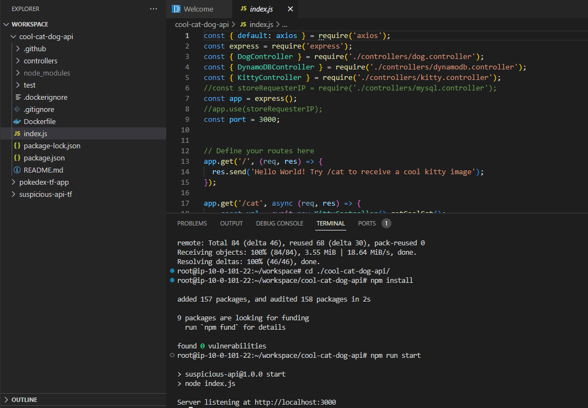

1.5 - Accedemos al puerto 3000 con el navegador `https://<nombre>-workstation.aprender.cloud/vscode/proxy/3000/` y nos devolvera un mensaje de bienvenida

```txt
Hello World! Try /cat to receive a cool kitty image
```

¿Os suena? Es el mismo mensaje que la API del Laboratorio 2 de Cloudtrail, pero sin ningún *"malware"* y con algunas mejoras.

1.6 - Si accedemos a `/cat`, nos devolverá una imagen de un gato. Si por el contrario accedemos a `/dog`, nos devolverá una de un perro.
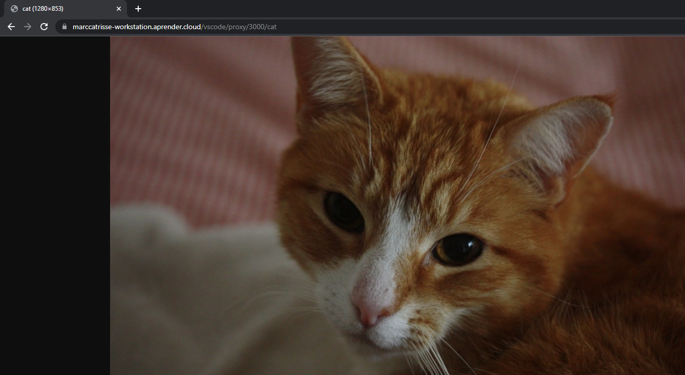


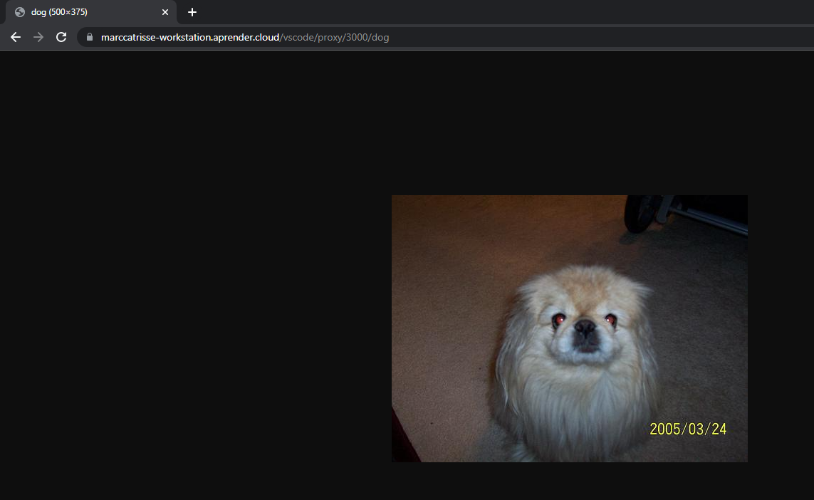

Cada una de estas peticiones se está guardando en una tabla de `DynamoDB` Si accedemos a `/history`, nos devolverá el contenido de esta.
```json
[
    {
        "id":"13f65642-44cf-4b48-a8cb-b9c7707d197d",
        "image":"https://images.dog.ceo/breeds/retriever-golden/joey_20210802_223302.jpg",
        "animal":"dog",
        "timestamp":1679784935662
    }
]
```
1.7 - Seguidamente, accederemos al apartado de `X-Ray` dentro del menú de `CloudWatch` (*`CloudWatch > X-Ray Traces > Service Map`*)

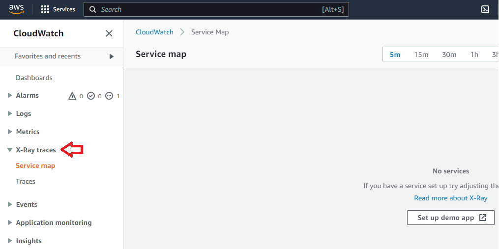

Como podemos observar, está vacío, nuestra aplicación aún no ha mandado ninguna información al servicio. A continuación, vamos a instrumentalizar la aplicación para mandar las trazas.

### Instrumentalización

La instrumentalización con la SDK de X-Ray es muy fácil, solamente tendremos que definir un segmento padre que incluya la tarea de procesado de cada petición. Adicionalmente, capturaremos las librerías encargas de hacer peticiones a la API de AWS y externas para poder reflejarlas en la traza.

Podéis consultar la documentación de la SDK de X-Ray para más información (https://docs.aws.amazon.com/xray/latest/devguide/xray-sdk-nodejs.html)

2.1 - Primero, pararemos la aplicación e importaremos la SDK de X-Ray para Node.

```bash
$ npm install --save aws-xray-sdk@^3.4.1
```

2.1 - Añadiremos 2 middleware, al principio y final de las definiciones de las rutas. Se tratan de funciones que se ejecutan para todas las peticiones.

Abriremos el fichero `index.js` y añadiremos el siguiente codigo al principio y final.

```js
const AWSXRay = require('aws-xray-sdk');
app.use(AWSXRay.express.openSegment('CatDogAPI'));
```

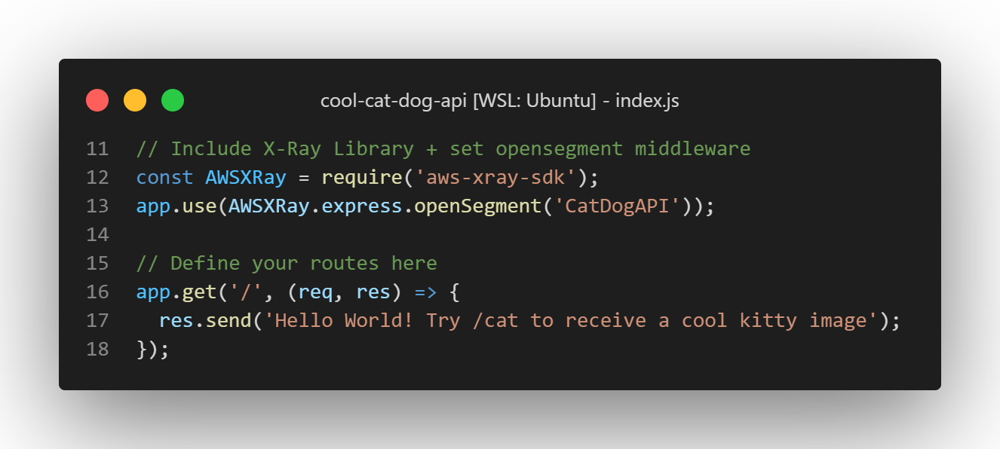

```js
app.use(AWSXRay.express.closeSegment());
```

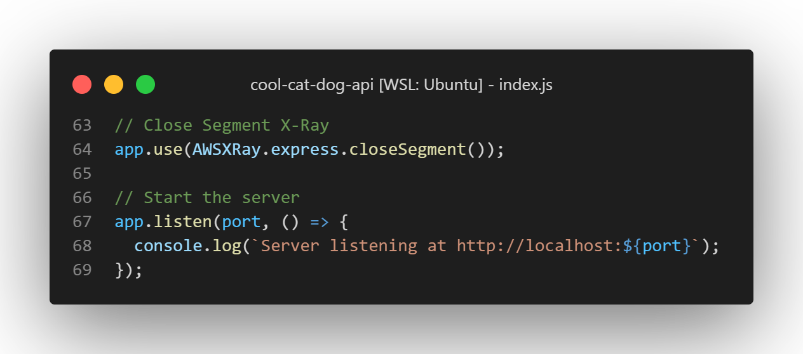

2.2 - Si en este punto iniciamos la aplicación con `npm run start`, veremos que sigue sin aparecer ninguna información en el dashboard de X-Ray. Esto es debido a que la SDK de Node no manda directamente las trazas a X-Ray, en vez de eso, delega el trabajo a un `Daemon de X-Ray` que se expone en el puerto 2000. (https://docs.aws.amazon.com/xray/latest/devguide/xray-daemon.html).

Nos descargaremos el Daemon de X-Ray para ejecutarlo a la vez que el programa

```bash
$ mkdir xray && cd xray
$ wget -O ./xray_daemon.zip https://s3.us-east-2.amazonaws.com/aws-xray-assets.us-east-2/xray-daemon/aws-xray-daemon-linux-3.x.zip
$ apt-get update && apt-get -y install unzip
$ unzip ./xray_daemon.zip && rm xray_daemon.zip && cd ..
```

2.3 - Ejecutaremos el Daemon de X-Ray en *background*, este permanecerá a la escucha de trazas de nuestra aplicación y las mandará a AWS.

```bash
$ ./xray/xray -o -n us-east-1 &
```
A continuación, ejecutamos nuestra API con `npm run start`. 
Si nos fijamos en los logs de la aplicación, deberíamos de ver también los logs del Daemon, notificando el envio de los segmentos

```txt
2023-03-26T15:26:07+01:00 [Info] Successfully sent batch of 1 segments (0.030 seconds)
```

Si en algún momento queremos parar el Daemon de X-Ray podemos ejecutar el comando

```bash
$ pkill xray
```

2.4 - Generamos un poco de tráfico para mandar datos a X-Ray, donde, después de actualizar el dashboard, deberíamos de ver el siguiente `ServiceMap`, junto a las trazas de las peticiones que hemos hecho

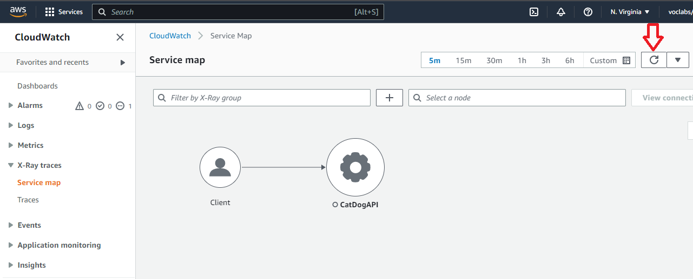

Si hacemos click sobre el id de la traza, accederemos a una vista donde podremos ver en detalle todos los segmentos asociados junto al Service Map

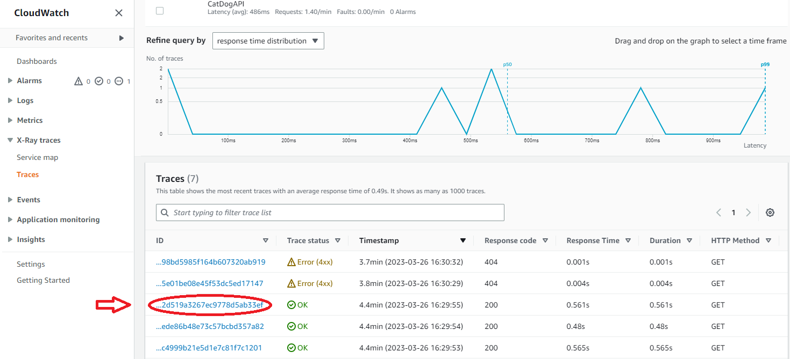

Como podéis apreciar, estas trazas solo contienen un segmento que engloba todo el trabajo que supone hacer la petición. 

Observa que, también se puede hacer correlación de la traza con logs, **esta parte queda fuera del laboratorio**, pero si quieres saber más, puedes consultar la [documentación](https://docs.aws.amazon.com/AmazonCloudWatch/latest/monitoring/deploy_servicelens_CloudWatch_agent_logintegration.html)

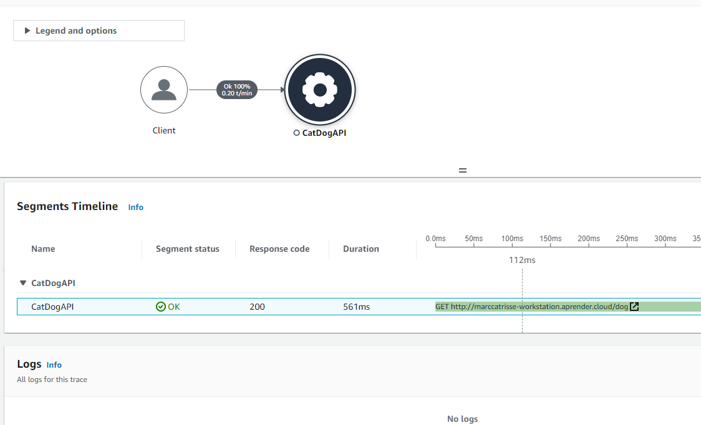

2.5 - Vamos a intentar desgranar un poco más este segmento, como bien sabemos, nuestra aplicación está accediendo a DynamoDB. Vamos a capturar las llamadas que hace el SDK de DynamoDB, solo debemos substituir la manera como instanciamos el cliente de DynamoDB en el fichero `./controllers/dynamodb.controller.js`

```js
const AWSXRay = require('aws-xray-sdk');
const docClient = AWSXRay.captureAWSv3Client(new DynamoDBClient({ region: "us-east-1" }));
```

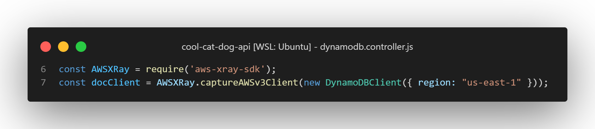

2.6 - Reiniciamos la API, generamos un poco de trafico y ahora deberíamos de poder ver el segmento de DynamoDB en las trazas.


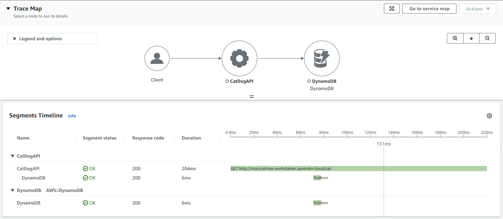

¿Habéis visto? El tiempo que tarda la operación de guardado de DynamoDB es ridículo en comparación con el resto.

2.7 - Finalmente, vamos a añadir los segmentos referentes a las peticiones que hace nuestra API a [Dog API](https://dog.ceo/dog-api/) y a [Cat API](https://thecatapi.com/), capturando la librería HTTP/s global. Queremos ver exactamente que peticiones desencadena nuestra API y cuanto tardan.

```js
AWSXRay.captureHTTPsGlobal(require('http'));
AWSXRay.captureHTTPsGlobal(require('https'));
```

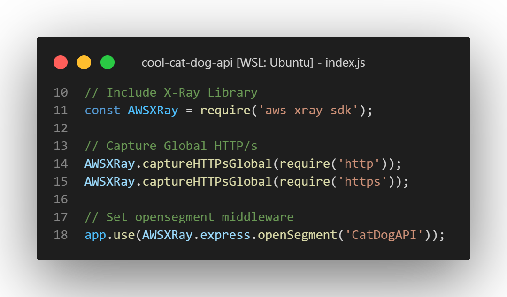

Si todo ha ido bien, después de generar tráfico, deberíamos de ver una traza así:

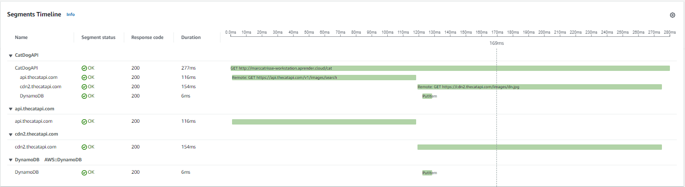

Con un Service Map así:

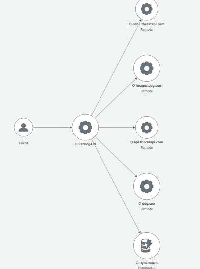


2.8 - Añade un error arbitrario en el código, que salte cuando se haga una consulta a `/cat` o `/dog`.

Ten en cuenta, que puedes mandar un error arbitrario a partir del objeto `res`, que encontrarás en las definiciones de los endpoints.

Por ejemplo: 

```javascript
app.get('/something', async (req, res) => {
    res.status(500).send('random error');
});
```

## Solución

Si en algún momento te quedas estancado/a y no sabes como continuar, puedes consultar la solución en el repositorio (https://github.com/TheMatrix97/cool-cat-dog-api/tree/solucion-lab3) en la rama `solucion-lab3` 


## Cleanup

C1 - Eliminamos la tabla de `DynamoBD` que hemos creado antes

```bash
$ aws dynamodb delete-table --table-name animals --region us-east-1
```

C2 - Detenemos el proceso de X-Ray

```bash
$ pkill xray
```


