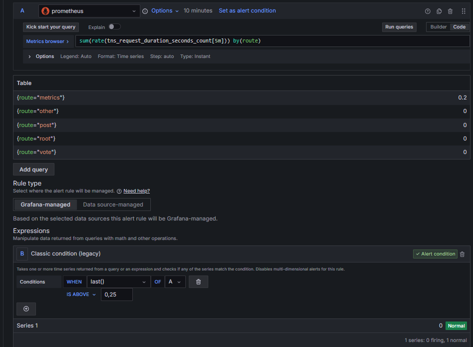
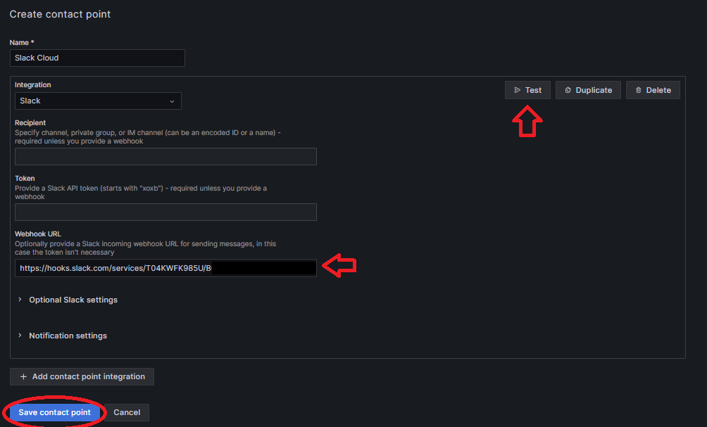

# Lab 8.4 - Introducción a Grafana

> Este laboratorio es opcional. Está basado en el tutorial [Grafana fundamentals](https://grafana.com/tutorials/grafana-fundamentals/) con algunas modificaciones

## Objetivos
En esta práctica, aprenderemos conceptos básicos de Grafana, Loki y Prometheus. Aportando la base para la monitorización de Métricas y Logs en Grafana y los mecanismos de alarmas que nos proporciona.

## Storytelling
Nuestra empresa está considerando la migración a Grafana para la monitorización de Métricas y Logs. La empresa ha crecido mucho, y ya disponemos de un equipo de infraestructura lo suficientemente grande para poder mantener un stack de monitorización propio. Nos han pedido una prueba de concepto del stack de Grafana + Loki + Prometheus.

## Lab

1- Primero, clonaremos el repositorio de Terraform que despliega el Stack de monitorización junto a la aplicación a monitorizar.

```bash
$ git clone https://github.com/TheMatrix97/Grafana-Tutorial-TF.git
```

2- Desplegaremos el lab con Terraform

```bash
$ cd Grafana-Tutorial-TF/src
$ terraform init
$ terraform apply
```
Estos comandos nos desplegarán una VM t3.medium con los servicios que se muestran a continuación


- **Grafana News**: Aplicación de ejemplo que nos permite publicar links y votar por ellos
- **Grafana News DB**: Servicio de base de datos para la aplicación Grafana News
- **Node_exporter**: Agente de Prometheus que exporta las métricas de la VM Host para Prometheus
- **Promtail**: Agente de Loki, recolecta las métricas de Grafana news y lo manda a Loki
- **Prometheus**: Herramienta de monitorización opensource orientada al almacenaje y consulta de métricas
- **Grafana**: Herramienta de análisis y visualización de dashboards
-  **Loki**: Herramienta de monitorización opensource orientada al almacenaje y agregación de logs.

Puedes ver el stack completo en el docker-compose que encontrarás en: https://github.com/TheMatrix97/tutorial-environment/blob/master/docker-compose.yml

Solamente se expone al exterior `Grafana` en el puerto `3000` y `Grafana News` en el `8081`.

Podremos ver el DNS público de la instancia en la salida del Terraform: instance_public_dns = "ecx-x-xxx-xx-xxx.compute-1.amazonaws.com"

3- Accede a `Grafana news` en el puerto 8081, publica un link y vota por él


4- Accede a `Grafana` en el puerto 3000 con `HTTPS` (https://ecx-x-xxx-xx-xxx.compute-1.amazonaws.com:3000) y haz login con las siguientes credenciales:
- **Username**: admin
- **Password**: cloud2023

Si todo ha ido bien, deberíamos de ver la pantalla inicial de Grafana


### Métricas

5- Accede al menú de la izquierda. `Connections > Add new connection` y añade Prometheus como fuente de datos, utilizando la URL `http://prometheus:9090` 


Finalmente, haremos click en la opción inferior de `Save & Test` para guardar la configuración y verificar que se puede conectar correctamente. Si te has fijado, estamos utilizando la red interna de Docker que crear el docker-compose, de esta manera evitamos exponer los servicios a internet.

6- Accede al menu `Home > Explore` para explorar los datos que almacena Prometheus. Una vez ahí, seleccionaremos el datasource `Prometheus`, activaremos el modo de refresco automático cada 5 segundos y el modo `Code` para escribir consultas `PromQL` directamente. 
Prueba a consultar `tns_request_duration_seconds_count`


La métrica `tns_request_duration_seconds_count` es de tipo contador, nos dice cuantos valores tenemos registrados de tipo `tns_request_duration_seconds`, en otra palabras, nos indica cuantas peticiones se han hecho al servicio.

Si hacemos la búsqueda, nos deberia devolver datos parecidos a este:
```promql
tns_request_duration_seconds_count{instance="app:80", job="tns_app", method="GET", route="other", status_code="404", ws="false"}
````
Cada una de las lineas que nos devuelve es una serie, si te fijas, prometheus crea una serie para cada conjunto de metadatos que recolecta. De manera que tendremos una serie para por ejemplo las peticiones `GET de /vote` y otra para las `GET de /other`.

6.1- Modifica la consulta por `rate(tns_request_duration_seconds_count[5m])`. Utilizando la función `rate` obtendrás el ratio de incremento de peticiones por segundo, en base a los datos obtenidos durante los últimos 5 minutos. Genera trafico en la aplicación `Grafana news` para observar el incremento en el número de peticiones por segundo.


Si te fijas, el ratio de peticiones por segundo de `GET /metrics` se mantiene igual. ¿Porque? La configuración de Prometheus que se muestra a continuación, indica que por defecto obtendrá los datos de todos los servicios cada 15s, excepto `Grafana News`, que lo hará cada 5s. 
Eso implica que hará 12 peticiones por minuto a `/metrics` o que es lo mismo `12 / 60 = 0,2 peticiones / segundo`
```yaml
global:
  scrape_interval: 15s

scrape_configs:
  - job_name: "prometheus"

    static_configs:
      - targets: ["localhost:9090"]
  
  - job_name: "node"

    static_configs:
      - targets: ["node_exporter:9100"]

  - job_name: "tns_app"

    # Override global settings
    scrape_interval: 5s

    static_configs:
      - targets: ["app:80"]
```

6.2 - Utiliza el operador `sum` para agregar los datos por el metadato `route`. 
```promql
sum(rate(tns_request_duration_seconds_count[5m])) by(route)
```
Puedes intentar agrupar por otras etiquetas, como `status_code`, variando la parte `by(route)`.

### Logs

7- Añadiremos el datasource de Loki de la misma forma que en el punto `5`, pero indicando la URL: `http://loki:3100`. Finalmente, haremos click en el botón `Save & Test` para guardar la configuración y revisar la conexión con el servicio


8- Accedemos al explorador de fuentes de datos, igual que en el punto `6`. Pero, esta vez seleccionamos el datasource `Loki`. Selecionamos el modo `Code` y executamos la siguiente consulta de Loki
```txt
{filename="/var/log/tns-app.log"}
```
Esta consulta nos devolverá todos los logs del fichero `tns-app.log` de `Grafana News`. Además, también mostrará un grafico de barras indicando el número de entradas registradas en relación al tiempo


8.1 - Ejecuta la siguiente consulta, para obtener solamente los logs que contengan la palabra `error`.
```
{filename="/var/log/tns-app.log"} |= "error"
```
En principio, no debería de salir ninguno, ya que no hemos provocado ningún error en la aplicación `Grafana news`. Puedes generar uno al intentar insertar un nuevo post sin ningún valor en el campo `URL`. Activa el Modo Live para poder ver los logs en tiempo real según van llegando a Loki.

### Crear un dashboard
A continuación crearemos un dashboard que nos permita visualizar nuestras métricas de interés almacenadas en Prometheus.
Los dashboards están formados por paneles, cada uno formado por una `consulta` y una `visualización`

9.1 - Para ello accederemos al Menu `Dashboards` y crearemos una visualización a partir del datasource `Prometheus`


9.2 - En esta visualización, mostraremos una gráfica del número de peticiones recibidas por segundo, agregando por cada ruta

```promql
sum(rate(tns_request_duration_seconds_count[$__rate_interval])) by(route)
```
> Se recomienda utilizar `$__rate_interval` en Grafana para las funciones `rate` y `increase`, ya que assegura que el intervalo es como mínimo 4 veces el `Scrape Interval`, que es lo recomendado (https://grafana.com/blog/2020/09/28/new-in-grafana-7.2-__rate_interval-for-prometheus-rate-queries-that-just-work/)


9.3 - Crea una visualización que nos permita ver el tiempo medio de respuesta por petición

<details><summary>Solución</summary>

```promql
sum(rate(tns_request_duration_seconds_sum[$__rate_interval])) by (route) / sum(rate(tns_request_duration_seconds_count[$__rate_interval])) by (route)
```

</details>

9.4 - También podemos añadir anotaciones en los gráficos, guarda el dashboard haciendo click al icono de guardado y haz doble click sobre cualquier gráfico para añadir una anotación. También puedes seleccionar intervalos de tiempo manteniendo pulsado el `CTRL`


9.5 - Hacer anotaciones manuales nos puede servir para eventos puntuales. Grafana nos permite añadir anotaciones automàticas basadas en consultas a otras bases de datos. A continuacion, vamos a añadir una anotación por cada error que registre Loki 

Seleccionamos el engranaje del menú superior para entrar a la configuración del dashboard y nos vamos al submenú `Annotations` para crear una nueva anotación. Seleccionamos el datasource de Loki e introducimos la query que hemos visto anteriormente para obtener los errores. Finalmente haremos click en `Apply` para guardar los cambios

```
{filename="/var/log/tns-app.log"} |= "error"
```


Si volvemos al dashboard y provocamos algunos errores en la web de `Grafana news`, deberíamos ver las anotaciones con una opción para desactivarlas.


### Crear Alarmas gestionadas por Grafana

En este apartado, crearemos una alarma que nos avise cuando el número de peticiones por segundo de cualquier endpoint supere un valor determinado (0,25)

10.1 - Para ello, accederemos al Menu `Home > Alerting > Alert Rules > New Rule` y definiremos una alerta `Traffic Alert` a partir de la consulta que hemos visto anteriormente

```promql
sum(rate(tns_request_duration_seconds_count[5m])) by(route)
```
10.2 - Borraremos los puntos `B` / `C` y crearemos una única expresión de tipo `classic condition` que lanzará la alarma en caso de que exista un TimeSeries con valor `0,25` o superior. Tal y como se muestra en la siguiente imagen



10.3 - Indicaremos el comportamiento que deseamos, definiendo la carpeta donde se guardará esta alerta (*Si no tienes ninguna, tienes que escribir el nombre en el selector y darle a la tecla ENTER*) y el grupo de evaluación (*lo tendrás que crear de la misma forma*). Indicando que todas las alarmas del grupo `traffic` se van a evaluar cada minuto `Evaluate query = 1m` y que se deberá lanzar la alarma nada más se viole la condición definida, indicando `for = 0m`.


Dejaremos el resto de atributos por defecto y guardaremos la alarma con el botón del margen superior derecho (`Save Rule and Exit`).

10.4 - A continuación crearemos el `contact point`, indicando como lanzar la acción de notificación cuando salte la alarma
(`Home > Alerting > Contact Points > Add contact point`).
Podemos utilizar la integración de Slack y lanzar la notificación por el webhook que hemos creado en el lab 2 o crear un webhook public nuevo con <https://requestbin.com/> haciendo click al link `public bin` para generar la url del webhook. 

En este ejemplo, utilizaremos el webhook de Slack que ya tenemos precreado.



Testeamos que el envío funciona correctamente con el botón `Test` y guardamos.

10.5 - Ahora solo falta conectar los puntos, cambiaremos la política de notificación por defecto para que haga uso de este `contact point` que hemos creado. Accederemos al menú de `Home > Alerting > Notification policies`.

Editaremos la política por defecto, indicando que el `contact point` por defecto ahora es `Slack`


10.6 - Ahora, ya podemos generar un pico de tráfico en `Grafana News` para hacer saltar la alarma. Añade una entrada nueva y vótala de manera repetida.

Si todo ha ido bien, deberías de ver un mensaje en slack parecido a este


### Métricas de host con node_exporter

Si has explorado un poco el prometheus, habrás visto que disponemos de métricas de la máquina host disponibles gracias a un componente llamado [`node_exporter`](https://github.com/prometheus/node_exporter).

11.1 - Importa este dashboard creado por la comunidad (https://grafana.com/grafana/dashboards/1860-node-exporter-full/) a tu instancia de Grafana y revisa todas las métricas disponibles


