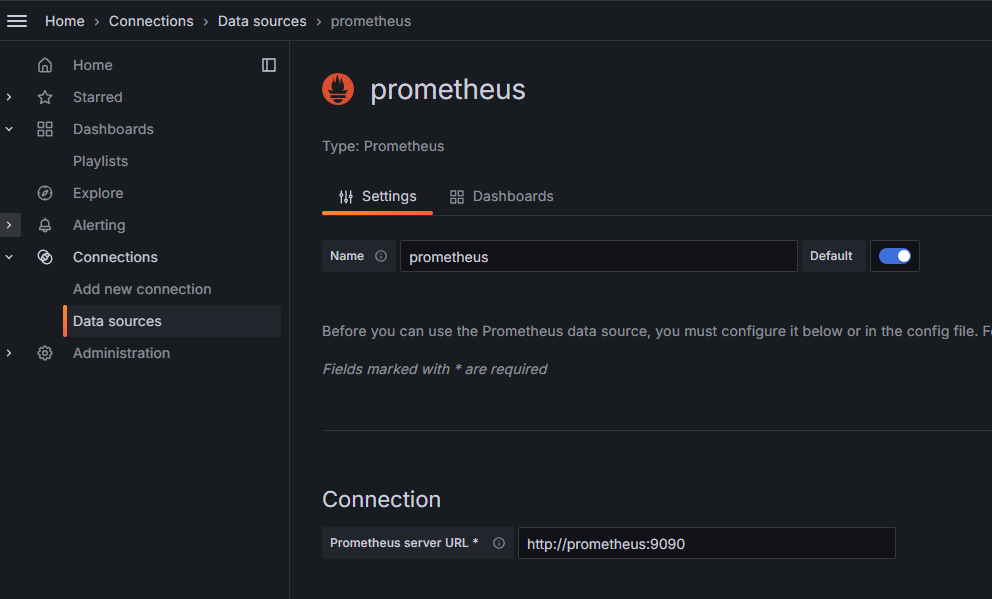
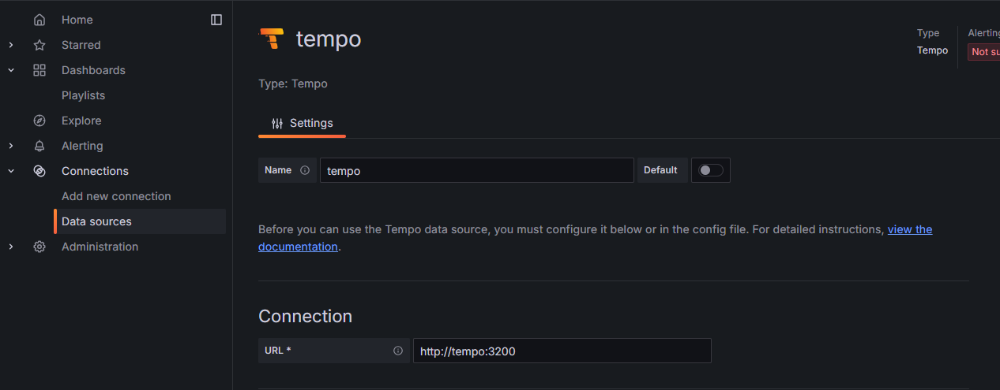
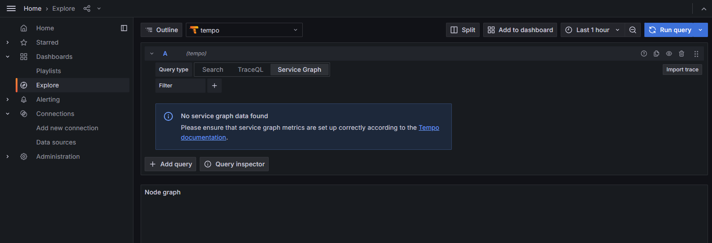
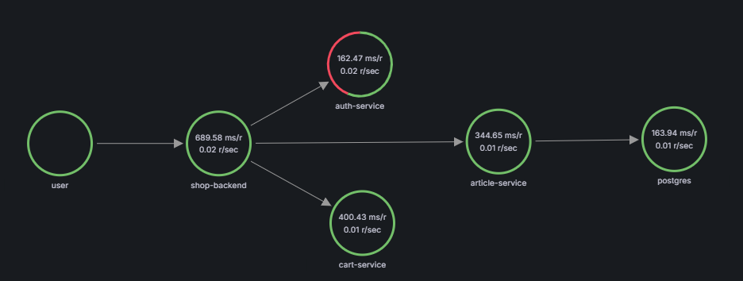
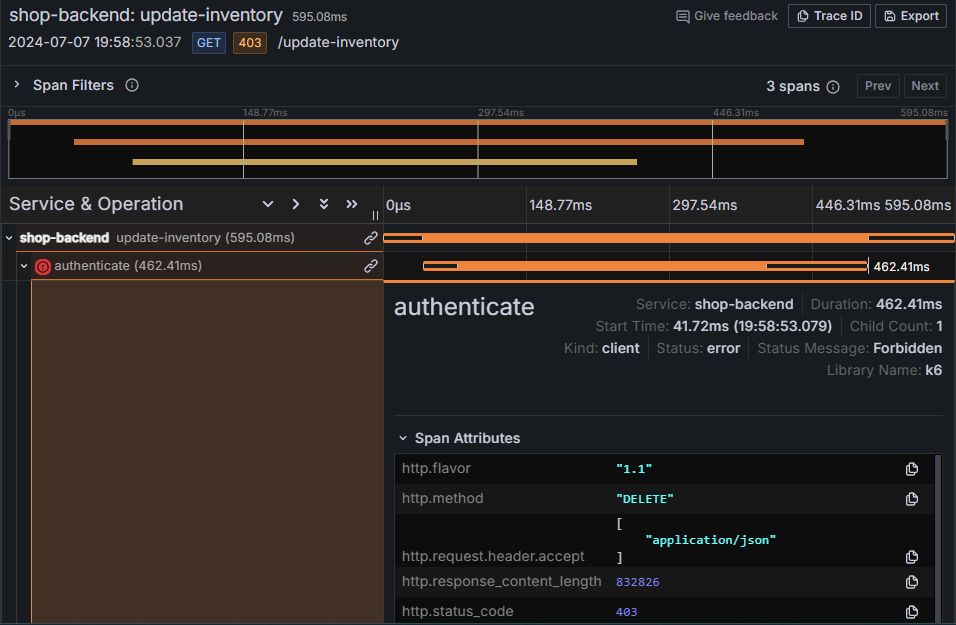
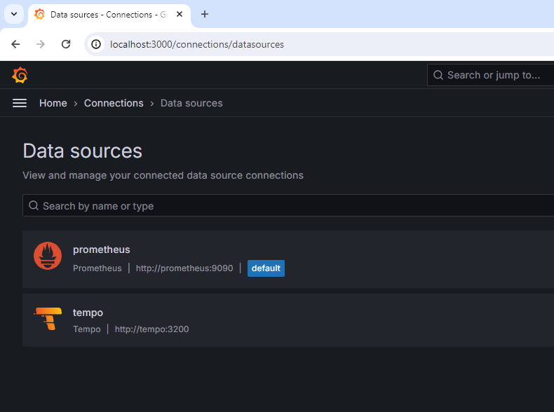
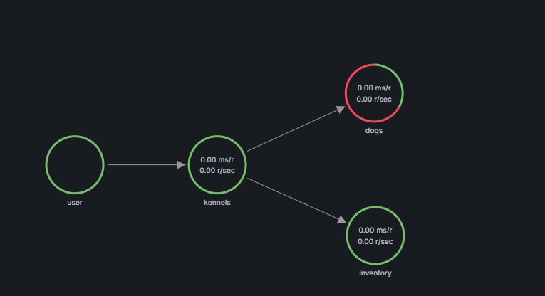

# Laboratori 8.5 - Distributed Tracing

En este laboratorio aprenderemos a generar y consultar trazas distribuidas a partir del stack `LGTM` de Grafana. En concreto, veremos cómo usar [`Tempo`](https://grafana.com/oss/tempo/) y [OpenTelemetry](https://opentelemetry.io/)

Antes de entrar en detalle en la instrumentación de aplicaciones, veremos cómo trabajar con trazas a partir de datos sintéticos generados con una extensión de [Grafana k6](https://k6.io/), una aplicación diseñada para diseñar y ejecutar pruebas de carga y de validación. En concreto, usaremos [xk6-client-tracing](https://github.com/grafana/xk6-client-tracing).

## Toma de contacto con las trazas

1.1 - Revisa el archivo docker-compose.yml donde verás los servicios que se desplegarán en esta parte de la práctica. En concreto, desplegaremos los siguientes servicios:
- Prometheus (Backend de métricas)
- Tempo (Backend de Trazas)
- Grafana (Dashboards)
- xk6-client-tracing (Generador de trazas)

1.2 - Fíjate en la configuración de Tempo que se encuentra en `./configs/tempo.yaml`, aquí es donde definiremos todos los parámetros de configuración de Tempo, en concreto, definiremos los protocolos que admite el `distributor`, el componente que recibe las trazas en los diferentes protocolos definidos y los dirige al `ingester` para su procesamiento.

```yaml
distributor:
  receivers:
    otlp:
      protocols:
        http:
        grpc:
```

Además, Tempo es capaz de generar métricas a partir del procesamiento de las trazas. Estas métricas se publicarán en Prometheus mediante `remote_write`. Deberemos consultar Prometheus para poder obtener métricas de las trazas y generar el `service map` que veremos más adelante.

```yaml
metrics_generator:
  registry:
    external_labels:
      source: tempo
      cluster: docker-compose
  storage:
    path: /var/tempo/generator/wal
    remote_write:
      - url: http://prometheus:9090/api/v1/write
        send_exemplars: true
  traces_storage:
    path: /var/tempo/generator/traces
```

1.3- Desplegaremos `Grafana` y `Prometheus`, definidos en el `docker-compose.yml`, que nos hará falta para poder visualizar las trazas y monitorizar las métricas asociadas a estas.

```bash
docker compose up grafana prometheus -d
```

1.4 - Accedemos a la UI de Grafana (http://localhost:3000) y configuraremos el Datasource Prometheus que hemos desplegado. Recuerda que puedes referenciar Prometheus desde Grafana con la red interna de Docker (http://prometheus:9090)



> Con la configuración por defecto debería ser suficiente, ya que el servicio no está autenticado.

1.5 - Desplegaremos la instancia de `Tempo` con Docker Compose

```bash
docker compose up tempo -d
```

1.6 - Configuraremos el datasource de Tempo mediante la interfaz de Grafana. En este caso el endpoint de Tempo es `http://tempo:3200`



En el apartado `Additional Settings` tendrás que configurar el datasource de `Prometheus` que hemos creado anteriormente como fuente de datos para la generación del `Service Graph`.

1.7 - A continuación, accederemos al explorador de datos, y escogeremos el datasource de `Tempo`



1.8 - Como podéis observar, aún no tenemos datos. Ejecutaremos la herramienta `xk6-client-tracing` para generar trazas realistas y enviarlas al endpoint `tempo:4317` usando el protocolo [otlp](https://opentelemetry.io/docs/specs/otel/protocol/) sobre [gRPC](https://grpc.io/)

```bash
docker compose up k6-tracing -d
```

1.9 - Espera unos minutos a que se empiecen a generar datos. Accede a la visualización de `Service Graph` para ver todos los componentes asociados a las trazas y las interacciones entre estos. Deberías ver algo parecido a esto:



1.10 - Como puedes ver, se están detectando algunos errores en el `Auth-Service`, ¿puedes intentar descubrir en qué función se produce este error en particular?

<details><summary>Solución</summary>



</details>

1.11 - En este punto, podemos borrar la aplicación que hemos desplegado para continuar con la segunda parte del Laboratorio

```bash
docker compose down -v
```

## Instrumentación de una aplicación (Opcional)

Disponemos de una API para la gestión de perreras (`kennels`), que está basada en NodeJS. Nos han pedido que la instrumentalicemos con [OpenTelemetry](https://opentelemetry.io/) y generemos trazas sobre esta. ¿La puedes instrumentalizar?

2.1 - Haz clone del proyecto a instrumentalizar

```bash
git clone https://github.com/TheMatrix97/Distributed-Tracing-Example
cd Distributed-Tracing-Example
```

2.3 - Crearemos una red Docker, donde desplegaremos todos los microservicios. Posteriormente, utilizaremos la misma red de Docker para desplegar el stack de monitorización

```bash
docker network create -d bridge kennels_net
```

2.2 - Ejecuta el Stack de la aplicación y verifica que funciona correctamente

```bash
docker compose up -d --build --force-recreate
```
> Si consultáis el endpoint `/api/v1/kennels`, os debería devolver información sobre los perros que residen en esa perrera

```bash
curl http://localhost:8080/api/v1/kennels?id=0

{"name":"awesome kennel","dogs":[{"id":0,"name":"Rufus"}]}
```
2.3 - Añadiremos un nuevo archivo docker-compose que desplegará el stack de monitorización que usaremos para almacenar y visualizar las trazas.

Crearemos un nuevo archivo llamado docker-compose.obs.yml con el siguiente contenido
```yaml
name: kennels_stack
volumes:
  grafana_data: {}
  tempo_data: {}

networks:
  kennels_net:
    external: true

services:  
  collector: # Exposes 4317 (grpc) and 4318 (http)
    image: otel/opentelemetry-collector:latest
    command: '--config /etc/otel-config.yaml'
    volumes:
      - ./obs/otel-config.yaml:/etc/otel-config.yaml
    networks:
      - kennels_net
  grafana:
    image: grafana/grafana:10.4.2
    restart: unless-stopped
    ports:
      - 3000:3000
    volumes:
      - grafana_data:/var/lib/grafana
    environment:
      - GF_AUTH_ANONYMOUS_ENABLED=true
      - GF_AUTH_ANONYMOUS_ORG_ROLE=Admin
      - GF_AUTH_DISABLE_LOGIN_FORM=true
      - GF_FEATURE_TOGGLES_ENABLE=traceqlEditor traceQLStreaming metricsSummary
    networks:
      - kennels_net
  
  tempo:
    image: grafana/tempo:latest
    command: [ "-config.file=/etc/tempo.yaml" ]
    volumes:
      - ./obs/tempo.yaml:/etc/tempo.yaml
      - tempo_data:/var/tempo
    ports:
      - "14268:14268"  # jaeger ingest
      - "3200:3200"   # tempo
      - "9095:9095" # tempo grpc
      - "4317:4317"  # otlp grpc
      - "4318:4318"  # otlp http
      - "9411:9411"   # zipkin
    networks:
      - kennels_net
  prometheus:
    image: prom/prometheus:v2.34.0
    restart: unless-stopped
    volumes:
      - ./obs/prometheus.yaml:/etc/prometheus/prometheus.yaml
    ports:
      - "9090:9090"
    command:
      - "--config.file=/etc/prometheus/prometheus.yml"
      - "--storage.tsdb.path=/prometheus"
      - "--enable-feature=remote-write-receiver"
    networks:
      - kennels_net
```
Revisa el stack e identifica los componentes que hemos visto para la monitorización de aplicaciones con trazas.

2.4 - Despliega el stack de monitorización que hemos definido anteriormente

```bash
docker compose -f docker-compose.obs.yml up -d --build --force-recreate
```

Como puedes ver, el despliegue no funciona correctamente, ya que no hemos definido los archivos de configuración de los componentes.

```bash
docker compose -f docker-compose.obs.yml ps -a
```

2.5 - Crea la carpeta obs y añade los archivos de configuración de los componentes

```bash
sudo rm -rf obs && mkdir obs
```
`otel-config`

```bash
cat << EOF > obs/otel-config.yaml
receivers:
  otlp:
    protocols:
      grpc:
        endpoint: 0.0.0.0:4317
      http:
        endpoint: 0.0.0.0:4318
exporters:
  debug:
    verbosity: detailed
  otlphttp:
    endpoint: http://tempo:4318
service:
  pipelines:
    traces:
      receivers: [otlp]
      exporters: [otlphttp]
    metrics:
      receivers: [otlp]
      exporters: [debug]
    logs:
      receivers: [otlp]
      exporters: [debug]
EOF
```
`tempo.yaml`

```bash
cat << EOF > obs/tempo.yaml
stream_over_http_enabled: true
server:
  http_listen_port: 3200
  log_level: info

query_frontend:
  search:
    duration_slo: 5s
    throughput_bytes_slo: 1.073741824e+09
  trace_by_id:
    duration_slo: 5s

distributor:
  receivers:                           # this configuration will listen on all ports and protocols that tempo is capable of.
    jaeger:                            # the receives all come from the OpenTelemetry collector.  more configuration information can
      protocols:                       # be found there: https://github.com/open-telemetry/opentelemetry-collector/tree/main/receiver
        thrift_http:                   #
        grpc:                          # for a production deployment you should only enable the receivers you need!
        thrift_binary:
        thrift_compact:
    zipkin:
    otlp:
      protocols:
        http:
        grpc:
    opencensus:

ingester:
  max_block_duration: 5m               # cut the headblock when this much time passes. this is being set for demo purposes and should probably be left alone normally

compactor:
  compaction:
    block_retention: 1h                # overall Tempo trace retention. set for demo purposes

metrics_generator:
  registry:
    external_labels:
      source: tempo
      cluster: docker-compose
  storage:
    path: /var/tempo/generator/wal
    remote_write:
      - url: http://prometheus:9090/api/v1/write
        send_exemplars: true
  traces_storage:
    path: /var/tempo/generator/traces

storage:
  trace:
    backend: local                     # backend configuration to use
    wal:
      path: /var/tempo/wal             # where to store the the wal locally
    local:
      path: /var/tempo/blocks

overrides:
  defaults:
    metrics_generator:
      processors: [service-graphs, span-metrics, local-blocks] # enables metrics generator
EOF
```
`prometheus.yaml`

```bash
cat << EOF > obs/prometheus.yaml
global:
  scrape_interval: 15s

scrape_configs:
  - job_name: "prometheus"

    static_configs:
      - targets: ["localhost:9090"]
EOF
```

2.6 - Volvemos a desplegar el stack de monitorización y revisamos que todos los contenedores se levantan correctamente

```bash
docker compose -f docker-compose.obs.yml up --force-recreate -d --build
```

```bash
docker compose -f docker-compose.obs.yml ps -a
```

2.7 - En este punto accederemos a la interfaz de grafana con el Navegador (http://localhost:3000) y añadiremos los datasources `prometheus` y `tempo`. Recuerda añadir `Prometheus` como datasource de las métricas del `service graph` en la configuración de `Tempo`.



Como podéis ver, `Tempo` está vacío, ya que aún no hemos instrumentado la aplicación. Por suerte, `OpenTelemetry` nos ofrece librerías para autoinstrumentalizar la aplicación sin tocar el código.

### Instrumentalización de la aplicación

2.8 - Consulta la documentación de OpenTelemetry sobre la autoinstrumentalización de nodejs (https://opentelemetry.io/docs/languages/js/automatic/) e instrumenta los 3 microservicios que forman la aplicación `kennels` -> `services/kennels | services/dogs | services/inventory`.

Reinicia el stack de aplicaciones con el siguiente comando, para recrear los contenedores y volver a construir las imágenes Docker.

```bash
docker compose up -d --force-recreate --build
```

<details><summary>Solución</summary>

```bash
# Install the Library Otel autoinstrumentation

cd ./services/dogs/ && npm install --save @opentelemetry/api  @opentelemetry/auto-instrumentations-node && rm -rf node_modules

cd ../inventory && npm install --save @opentelemetry/api  @opentelemetry/auto-instrumentations-node && rm -rf node_modules

cd ../kennels && npm install --save @opentelemetry/api  @opentelemetry/auto-instrumentations-node && rm -rf node_modules

# Add environment variables in docker-compose.yml to send the traces to the collector

# Modify the Package.json to use the auto-instrumentation library

sed -i 's/node src\/index.js/node --require @opentelemetry\/auto-instrumentations-node\/register src\/index.js/' ./services/dogs/package.json

sed -i 's/node src\/index.js/node --require @opentelemetry\/auto-instrumentations-node\/register src\/index.js/' ./services/inventory/package.json

sed -i 's/node src\/index.js/node --require @opentelemetry\/auto-instrumentations-node\/register src\/index.js/' ./services/kennels/package.json

# Add the following environment variables on each microservice container. Don't forget to replace the service name
environment:
- OTEL_SERVICE_NAME=<NAME_SERVICE>
- OTEL_TRACES_EXPORTER=otlp
- OTEL_EXPORTER_OTLP_ENDPOINT=collector:4317
- OTEL_NODE_RESOURCE_DETECTORS=env,host,os
- OTEL_EXPORTER_OTLP_PROTOCOL=grpc 
- OTEL_EXPORTER_OTLP_INSECURE=true

```

</details>

2.8 - Revisa que la instrumentación funciona correctamente y que se están generando las trazas. Para hacerlo consulta los logs de los contenedores de la aplicación y del collector donde deberías ver información sobre las trazas que va procesando.

```bash
# Generamos tráfico
curl http://localhost:8080/api/v1/kennels?id=1
curl http://localhost:8080/api/v1/kennels?id=2
curl http://localhost:8080/api/v1/kennels?id=3
```

2.9 - Accede a la interfaz de `Grafana` para ver el `service graph` de las trazas.



2.10 - Oops... Parece que el microservicio dogs está fallando, ¿sabrías decir dónde? Consulta las trazas y haz una captura de pantalla de una traza de error.

### Load testing

Como podéis ver, las trazas que estamos viendo son las que hemos generado nosotros de manera manual con `Curl`. Esto no es realista. En este punto definiremos una prueba sintética de carga con `Grafana K6`.

3.1 - Definiremos la prueba de carga. Esta es una propuesta, revisa la [documentación de K6](https://grafana.com/docs/k6/latest/testing-guides/test-types/stress-testing/) si quieres modificar el test.

```bash
cat << EOF > obs/load_test.js
import http from 'k6/http';
import { sleep, check } from 'k6';

const API_URL = 'http://nginx/api/v1/kennels';

export let options = {
  stages: [
    { duration: '1m', target: 50 }, // simulate ramp-up of traffic from 0 to 50 users over 1 minute
    { duration: '30m', target: 20 }, // stay at 20 users for 30 minutes
  ],
};

export default function () {
  let response = http.get(API_URL+'?id=0');
  let response2 = http.get(API_URL+'?id=1');
  let response3 = http.get(API_URL+'?id=2');
  sleep(1);
}
EOF
```
3.2 - A continuación, ejecutaremos la herramienta de K6 con Docker usando la prueba que hemos definido anteriormente.

```bash
docker run -it --rm -v $PWD/obs/load_test.js:/scripts/load_test.js --network kennels_net  grafana/k6:latest run /scripts/load_test.js
```

3.3 - Observa las trazas que se generan en Tempo. ¿Cuál es el ratio de fallos que nos estamos encontrando en el microservicio `dogs`? ¿Cuántas peticiones por segundo estamos generando con K6? ¿Cuál es el cuello de botella de la aplicación?


### Cleanup

Eliminaremos los recursos generados con Docker.

```bash
docker compose down -v && docker compose -f docker-compose.obs.yml down -v
docker network rm kennels_net
```


