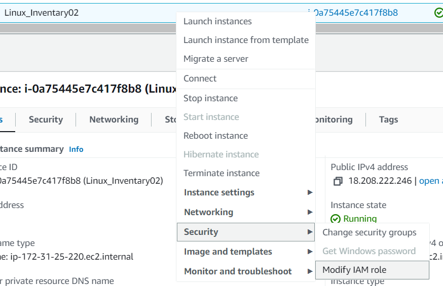
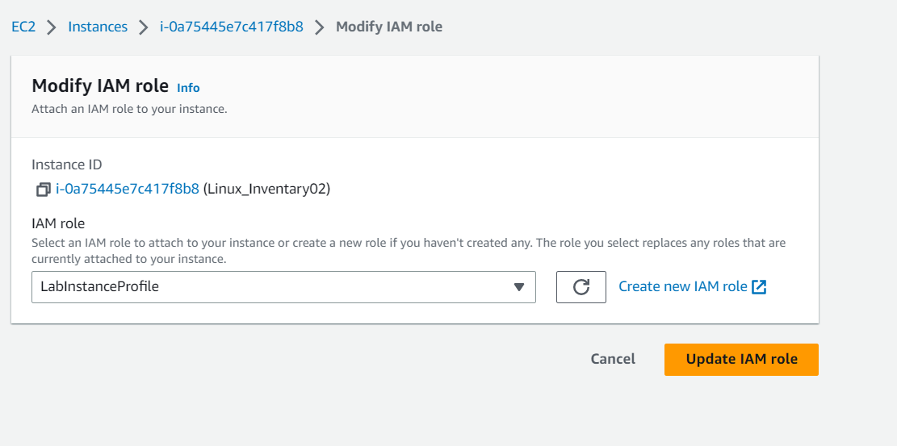
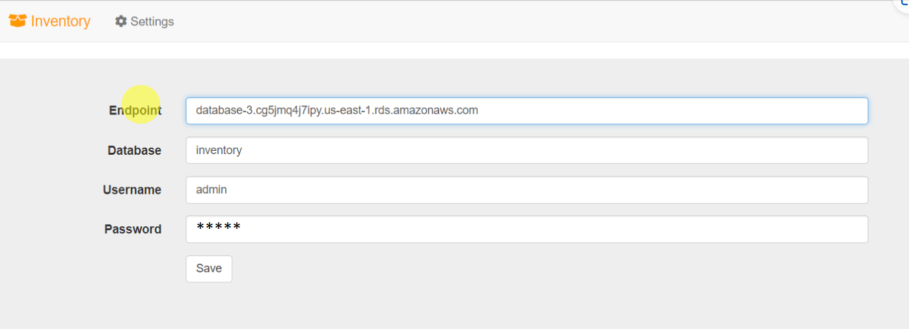

# RETO - Despliegue de una aplicacion de inventario

En este laboratorio vamos a realizar la instalación de una aplicación de inventario en un VPC propio , en una EC2 Ami LInux 2023 y una BBDD RDS Mysql en cluster.

## VPC

* Crear un VPC propio con redes privadas y públicas

* Crear VPC 10.44.0.0/16

* Crear subredes publicas 10.44.1.0/24 10.44.2.0/24 y privadas 10.44.3.0/24 10.44.4.0/24

* Crear Internet Gateway

* Modificar las tablas de enrutamiento


## EC2

* Crear un grupo de seguridad SBWeb con el puerto 22 y 80 abierto para acceso por SSH y consultar la web

* Lanzar la EC2 Linux AMI 2 (no usar este código en Linux AMI 2023) con este User Data

```bash
#!/bin/bash
# Install Apache Web Server and PHP
yum install -y httpd mysql
amazon-linux-extras install -y php7.2
# Download Lab files
wget https://s3.eu-west-1.amazonaws.com/www.profesantos.cloud/HoL/Inventory/inventory-app.zip
unzip inventory-app.zip -d /var/www/html/
# Download and install the AWS SDK for PHP
wget https://s3.eu-west-1.amazonaws.com/www.profesantos.cloud/HoL/Inventory/aws.zip
unzip aws -d /var/www/html
# Turn on web server
chkconfig httpd on
service httpd start
```
* Comprobar el acceso con la IP pública. En este momento te da el siguiente error por ser cuentas de AWS academy. 


* Lo solucionamos cambiando el Role de la EC2 or el role utilizado en AWS Academy



* Elegimos LabInstanceProfile



* Refrescamos la IP pública y el error desaparecerá


## BBDD

* Crear un Subnet Group con las redes privadas

* Crear un Security Group, SWbbdd con el puerto 3306 para acceso desde la EC2

* Lanzar un Mysql en cluster de desarrollo con el grupo de subredes creado

* Le diremos que cree una base de datos llamada inventory a la hora de lanzar la instancia RDS


## Comprobacíón final

* Vamos a la IP pública y elegimos la pestaña Settings y lo rellenamos con los datos de nuestro proyecto



* Conectará con la bbdd y aparecerán 3 artículos de ejemplo donde podemos agregar más.


## AYUDA: Canal AWS Academy con la solución

* [Step by Step - App inventario ](https://www.youtube.com/watch?v=I0nL0NX4qZc&list=PLr35b7rSarzizDIWK4eKyl6mY4V_HxERi&index=17)