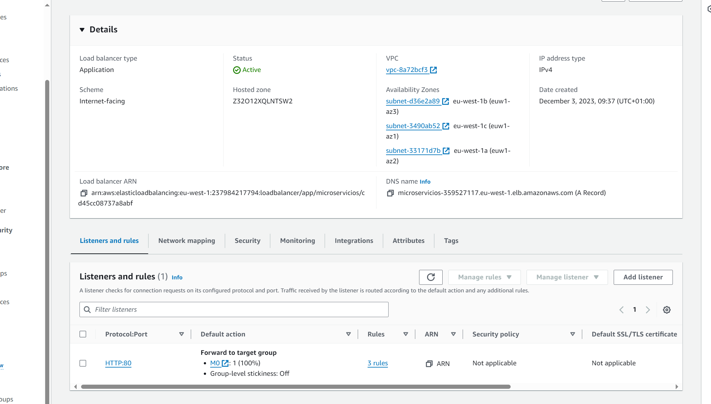

# ALB con multi path

## Crea dos microservicios web

```
#!/bin/bash
dnf update -y
dnf install httpd -y
systemctl start httpd
systemctl enable httpd
cd /var/www/html
mkdir m1
echo "Microservicio 1 desde $(hostname -f)" > /var/www/html/m1/index.html
mkdir m2
echo "Microservicio 2 desde $(hostname -f)" > /var/www/html/m2/index.html
```
## Monta un ALB con un TG

## Configura dos reglas con multi path a cada microservicio

Entra en la configuración del balanceador en "listener and Rules"


Añade 2 reglas de path nuevas que apunten a m1 y m2

