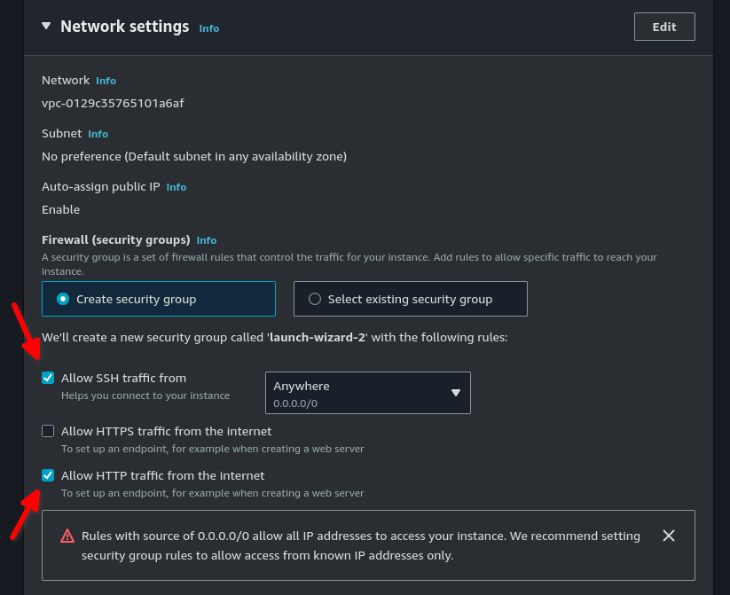
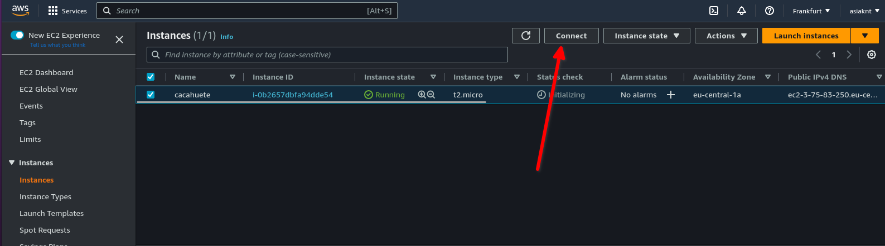
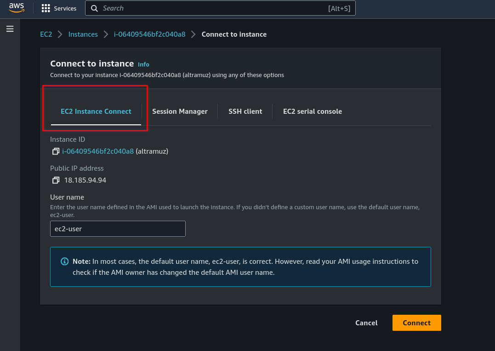
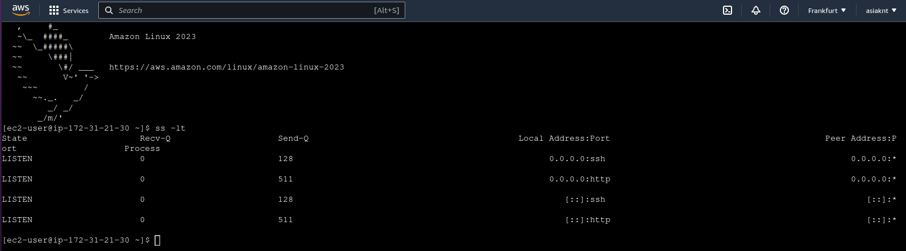
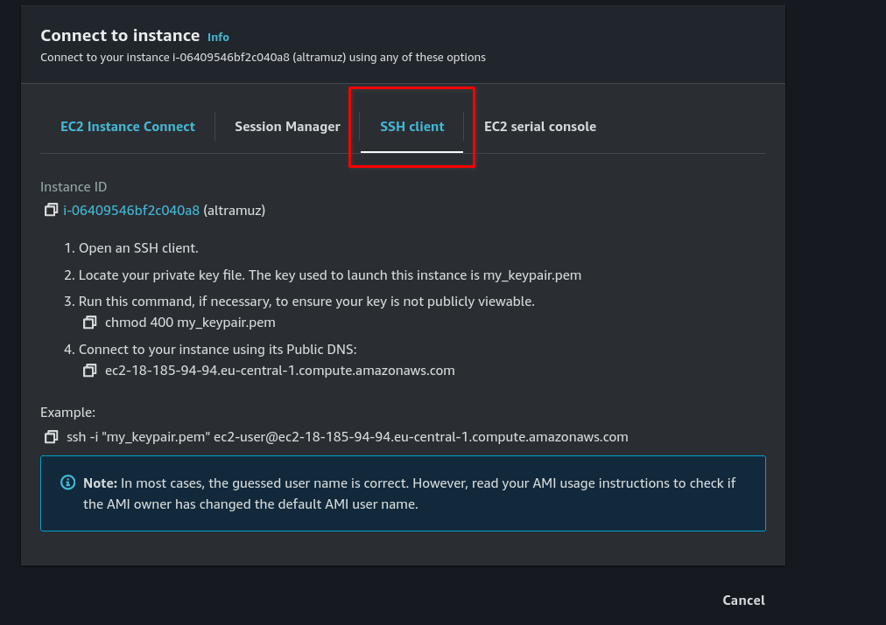
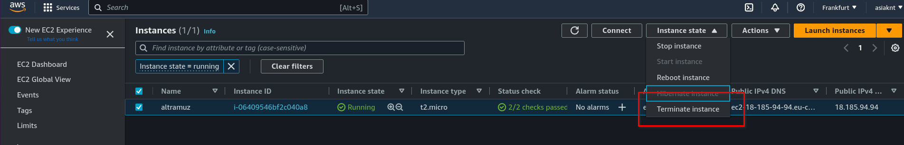

# OBJETIVO 

En este laboratorio vamos a desplegar una instancia EC2, instalarle un NGINX y confirmar que nuestra IP aparece en los logs del servicio dentro de la instancia. También vamos a ver cómo funcionan las diferentes formas de conectarnos a una instancia EC2.

## Creación de la EC2

1. Vamos a acceder a la Consola de AWS y buscar el servicio de *EC2* y después pincharemos en *Instances*.

2. Vamos a lanzar una instancia EC2 muy simple 


- Le pondremos un nombre identificativo y seleccionaremos la *AMI de Amazon Linux* . Para esta demonstración nos valdrá con una instancia *t2.micro*

- Tenemos que asegurarnos de que la instancia va a tener acceso por SSH desde cualquier parte y también de que permitimos tráfico por HTTP desde internet



- También crearemos unas key_pair para esta instancia en específico y veremos cómo se nos descarga el fichero .pem

- Finalmente desplegamos el apartado de *Advanced Settings* y en el último recuadro llamado *user data* pegamos lo siguiente:

```
#!/bin/bash

yum update
yum install -y nginx

echo "<h1>Hola internet!!!</h1>" > /usr/share/nginx/html/index.html

```

## Conexión con Instance Connect

### Escenario:
A pesar de que supuestamente NGINX ha sido instalado en nuestra instancia nos comunican que por algún motivo no funciona. Tenemos que conectarnos a la instancia y averiguar qué está pasando.

1. Cuando nuestra instancia ya está en estado *Running* vamos a comprobar que todo ha ido como esperábamos y de paso vemos el tipo de conexión más simple: Instance Connect.

- Al selecionar nuestra instancia el botón de *Connect* va a aparecer como disponible:



- Al pulsarlo vamos a ver que AWS ya nos muestra las formas que tenemos de conectarnos a esta instancia. Vamos a empezar con la primera. Como vemos no requiere ninguna configuración adicional.



- Una vez lanzado el Instance connect vamos a comprobar que efectivamente están abiertos los puertos que hemos indicado ejecutando ` ss -lt ` .

- Oh...parece que el servicio de NGINX no está arrancado. Nos acordabamos de que en las distribuciones RedHatBased cuando nos instalamos el servicio NO se arranca automáticamente así que tenemos que hacerlo nosotras:

 ` sudo systemctl start nginx.service `

 ¡Funciona!



- Ahora vamos a conseguir la IP de la instancia: ` curl ifconfig.me ` para comprobar que efectivamente nuestro servicio está levantado.

- También tenemos que cambiar los permisos de los ficheros de log de NGINX: 

` sudo chmod 755 /var/log/nginx/ ` 

- Introduciremos la IP de nuestra instancia en el navegdor y deberíamos ver nuestro mensaje personalizado

- Si dentro de la instancia ejecutamos:

` sudo tail -f /var/log/nginx/*log `

veremos nuestra IP accediendo al servicio en los logs.


## Conexión por SSH

- En esta ocasión, después de seleccionar nuestra instancia de la lista y pulsar *Connect*, vamos a conectarnos por SSH.



- Primero le daremos permisos de lectura a nuestro usuario sobre el fichero .pem que nos bajamos cuando iniciamos la instancia.

` chmod 400 my_keypair.pem `

- Una vez hecho esto solo nos queda conectarnos via ssh como ya hemos visto al principio de la clase. El fichero .pem asociado a esta instancia y su DNS o IP *pública*.

` ssh -i "my_keypair.pem" ec2-user@ec2-18-185-94-94.eu-central-1.compute.amazonaws.com ` 

**¡Importante!** : recuerda que el usuario para la conexión puede cambiar dependiendo de la distribución que usa nuestra instancia.

Ya podemos terminar nuestra instancia EC2. Selecionamos nuestra instancia de la lista y pulsamos "terminate instance". *Nota* : las instancias tardan unos minutos en desaparecer de la lista una vez paradas.


