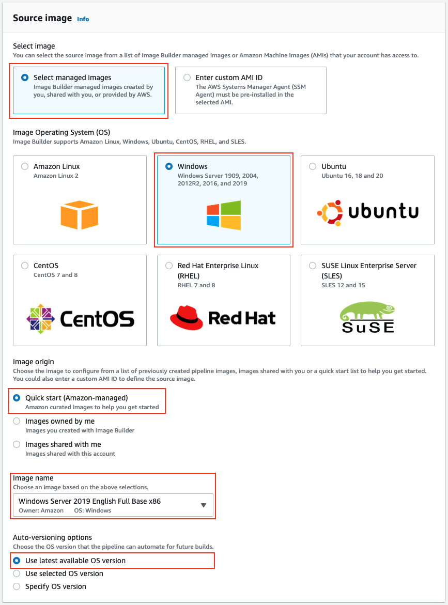

# OBJETIVO 

En este laboratorio vamos a aprender interactuar con el servicio Image Builder que forma parte de Systems Manager. Vamos a aprender a crear una Pipeline y posteriormente crearemos nuestros propios componenetes.

## Creación de nuestro Pipeline dentro de EC2 Image builder.

1.1 Vamos a irnos al servicio **EC2 Image Builder** y pulsaremos sobre **Create image pipeline**

1.2 Pipeline: Le daremos un nombre a nuestra primera pipeline y NO marcaremos el security scan de las instancias. También fijaremos que el lanzamiento de la pipeline sea manual y no con un CRON ni horario.

1.3 Receta: *Create new recipe* y la basaremos en una AMI de Windows Server 2019. También tendremos que ponerle un nombre a nuestra receta y una versión (1.0.0)

1.4 Componentes: agregaremos un agente de Cloudwatch (amazon-cloudwatch-agent-windows/1.0.0) y hello-world-windows/1.0.0. También le podemos añadir un Test para que compruebe que la instancia se ha iniciado correctamente: *simple-boot-test-windows/1.0.0*

1.5 Infraestructura: crearemos una nueva configuración (**Create a new infrastructure configuration**) a la que le daremos el nombre que queramos. Tendremos que crear un rol que tenga la policy *EC2InstanceProfileForImageBuilder* que tiene permisos para S3 y CloudWatch. Finalmente seleccionaremos el tipo de instancia que queremos usar y si no seleccionamos nada más la infraestructura que se usará (VPC, subred, security groups etc) será la que hay por defecto en la cuenta.

1.6 Distribución: marcaremos **Create distribuiton settings using service defaults** para mantener esta imagen privada y solo disponible para nuestra cuenta. ¡Nuestro primer pipeline está listo!
