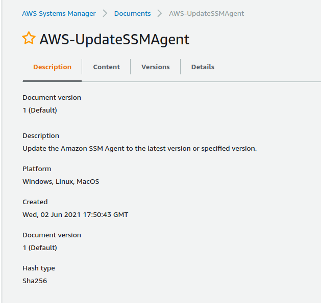

# OBJETIVO 

Vamos a aprender a trabajar con AWS Systems Manager State Manager.

## Escenario

Vamos a desplegar varias instancias con nuestro Stack de CloudFormation y configuraremos una Association para que mantenga al día nuestro agente de SSM y nuestro agente de CloudWatch.

## Despliegue de instancias

1.1 Seleccionaremos el .yaml que previamente hemos guardado del lab 03_AWS_Systems_Manager_Run_Command, le daremos un nombre a nuestro stack y rellenaremos los 3 campos que nos pedirá:
1. la referencia a la AMI que acabamos de recopilar. 
2. El número de instancias: indicaremos que queremos desplegar 3.
3. El valor del tag Name (el nombre que van a tener las instancias)

1.2. Editaremos el rol que usa cada una de las instancias y le configuraremos el rol *LabInstanceProfile* para que el SSM pueda actuar sobre ellas.

## Creación de una Association

2.1 Iremos a **Systems Manager** >>> **State Manager** y haremos click sobre **Create Association** en la parte derecha.

Llamaremos a nuestra asociación **UpgradeSSMAgent** y seleccionaremos el Documento **AWS-UpdateSSMAgent** Pero ¿qué hace ese documento? Vamos a comprobarlo.

2.2 En otra pestaña nos vamos a **Systems Manager**  >>> **Documents** y buscaremos el documento por su nombre: AWS-UpdateSSMAgent . Solo hay una coincidencia y vamos a examinar toda la información sobre el documento: qué hace y la configuración que tiene

Ahora que sabemos lo que vamos a hacer volvemos a la pestaña del State Manager.

2.3 Si seleccionamos el documento de AWS-UpdateSSMAgent veremos que es exactamente lo mismo que hicimos para el lab 03 porque, efectivamente, este documento despliega una acción de Run Command.

Seleccionaremos las instancias que queremos que se vean afectadas por esta Asociación. Ya sea por tags o de forma manual.

Podemos aplicar esta asociación una vez o configurar una periodicidad. 

También podemos marcar la casilla "Apply association only at the next specified cron interval". Si la dejamos desmarcada la asociación se ejecutará por primera vez en cuanto la creemos.

Pincharemos sobre **Create association** y veremos como su estado pasa de *Pending* a *Sucess*. 

A partir de ahora el State Manager se encargará de ejecutar esta Asociación dependiendo de la configuración que le hemos aplicado para mantener nuestras instancias gestionadas exactamente en el punto que queremos.

Podemos Editar y ver nuestras Asociaciones así como ejecutarlas al momento si así lo deseamos.