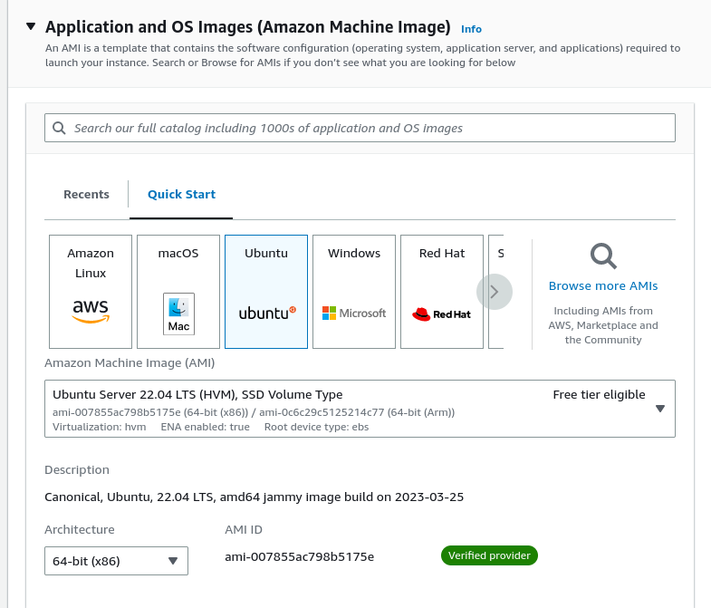
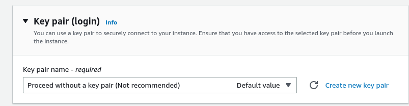
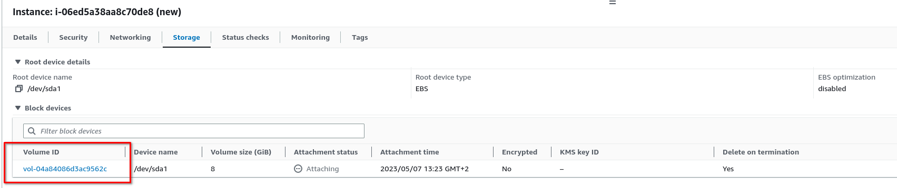
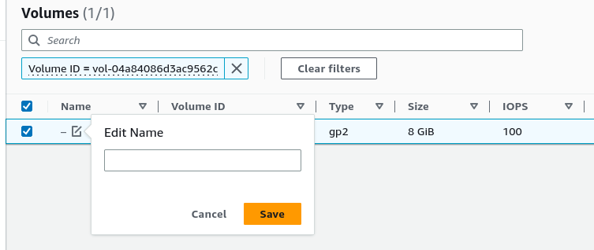
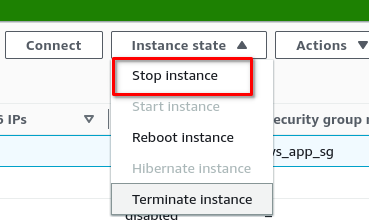

# OBJETIVO 

Aprender a recuperar una instancia a la que no tenemos acceso.

### Escenario:

- En la empresa actual nos encontramos con que hay una instancia EC2 desplegada que gestiona una VPN dentro de nuestra infraestructura. Es un recurso legacy y se ha perdido el acceso a él ya que no tiene abierto el puerto 22 ni se sabe dónde está el .pem de esa instancia. 

- Tendremos que encontrar la manera de conseguir una información vital que existe dentro de la instancia
y además poder usar la misma IP cuando levantemos una nueva instancia con el mismo propósito.

### Levantar la instancia Old

Vamos a tirar un poco de imaginación y crear nosotros mismos la instancia problemática.

Iremos a **EC2** >>> **Launch instance** y lanzaremos una instancia con la AMI de Ubuntu y a la que llamaremos **OLD**



No le asignaremos ninguna key pair y deshabilitaremos el acceso por SSH:



Desplegaremos **Advanced details** y abajo del todo en el apartado **user data** meteremos lo siguiente y desplegaremos la instancia:

``` 
#!/bin/bash
head /dev/urandom | tr -dc A-Za-z0-9 | head -c 35 | tee /etc/ipsec.secret
chmod 400 /etc/ipsec.secret

```

### Asociar una Elastic IP a la instancia Old

Vamos a **EC2** >>> **Network and Security** >>> **Elastic IPs**

Allí pediremos una Elastic IP (**Allocate Elastic IP adress**), la llamaremos **OLD** y la asociaremos a nuestra instancia OLD seleccionandola y pulsando **Actions** >>> **Assocciate Elastic IP adress**

#### ***Ya tenemos todo listo***

En este momento tenemos una instancia a la que no tenemos acceso, no tenemos el .pem, no tiene acceso por SSH y al tener una AMI de Ubuntu 22 no soporta ni tiene configurado SSM etc.

Dentro de esta instancia tenemos un token muy valioso para nuestra empresa y tenemos que conseguirlo para poder volver a desplegar el servicio de VPN que ahora corre en la instancia OLD pero bien montado y con todos los accesos configurados.

¿Cómo podemos hacerlo?

**IMPORTANTE** --- a partir de este punto es esencial seguir los pasos en el orden en el que se indican porque sino no vamos a poder recuperar la información que queremos.

### Recuperación de los datos de la instancia OLD

1. Vamos a levantar una instancia igual que nuestra instancia OLD, solo que en esta ocasión sí vamos a asignarle un Key Pair y vamos a darle conectividad por SSH. La vamos a llamar **NEW** para que no haya confusiones con las siguientes acciones que vamos a realizar.

2. Nuestras dos instancias OLD y NEW tienen un volumen asociado. Vamos a renombrar esos volúmenes, de nuevo, para evitar confusión. Para eso seleccionamos la instancia y en el desplegable de abajo vamos a la sección de **Storage**



Pulsaremos sobre el Volume ID y nos llevará al apartado **Elastic Block Storage** de EC2. En ese apartado podremos editar el nombre de nuestro volúmen y le pondremos el mismo que el de la instancia a la que ahora mismo corresponde (OLD o NEW)



3. Pausaremos las dos instancias (OLD y NEW). ***IMPORTANTE*** pausarlas y no terminarlas



4. Ahora volveremos a listar los volúmenes y en los dos pulsaremos **Actions**  >>> ***Detach volume***

En este punto nuestras dos instancias están pausadas y los dos volúmenes no están asignadas a ninguna de ellas.

5. Seleccionaremos nuestro volumen OLD y pulsaremos sobre ***Actions***  >>> **Attach volume** y lo asignaremos a nuestra instancia **NEW**. Durante el proceso de attachment nos preguntará a qué instancia queremos asignarlo y el nombre de la partición: **dev/sda1**

6. Ya podemos volver a arrancar nuestra instancia **NEW** que ya estará corriendo con el volumen de la instancia OLD. Cuando la isntancia arranque podremos acceder a ella por AWS EC2 instance connect.

7. Una vez dentro nos moveremos al directorio `/etc/` y veremos que allí hay un fichero llamado `ipsec.secret` ¿Podemos hacer un ` cat ` de ese fichero?  


¡Tachán! allí tenemos nuestro token que estaba en la instancia OLD :) 

### Extra

Al principio dijimos que nuestra instancia OLD corría con una Elastic IP. Esto nos ayudará a que nuestra nueva instancia NEW y la VPN que configuraremos en ella use la misma IP que hasta ahora.

Para lograr eso simplemente iremos al apartado **Elastic IPs** y asignaremos la IP que habíamos creado a la instancia NEW en vez de la instancia OLD.

De esta manera tendríamos un sevicio idéntico de puertas para fuera pero a la que ahora ya sí tendríamos acceso.