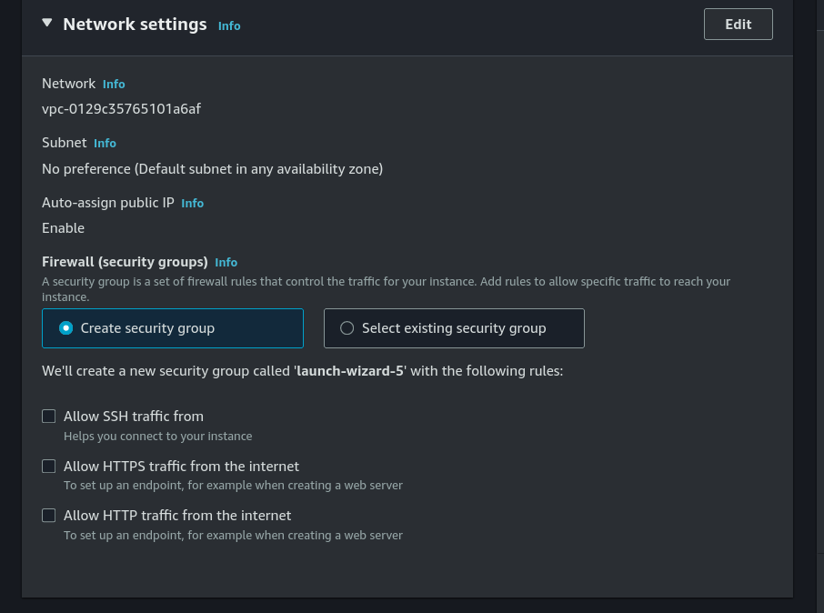
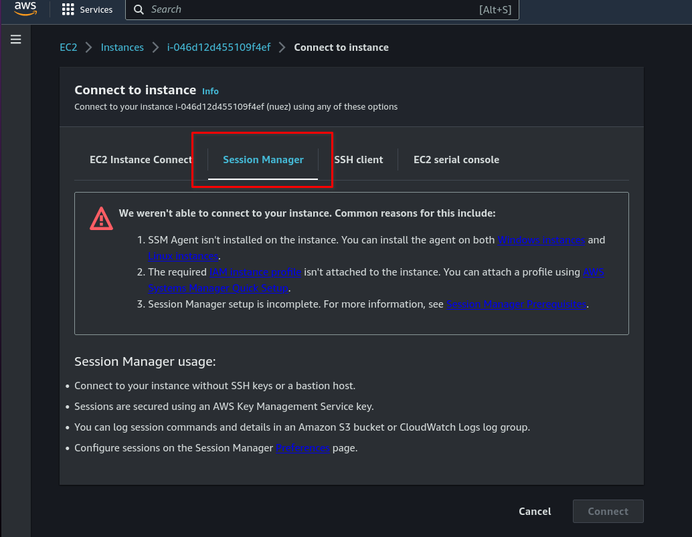
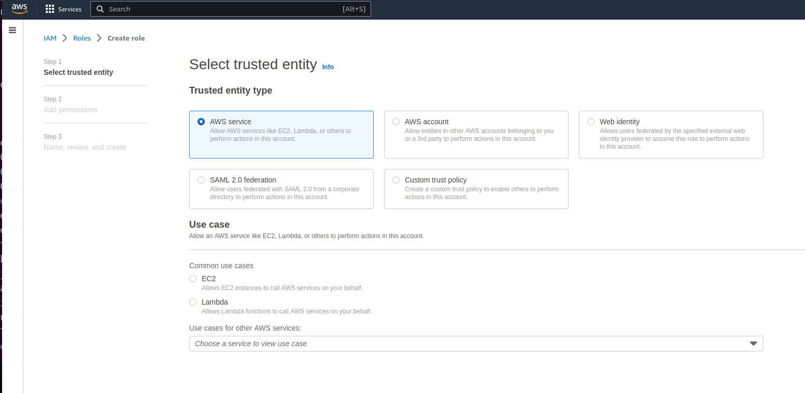

# OBJETIVO 

En el anterior lab ya hemos visto cómo conectarnos a nuestra instancia usando Instance Connect, SSH y EC2 serial console. En este lab vamos a ver más en profundidad cómo configurar y usar la conexión a través de AWS Systems Manager Session Manager.

### Escenario:

- Tenemos que hacer troubleshooting dentro de nuestra instancia EC2 pero nos comunican que por motivos de seguridad el cliente ya no quiere que la instancia tenga acceso directo a internet y tenga expuesto el puerto 22. Vamos a tener que buscar otra forma de conectarnos a ella. 

## Iniciamos una instancia EC2

- Seguimos los pasos enumerados en "Creación de la EC2" del lab anterior solo que en esta ocasión no permitimos el acceso por SSH ni el tráfico desde internet




- Y también meteremos un User data diferente :

```
#!/bin/bash

echo "Datos supersecretos aqui" | tee  /tmp/fichero_secreto.txt

```

## Conexión son Session Manager y configuración de logs

Ahora mismo tenemos una instancia corriendo que no tiene abierto el puerto 22 y tampoco es accesible desde internet. ¿Qué hacemos para acceder a nuestro fichero supersecreto? Vamos a conectarnos con Session Manager.

1. En primer lugar seleccionaremos nuestra instancia y pulsaremos *Connect*. En la pantalla de conexiones seleccionaremos la opción de Session Manager.



Como vemos nos salen varias opciones de configuración que debemos completar antes de que podamos establecer conexión con nuestra instancia.

Sabemos que el punto 1. sí se cumple porque hemos usado una AMI Amazon Linux que lleva el agente SSM instalado por defecto. Pasemos por lo tanto al punto 2.

2. A partir de aquí tenemos varias formas de terminar de configurar los permisos que necesita SSM para Session Manager:

 a) hacer una configuración con *Quick Setup*

 b) crear un instance role para nuestra instancia con los permisos necesarios

 Como la ya hemos visto la opción a) vamos a configurar la opción b.

 **Nota**: al trabajar con AWS Academy y teniendo en cuenta las limitaciones que eso supone NO vamos a poder crear un rol y por lo tanto tendremos que adjudicarle a nuestra instancia el instance role del lab *LabInstanceProfile* siguiendo el punto 2.2

 [Saltarse esta parte por las limitaciones de AWS Academy]:


 <!-- Vamos a ir a IAM y crear un rol específico para nuestra EC2.

 

 Le tenemos que adjuntar la policie *AmazonSSMManagedInstanceCore* a nuestro rol para que funcione. Nota: la policy *AmazonEC2RoleforSSM* está deprecada pero puede seguir apareciendo en alguna documentación o manuales de AWS.

 También le vamos a adjuntar la policy *AmazonS3FullAccess* para poder auditar las sesiones que iniciemos. -->
 

 2.2. Una vez creado el rol, al volver a nuestra instancia y pulsar *Actions >> Security >> Modify IAM role* podremos asociarlo a la instancia. 

 *Nota*: hay que esperar unos minutos a que el instance role se propague a la instancia.

  2.3. Mientras esperamos a que los permisos se propaguen a la instancia vamos a configurar el Session Manager para volcar los logs de cada sesión a S3. Para eso vamos a crear un bucket S3:

  **S3 >>> Create bucket** 

  Le ponemos un nombre identificativo y no lo ciframos ni le ponemos versionado en esta ocasión. (En un escenario real sería conveniente hacerlo)

  Ahora debemos configurar Session Manager para que guarde los logs en este bucket. Para eso accedemos al servicio, o bien desde la misma ventana de conectividad con nuestra instancia:

   

   o bien yendo al Servicio AWS Systems Manager y buscando Session Manager bajo el desplegable de Node Management.

   Aquí podemos ver toda la información de Session Manager: tanto las sesiones que hay abiertas actualmente como el histórico de sesiones y las preferencias de este servicio. Vamos a pinchar en *Preferences* y *Edit* y configurar *S3 Logging* indicando el nombre del bucket que hemos creado antes.

 ## Conexión a través de Session Manager

 Ya tenemos todo listo para usar Session Manager. Nos conectamos y ejecutamos:

 ` cd /tmp ` 
 ` cat fichero_secreto.txt `

 Aquí podemos ejecutar los comandos que queramos o crear otro fichero por ejemplo:

 ` touch fichero_mas_secreto.txt ` 

 Una vez hecho esto podemos pulsar en *Terminate* del Session manager y cerrar la sesión. Si volvemos a la consola del servicio veremos que nuestra sesión ha quedado registrada y auditada: 


A la derecha del todo tendremos un botón que nos llevará directamente al fichero de logs de esa sesión que se ha guardado en nuestro bucket S3. Podemos acceder a ese fichero y guardarlo en nuestro equipo. Se bajará un fichero .log que podremos examinar con un `cat` y allí se mostrarán todas las acciones que hemos realizado durante la sesión.

