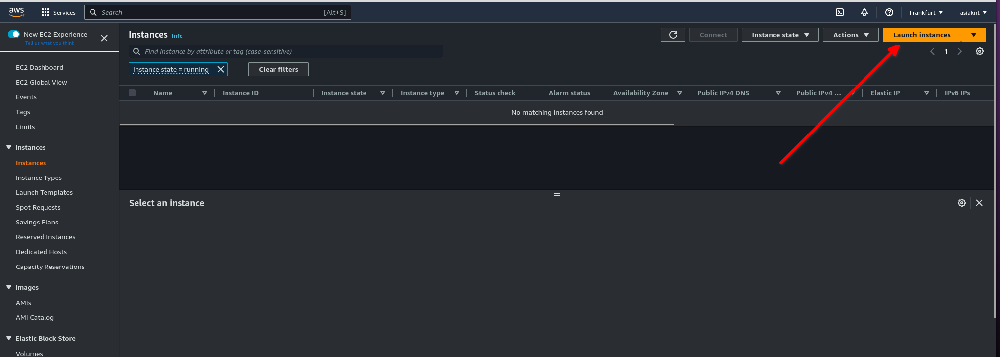
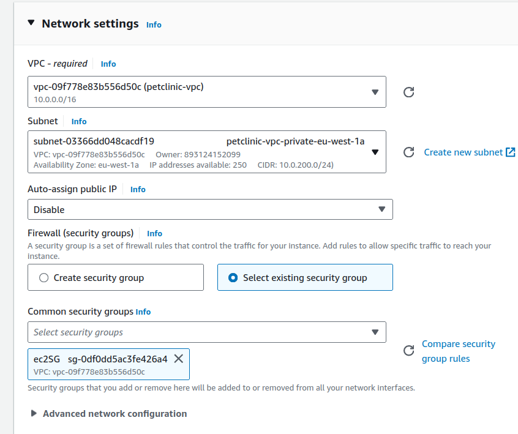
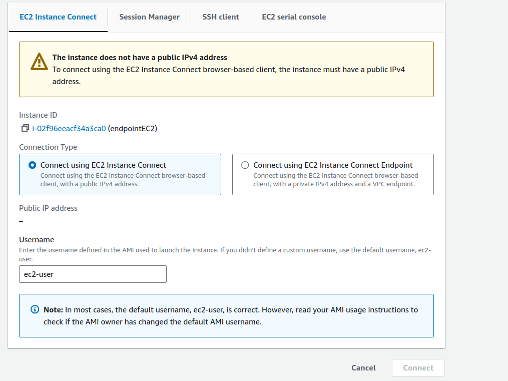

# OBJETIVO 

En este laboratorio vamos a aprender cómo podemos conectarnos a una instancia ubicada en una subred privada utilizando AWS EC2 Instance Connect Endpoint.

Vamos a desplegar una EC2 en una subred privada. Para eso tenemos que asegurarnos de que tenemos una subred privada en nuestra VPC. Es decir, una subred que no esté enrutada a un IGW. Si no tenemos ninguna vamos a crearla nosotros.

## Creación de Security Groups

Vamos a crear dos security groups. Uno para el endpoint y otro para la instancia de prueba que vamos a lanzar. 

Las reglas del SG del Endpoint serán las siguientes:

No podremos poner la regla Outbound hasta que no tengamos creado el SG de la instancia así que eso lo dejamos para luego.

Creamos el SG de la instancia que tendrá las siguientes reglas:

Ahora también podemos volver al SG del endpoint para terminar de crear sus reglas.

## Creación del Instance Connect Endpoint

Como la creación del endpoint tarda un rato es lo primero que vamos a crear.

Vamos a **VPC** y en la lista de la izquierda seleccionamos el apartado de "Endpoints"

Al crear el endpoint debemos:
- Darle un nombre identificativo
- Seleccionar un endpoint cuyo Service Category sea "EC2 Instance Connect Endpoint"
- Seleccionar la VPC en la que vamos a desplegarlo (la misma que la de la EC2)
- Seleccionar el SG que previamente hemos creado
- Seleccionar la subred *privada* en la que vamos a desplegarlo junto a la instancia

Al terminar el proceso de creación el Endpoint nos saldrá listado en el apartado Endpoints. Primero su estado será "Pending" pero después de unos minutos pasará a ser "Available"

## Creación de la EC2

1. Vamos a acceder a la Consola de AWS y buscar el servicio de *EC2* y después pincharemos en *Instances*.

2. Vamos a lanzar una instancia EC2 muy simple 

- Le pondremos un nombre identificativo y seleccionaremos la *AMI de Amazon Linux* . Para esta demonstración nos valdrá con una instancia *t2.micro*

- Tenemos que asegurarnos de que la instancia va a tener acceso por SSH y que la desplegamos en una subred privada. Para conseguir esto último vamos a modificar la configuración de Networking que viene por defecto:

Vamos a desplegar la instancia en la misma VPC y subred privada que nuestro Endpoint y también le vamos a asignar el SG que habíamos creado previamente para ella.

- También crearemos unas key_pair para esta instancia en específico y veremos cómo se nos descarga el fichero .pem

- Lanzaremos la instancia y esperaremos a que esté disponible para seleccionarla y conectarnos a ella.

## Conexión a través del Instance Connect Endpoint

Al intentar conectarnos por instance connect, como es natural nos aparecerá un mensaje indicando que la instancia no tiene una IP pública y por lo tanto no podemos establecer conexión con ella.

Sin embargo si seleccionamos la opción de "Connect using EC2 Instance Connect Endpoint se nos dará la opción de elegir el endpoint que previamente hemos creado y podremos acceder a la instancia.

¡Buen trabajo!

