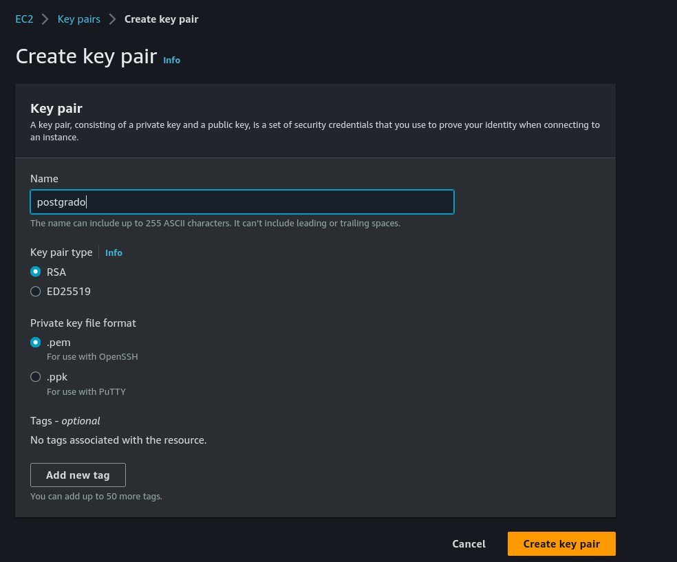
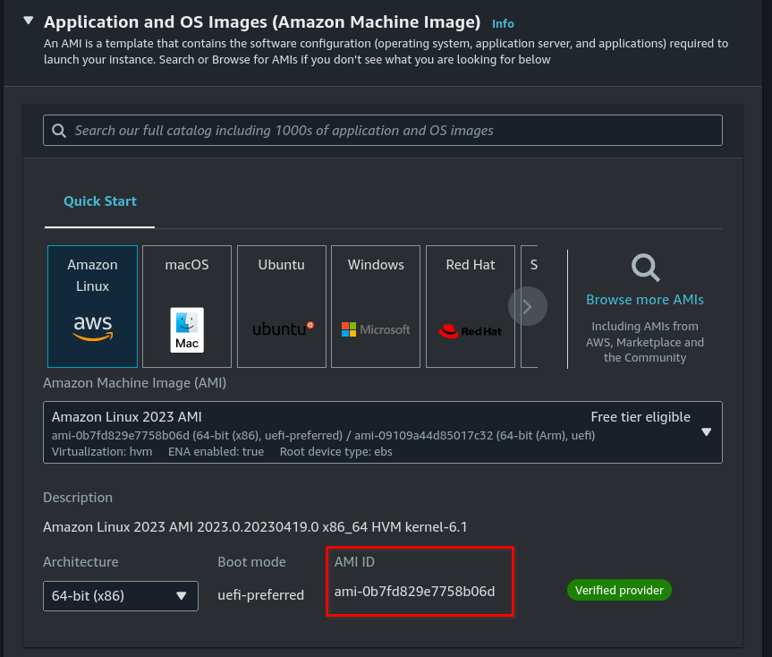
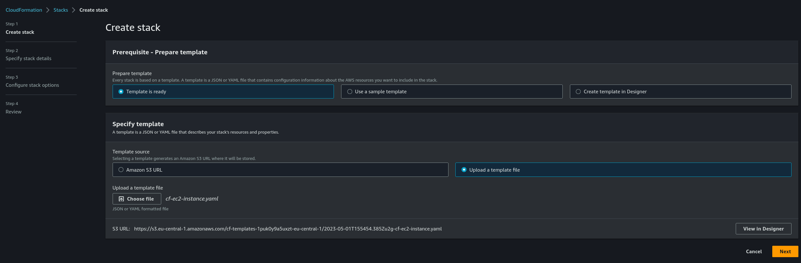
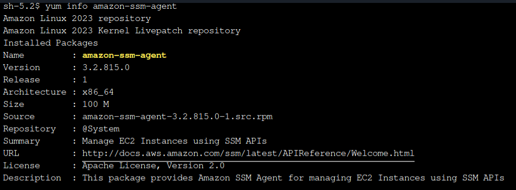
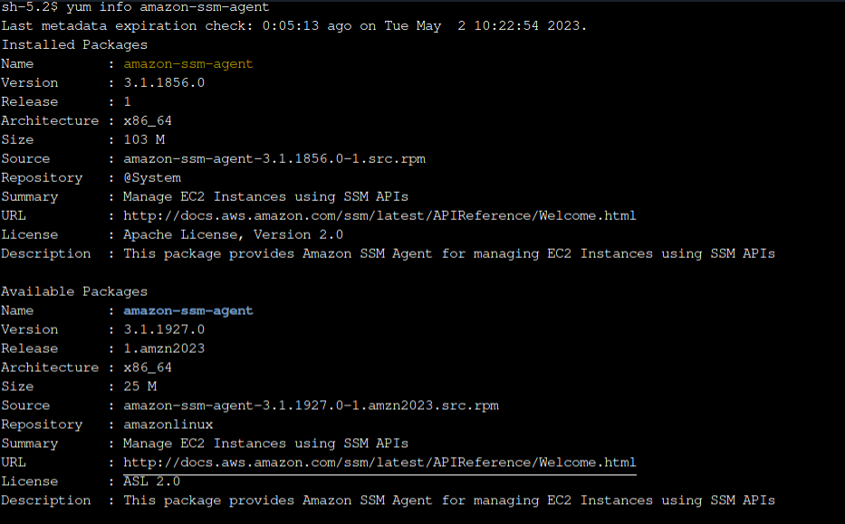

# OBJETIVO 

En este laboratorio vamos a realizar acciones sobre un grupo de instancias EC2 usando Run Command. Primero veremos cómo se podría actualizar el agente de SSM que corre en las instancias y luego cómo podríamos ejecutar un Shell Script en todas las instancias a la vez.

## Creación de varias instancias con CloudFormation

- En esta ocasión no vamos a crear una instancia como en los labs anteriores sino que queremos ejecutar acciones sobre un grupo de instancias por lo que vamos a desplegar una plantilla de CloudFormation. 

1.1 Lo primero que tenemos que hacer es crear un key pair para poder conectarnos a las instancias que vamos a lanzar. En la plantilla de CloudFormation hemos especificado que ese key pair tiene que llamarse `postgrado` así que vamos a crearlo.

Vamos al servicio **EC2** y a mano izquierda, bajo el apartado **Network&Security** seleccionamos **Key Pairs**. 

Introduciremos el nombre de nuestra key pair (**postgrado**) y dejaremos todos los demás campos como están. Al crear la key pair nos aseguraremos de que el archivo .pem se ha bajado a nuestro equipo.

1.2 Antes de proceder a crear nuestro stack tenemos que averiguar qué AMI queremos que usen nuestras instancias porque CloudFormation nos lo va a preguntar. Vamos a **EC2** >> **Launch Instance** . Es la forma más rápida de saber la AMI que queremos desplegar.

1.3 Lo siguiente que vamos a hacer es ir al servicio **CloudFormation** y pulsaremos en *Create Stack*

Seleccionaremos el .yaml que previamente hemos guardado, de daremos un nombre a nuestro stack y rellenaremos los 3 campos que nos pedirá:
1. la referencia a la AMI que acabamos de recopilar. 
2. El número de instancias: indicaremos que queremos desplegar 2.
3. El valor del tag Name (el nombre que van a tener las instancias)

Después de un rato nuestro stack estará desplegado y podemos seguir.

## Configuración de SSM en las instancias desplegadas

- Por las limitaciones de AWS Academy no vamos a poder usar el **Quick Setup** de Systems Manager así que simplemente tendremos que cambiar el IAM role de nuestras instancias una por una por el de *LabInstanceProfile* para que las instancias puedan funcionar con Systems Manager.

Ahora quedaría esperar unos 5 minutos hasta que la configuración se propague a nuestras instancias desplegadas.

Antes de seguir vamos a conectarnos a alguna de nuestras instancias a través del Session Manager y comprobar qué versión de SSM Agent tienen corriendo ejecutando:

` yum info amazon-ssm-agent `

## Run Command SMM Agent Downgrade

3.1 Dentro de **Systems Manager** Nos vamos al apartado **Run Command** que está dentro de **Node Management**.

Seleccionaremos el documento *AWS-UpdateSSMAgent* y en el apartado *"Command parameters"* Cambiaremos el **Allow Downgrade** a *True* y fijaremos la versión en la 3.1.1856.0

Seleccionaremos las instancias a las que queremos aplicar este cambio. En este caso por Tag. Marcaremos Name/Nuesro_Tag.

3.2 Esperaremos a que el Run Command termine de ejecutarse y volveremos a conectarnos a alguna de nuestras dos instancias mediante Session Manager. Al volver a ejecutar la información sobre el agente de SSM ahora la versión que aparece debería ser la que hemos fijado:

## Run Command Shell Script

4.1 Vamos a conectarnos a alguna de las dos instancias usando Session Manager y una vez dentro ejecutaremos:

` docker --version `

Como vemos, nuestro stack de CloudFormation también ha instalado Docker en las instancias que hemos desplegado.

4.2 Volveremos a Run Command y esta vez ejecutaremos el documento **AWS-RunShellScript**

En el recuadro *Command parameters* podemos introducir cualquier commando o script. En este caso introduciremos:
` yum remove -y docker `

4.3 Al volver a conectarnos a cualquiera de las dos instancias que tenemos desplegadas y ejecutar ` docker ` veremos que Docker ha sido desinstalado en ellas por el Run Command.

