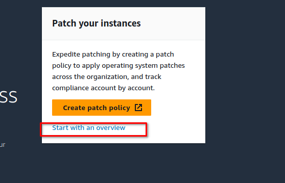
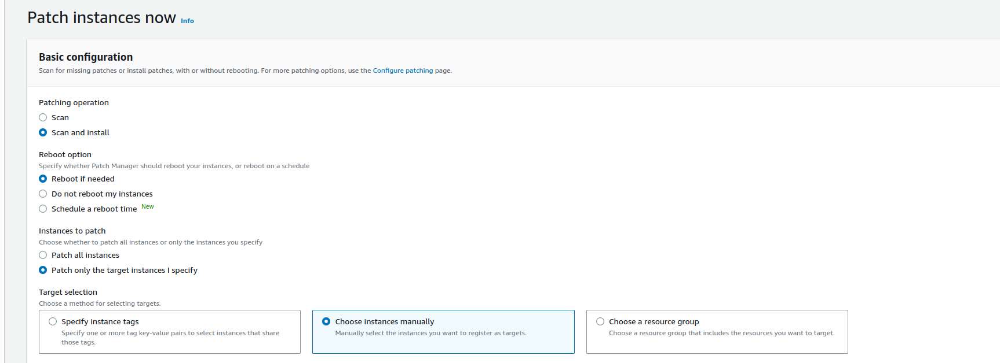
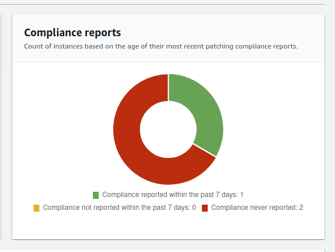

# OBJETIVO 

Vamos a ver un ejemplo sencillo del uso de Patch Manger.

## Escenario

Por las limitaciones de AWS Academy no vamos a poder hacer la configuración recomendada de Patch manager que se realiza desde el **Quick Setup** de Systems Manager. 

En esta ocasión simplemente vamos a realizar un **Patch now** sobre las instancias que ya teníamos desplegadas del LAB anterior.

### Realizar un escaneo

Antes de empezar con el Patch Manager vamos a crear un Bucket S3 y le vamos a poner un nombre identificativo y único. Desactivaremos el cifrado del bucket para hacer el lab de forma más dinámica. Allí será donde se guarde el stdout del parcheo que vamos a realizar. 

La primera vez que abramos el Patch Manager veremos que la opción que se nos recomienda es redirigirnos al **Quick Setup** de Systems Manager. Nosotros vamos a pinchar sobre **Start with an overview**  para ejecutar un Patching en tiempo real y ver lo que ocurre.

En la pestaña de **Compliance reporting** veremos listadas las instancias que tenemos configuradas con el agente de SSM.

Pulsaremos sobre **Patch now** arriba a la derecha y rellenaremos los campos como en la imagen

De las instancias que tenemos desplegadas del lab anterior solo seleccionaremos UNA y seleccionaremos el bucket s3 que hemos creado previamente para guardar los logs del parcheo.

Pulsaremos a **Patch now** y el parcheo comenzará.

Cuando haya terminado podremos ver en el Dashboard que solamente 1 de los nodos gestionados por SSM ha sido parcheado porque hemos seleccionado solo una de las tres instancias que tenemos corriendo.

Si vamos a nuestro bucket S3 también podremos ver el log del parcheo que se ha realizado.