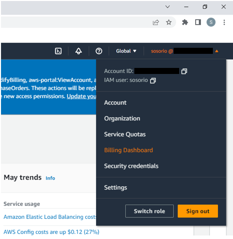
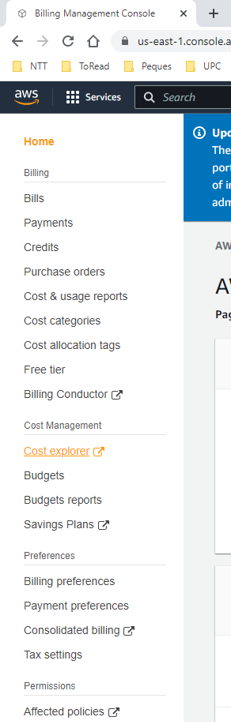
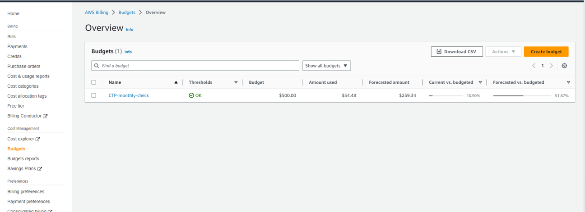
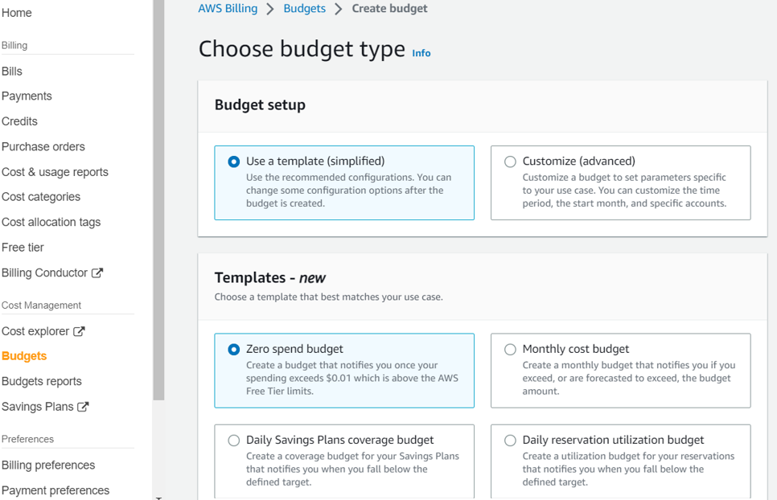
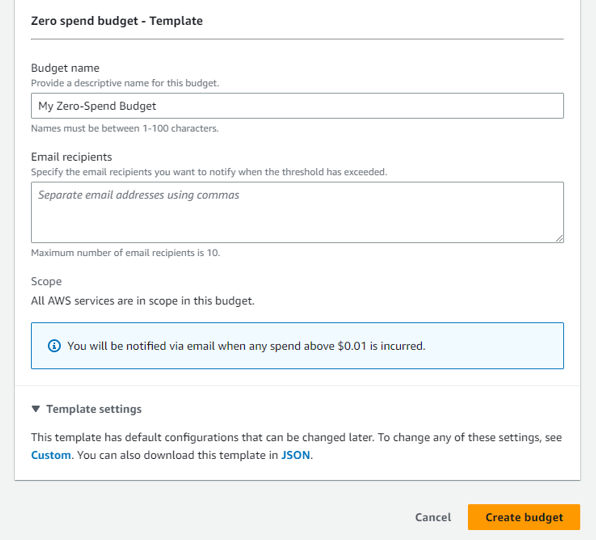
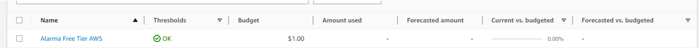
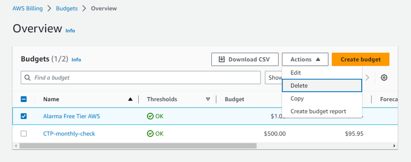

# Lab 01 - Crear alerta para FreeTier

1. Ir la consola de AWS --> Billing Dashboard
 

2. Acceder a la sección de Budgets
 

3. Apretar el botón de "Create budget"
 

4. Seleccionar "Use a template (simplified)" y como template, "Zero Spend Budget"
 

- Información básica:

  - Budget Name: "Alarma Free Tier AWS"
  - Email recipients: _poner vuestro correo_
 

5. Seleccionar el botón "Create budgets 

6. Debería aparecer el nuevo budget creado en el listado:
 

7. Para borrarlo, seleccionar la línea del listado y a continuación desplegar el botón Actions. Aparecerá la opción de borrar (Delete)
 

