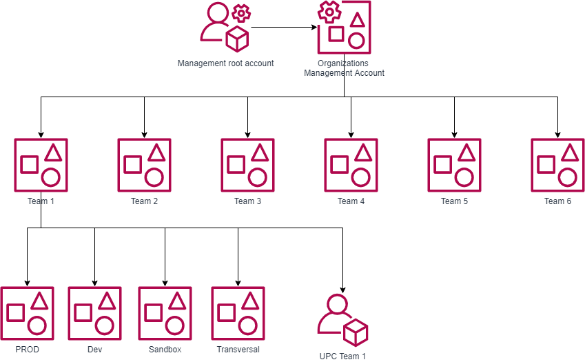

# Lab 01- Mostrar la aplicación de SCP en una AWS Account

1. La AWS Organizations de prueba tiene el siguiente esquema:
</br>



Para cada equipo del posgrado se han generado las siguientes cuentas:

Datos de las cuentas:

```bash
UPC Team 1
Account Number: 792415633245
E-mail: degauniversitat+team1@protonmail.com

UPC Team 2
Account Number: 219485517304
E-mail: degauniversitat+team2@protonmail.com

UPC Team 3
Account Number: 683913522156
E-mail: degauniversitat+team3@protonmail.com

UPC Team 4
Account Number: 634427852167
E-mail: degauniversitat+team4@protonmail.com

UPC Team 5
Account Number: 006640390480
E-mail: degauniversitat+team5@protonmail.com

UPC Team 6
Account Number: 746642716834
E-mail:  degauniversitat+team6@protonmail.com
```

2. Mostrar las SCPs existentes

Asociado al *root* de la AWS Organizations tenemos la siguiente SCP:
```bash
{
  "Version": "2012-10-17",
  "Statement": [
    {
      "Effect": "Allow",
      "Action": "*",
      "Resource": "*"
    }
  ]
}
```
En cada uno de las _Team X_ OU se ha asignado la siguiente SCP:

```bash
{
  "Version": "2012-10-17",
  "Statement": [
    {
      "Sid": "DenyAll",
      "Effect": "Deny",
      "Action": "*",
      "Resource": "*"
    }
  ]
}
```

A la cuenta _UPC Team X_ se le ha asignado la siguente SCP:

```bash
{
  "Version": "2012-10-17",
  "Statement": [
    {
      "Sid": "Statement1",
      "Effect": "Allow",
      "Action": [
        "ec2:*"
      ],
      "Resource": "*"
    }
  ]
}
```

PREGUNTA: Qué créeis que se podrán hacer en las cuentas que tenéis acceso?

3. Dar acceso a los alumnos a las cuentas de pruebas

Por cada grupo, solicitar el password de acceso a vuestras cuentas de prueba, una por cada equipo.

4. Explorar la consola para ver qué hay disponible

Qué podéis hacer y qué no?
Tened en cuenta que estáis accediendo con los datos de creación de cuenta (root access to the AWS Acconut)

5. Aplicar nuevas SCPs

Cuando hayáis explorado y tengáis repuesta a las preguntas anteriores, solicitar al profesor un cambio de SCPs

6. Qué ha cambiado? Se puede realizar alguna acción?
