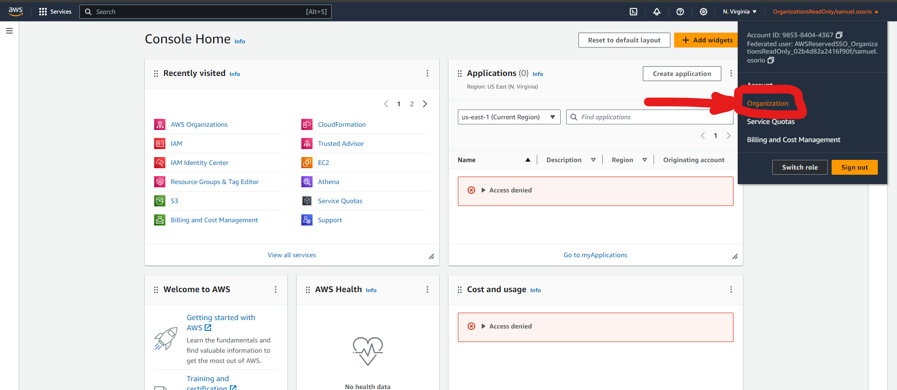
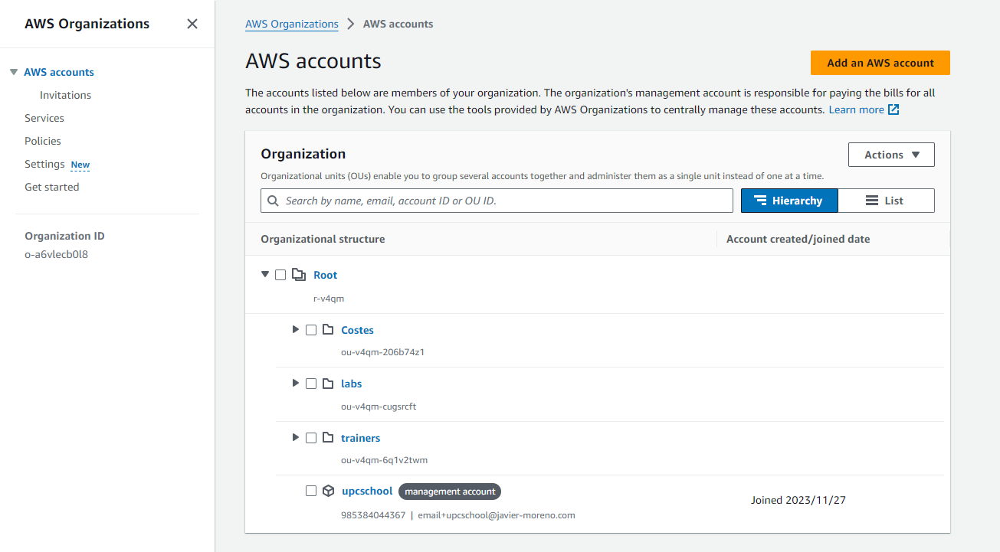
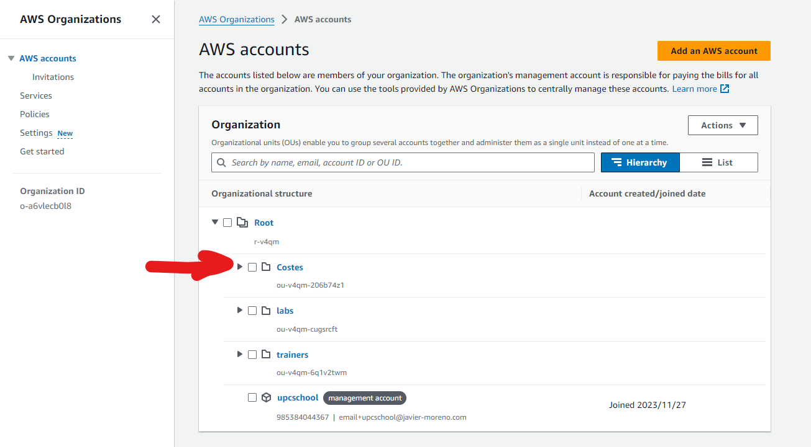
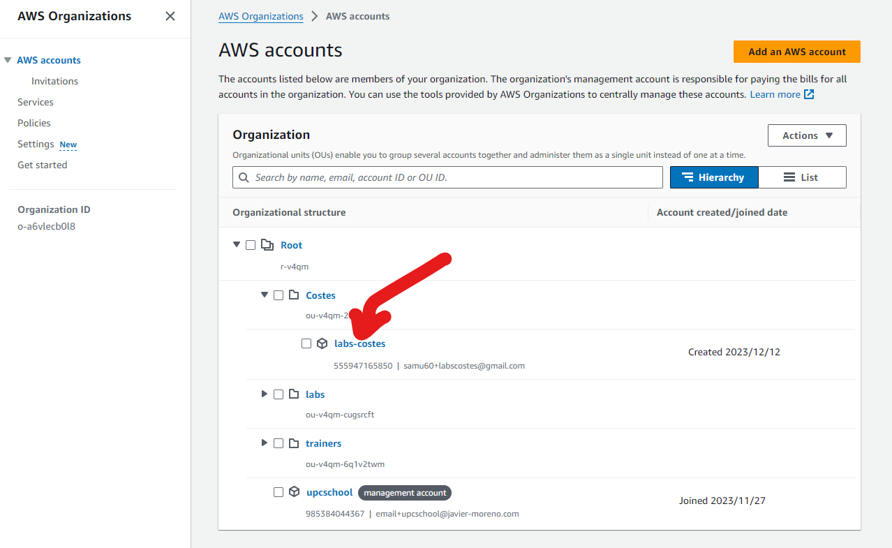
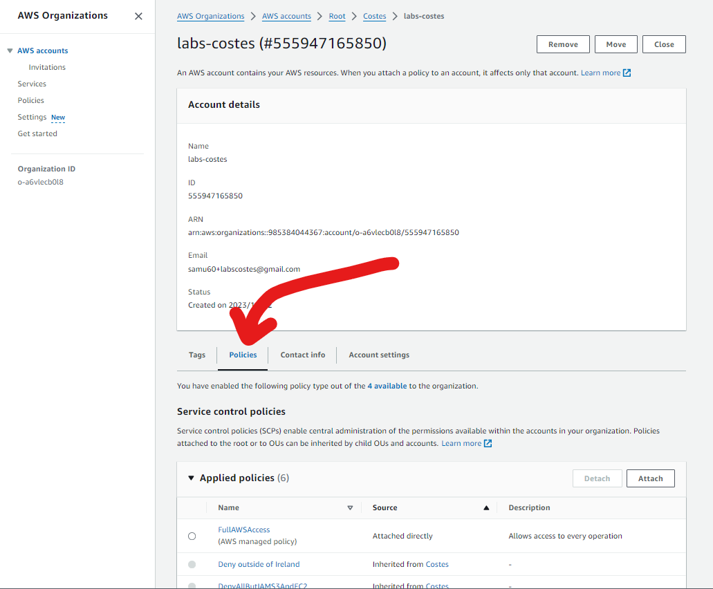
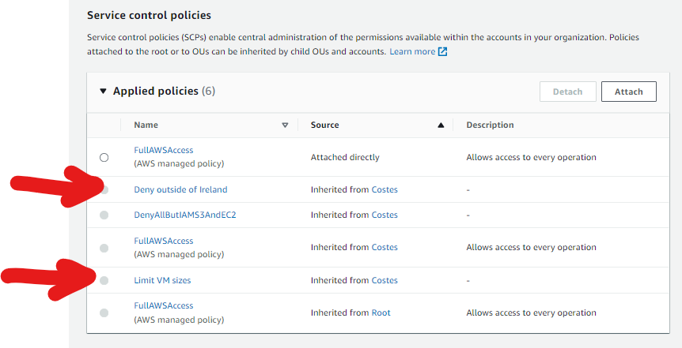
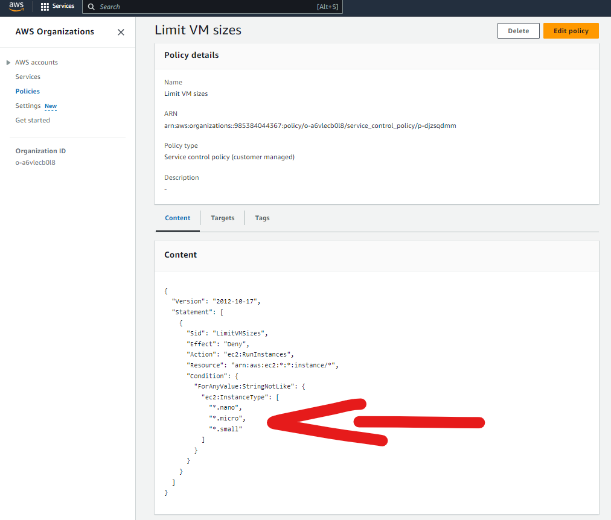

# Lab 01 - Revisar estructura AWS Organizations y SCP aplicadas

1. Ir la consola de Organizations desde la consola de AWS
</br>



2. Revisar la estructura general de OUs y cuentas asignadas
</br>



2.1. Alternativa AWS CLI

Ejecutando la siguiente instrucción:
```
aws organizations list-organizational-units-for-parent --parent-id r-v4qm
```
Debe aparecer el primer nivel de OUs:
<details>
{
    "OrganizationalUnits": [
        {
            "Id": "ou-v4qm-6q1v2twm",
            "Arn": "arn:aws:organizations::985384044367:ou/o-a6vlecb0l8/ou-v4qm-6q1v2twm",
            "Name": "trainers"
        },
        {
            "Id": "ou-v4qm-206b74z1",
            "Arn": "arn:aws:organizations::985384044367:ou/o-a6vlecb0l8/ou-v4qm-206b74z1",
            "Name": "Costes"
        },
        {
            "Id": "ou-v4qm-cugsrcft",
            "Arn": "arn:aws:organizations::985384044367:ou/o-a6vlecb0l8/ou-v4qm-cugsrcft",
            "Name": "labs"
        }
    ]
}
</details>

3. Ubicar la cuenta labs-costes. Apretar la flecha delante de la OU "Costes" para desplegarla
</br>



3.1. Alternativa AWS CLI

Ejecutando la siguiente instrucción:
```
aws organizations list-accounts-for-parent --parent-id ou-v4qm-206b74z1
```
Debe aparecer las cuentas dentro de la OU _Costes_ (si no se sabe la OU se debe iterar hasta encontrar la cuenta):
<details>
{
    "Accounts": [
        {
            "Id": "985384044367",
            "Arn": "arn:aws:organizations::985384044367:account/o-a6vlecb0l8/985384044367",
            "Email": "email+upcschool@javier-moreno.com",
            "Name": "upcschool",
            "Status": "ACTIVE",
            "JoinedMethod": "INVITED",
            "JoinedTimestamp": "2023-11-27T16:09:02.290000+00:00"
        }
    ]
}
</details>

4. Revisar la configuración de la cuenta, apretando sobre el nombre de la misma en el dashboard de AWS Organizations
</br>



5. Debería aparecer el detalle de la cuenta con un apartado de las Policies asignadas
</br>



5.1. Alternativa AWS CLI
Ejecutando la siguiente instrucción:
```
aws organizations list-policies-for-target --target-id 555947165850 --filter SERVICE_CONTROL_POLICY
```
Debe aparecer las Service Control Policies pero _sólo las directamente asociadas_:
<details>
{
    "Policies": [
        {
            "Id": "p-FullAWSAccess",
            "Arn": "arn:aws:organizations::aws:policy/service_control_policy/p-FullAWSAccess",
            "Name": "FullAWSAccess",
            "Description": "Allows access to every operation",
            "Type": "SERVICE_CONTROL_POLICY",
            "AwsManaged": true
        }
    ]
}
</details>

6. El detalle completo de las SCP aplicadas deberia ser el siguiente:
</br>




7. Seleccionando sobre el nombre de las SCPs se puede observar el detalle de la Policy:
</br>



7.1. Alternativa AWS CLI
Ejecutando la siguiente instrucción:
```
aws organizations describe-policy --policy-id p-FullAWSAccess
```
Debe aparecer el detalle de la policy que hemos visto anteriormente asignada a la cuenta:
<details>
{
    "Policy": {
        "PolicySummary": {
            "Id": "p-FullAWSAccess",
            "Arn": "arn:aws:organizations::aws:policy/service_control_policy/p-FullAWSAccess",
            "Name": "FullAWSAccess",
            "Description": "Allows access to every operation",
            "Type": "SERVICE_CONTROL_POLICY",
            "AwsManaged": true
        },
        "Content": "{\n  \"Version\": \"2012-10-17\",\n  \"Statement\": [\n    {\n      \"Effect\": \"Allow\",\n      \"Action\": \"*\",\n      \"Resource\": \"*\"\n    }\n  ]\n}"
    }
}
</details>

El contenido de la política es difícil de ver por el formato, pero debe estar en el campo _Content_