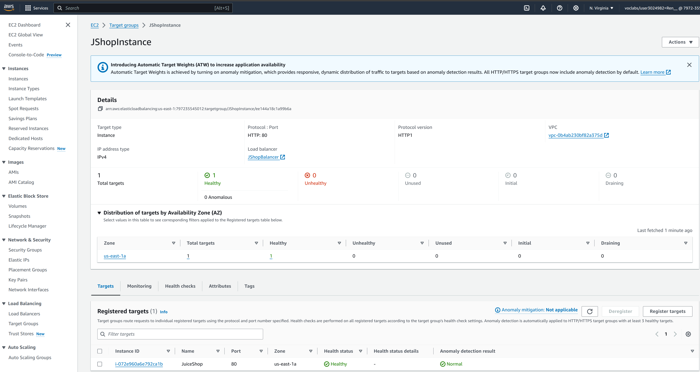

# Laboratorio de Redes Avanzadas

## Lab 3: Instalar un AWS WAF y JuiceShop

En este caso tenemos una aplicación instalada en nuestro entorno que sospechamos que es insegura. El propósito de esta práctica va a ser ver como la web insegura se puede vulnerar cuando no usamos un WAF, pero con las reglas apropiadas podemos evitar el ataque.

### Preparación del entorno

Primero crearemos una máquina en EC2 y en el VPC por defecto y en la zona de disponiblidad queramos. Para la demo habilitamos en la Security Policy el tráfico HTTP desde toda la red.

Si seleccionamos una máquina tipo Ubuntu, una vez desplegada nos conectamos a la consola y instalamos la aplicación:


```
sudo apt update
sudo apt install docker.io
sudo docker run --restart=always -d -p 3000:3000 --name juice-shop -e "NODE_ENV=ctf" bkimminich/juice-shop
```

Comprobamos que la aplicación se ha instalado correctamente usando su IP pública en un navegador:
http://[IP AWS]

Una vez dentro podemos probar de hacer un ataque de SQL injection, para ello vamos a la opción de "Account" que se encuentra en la parte superior derecha de la pantalla y ponemos como usuario:

```
' or true --
```

Y cualquier cosa en el password.

Si hemos tenido éxito deberíamos ver un aviso que el ataque ha sido exitoso.

### Protegiendo la infrastructura

Para que el sistema pueda ser protejido vamos a instalar los siguienes componentes:
    * Application Load Balancer (ALB): en el que se añadirá la máquina EC2 que se ha creado anteriormente
    * WAF: para proteger los accesos

#### Application Load Balancer

Solo es necesario tener en cuenta que el Security Group permita que el WAF se pueda conectar al ALB así como que el ALB se conecte al puerto 80 de la instancia de EC2. Se puede ver fácilmente si el ALB está correctamente configurado cuando ponga que la instancia está Healthy como muestra la siguiente figura.

:

#### Configuración del WAF

Para configurar el WAF se necesita crear una //Web ACL//. En ella se necesita crear unas reglas, para el lab solo necesitamos crear una regla gestionada y añadir SQL Injection.

También se tienen que asociar los recursos AWS del Application Load Balancer que se ha creado anteriormente. Conviene asegurarse que el Security Group permite dicha conexión.


