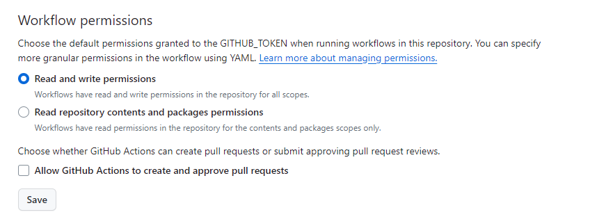

# Github actions Terraform

This laboratory will help you to deploy infraestructure components using Terraform and Github actions to automate the deployment of changes, using the Git repository as unique source of truth.

## Preparation

* Install the [GitHub CLI](https://cli.github.com/), as we will use it to automate the management
of the repo

```bash
curl -fsSL https://cli.github.com/packages/githubcli-archive-keyring.gpg | sudo dd of=/usr/share/keyrings/githubcli-archive-keyring.gpg \
&& sudo chmod go+r /usr/share/keyrings/githubcli-archive-keyring.gpg \
&& echo "deb [arch=$(dpkg --print-architecture) signed-by=/usr/share/keyrings/githubcli-archive-keyring.gpg] https://cli.github.com/packages stable main" | sudo tee /etc/apt/sources.list.d/github-cli.list > /dev/null \
&& sudo apt update \
&& sudo apt install gh jq -y
```

## Backend configuration

Following GitOps best practises, we will initialize a Terraform remote backend, instead of tracking the state file in the git repository.

1.1- Use the Terraform files from [Lab50 Module 09-gitops-terraform](../../../09-gitops-terraform/labs/lab50-backends/00-src-init-backend/) to create an S3 bucket for storing the state
and a DynamoDB table to avoid simultaneous manipulation of the infrastructure from two different runners.

1.2- `validate`, `init` and `apply` the configuration stored in [00-src-init-backend](../../../09-gitops-terraform/labs/lab50-backends/00-src-init-backend/),
and **take note of the output**; we will need it in the near future!

1.3- Make sure the S3 Bucket and DynamoDB table have been created correctly


## Local Repository initialization

2.1- Create the local repository of the project that will configure the pipeline

```bash
mkdir poc-actions-terraform
cd poc-actions-terraform
git config --global init.defaultBranch main
git init
```

2.4- Add the following `.gitignore` to avoid uploading undesired files to GitHub

```.gitignore
# Local .terraform directories
**/.terraform/*

# .tfstate files
*.tfstate
*.tfstate.*

# Crash log files
crash.log
crash.*.log

# Exclude all .tfvars files, which are likely to contain sensitive data, such as
# password, private keys, and other secrets. These should not be part of version 
# control as they are data points which are potentially sensitive and subject 
# to change depending on the environment.
*.tfvars
*.tfvars.json

# Ignore override files as they are usually used to override resources locally and so
# are not checked in
override.tf
override.tf.json
*_override.tf
*_override.tf.json

# Ignore CLI configuration files
.terraformrc
terraform.rc

# Configuration files
*.conf
```

2.5- Copy the source code you will find in [./00-src-network/](./00-src-network/). Take the opportunity to look at the code, make sure you understand the content and commit the files.

```bash
git add --all
git commit -m "first commit"
```
Your repo should have the following structure:

```txt
.
├── .gitignore
├── main.tf
├── outputs.tf
├── providers.tf
└── variables.tf
```


## Github Repository initialization

Next, we will **create a new repository in GitHub** where we will push the source code.

3.2- Authenticate yourself on GitHub using the CLI (follow the instructions provided by the tool)

```bash
gh auth login
```

3.3- Create the new repo, setting it as the *origin* of the local one

```bash
gh repo create poc-actions-terraform --public --source .
```

3.4- Now, push the code to the newly created repo

```bash
git push origin main
```

## Local Terraform Run

3.1- Set your AWS credentials (**replace the portion of text in the diamon with the actual values**)

Note: You should already have the AWS Credentials configured, take a look just in case.

```bash
export AWS_ACCESS_KEY_ID=<access_key>
export AWS_SECRET_ACCESS_KEY=<secret_key>
export AWS_SESSION_TOKEN=<session_token>
```

3.2- Check that you configured your credentials correctly

```bash
aws sts get-caller-identity
```

3.3- Try to run `terraform init` locally. The command should prompt you for the mandatory variables necessary to initialize the backend. This is because the backend definition in `providers.tf`, is empty!
This time, we are providing a configuration file with the backend configuration `backend.conf`

```bash
export BUCKET_S3_NAME="<S3 BUCKET NAME>"
export DYNAMODB_TABLE="<DYNAMODB TABLE NAME>"
```

```bash
cat << EOF > backend.conf
bucket = "$BUCKET_S3_NAME"
key    = "terraform.tfstate"
dynamodb_table = "$DYNAMODB_TABLE"
region = "us-east-1"
EOF
```

```bash
terraform init -backend-config=backend.conf
```

3.4- Make sure the source code is correct using `terraform validate`


## Configure GitHub Actions

4.1- Retreive your GitHub Username

```bash
GH_USER=$(gh api user | jq -r '.login')
echo You are $GH_USER.
```

4.2- Define three secrets for your recently created repository and set your AWS credentials
as their values

```bash
gh secret set AWS_ACCESS_KEY_ID \
  --app actions \
  --body $AWS_ACCESS_KEY_ID \
  --repo $GH_USER/poc-actions-terraform

gh secret set AWS_SECRET_ACCESS_KEY \
  --app actions \
  --body $AWS_SECRET_ACCESS_KEY  \
  --repo $GH_USER/poc-actions-terraform

gh secret set AWS_SESSION_TOKEN \
  --app actions \
  --body $AWS_SESSION_TOKEN  \
  --repo $GH_USER/poc-actions-terraform
```

4.3- We don't consider the Terraform Backend configuration of the bucket as sensible information, so we set the `s3 bucket name` together with the `dynamodb table name` as a repository variable instead.

```bash
gh variable set s3_bucket --body "$BUCKET_S3_NAME" --repo $GH_USER/poc-actions-terraform
gh variable set dynamodb_table --body "$DYNAMODB_TABLE" --repo $GH_USER/poc-actions-terraform
```

4.4- Use the Github UI to check that the secrets together with the variable are set correctly.

```bash
echo "Visit https://github.com/$GH_USER/poc-actions-terraform/settings/secrets/actions"
```

Notice that secrets can not be visualized, thus can only be updated or deleted

## Configure the base workflow

5.1- First, make sure the `Actions` functionality is enabled in your repository, and you can access to the correspoding tab.

```bash
echo "https://github.com/$GH_USER/poc-actions-terraform/actions"
```

5.2- Now, we are ready to define a basic Worflow, create a YML file `.github/workflows/terraform.yml` with the following definition

```bash
mkdir -p .github/workflows
```

```yaml
name: Github Actions Terraform
on: [push]
jobs:
  format_check:
    name: Terraform Validation Check
    runs-on: ubuntu-latest
    outputs:
      validate_outcome: ${{ steps.validate.outcome }}
      validate_stdout: ${{ steps.validate.outputs.stdout }}
      fmt_outcome: ${{ steps.fmt.outcome }}
    steps:
      - uses: actions/checkout@v4

      - name: Extract Backend Config
        run: |
          cat << EOF > backend.conf
            bucket = "${S3_BUCKET}"
            key    = "terraform.tfstate"
            dynamodb_table = "${DYNAMODB_TABLE}"
            region = "us-east-1"
          EOF
        env:
          S3_BUCKET: ${{ vars.s3_bucket }}
          DYNAMODB_TABLE:  ${{ vars.dynamodb_table }}

      - uses: hashicorp/setup-terraform@v3

      - name: Terraform fmt
        id: fmt
        run: terraform fmt -check -diff -recursive -no-color
        continue-on-error: false

      - name: Terraform Init
        id: init
        run: terraform init -backend-config=backend.conf
        env:
          AWS_ACCESS_KEY_ID:  ${{ secrets.AWS_ACCESS_KEY_ID }}
          AWS_SECRET_ACCESS_KEY:  ${{ secrets.AWS_SECRET_ACCESS_KEY }}
          AWS_SESSION_TOKEN:  ${{ secrets.AWS_SESSION_TOKEN }}

      - name: Terraform Validate
        id: validate
        run: terraform validate -no-color
```

5.3- Commit and push the worflow and check the workflow runs flawlessly

```bash
git add --all
git commit -m "add workflow"
git push origin main
echo "Check the workflow run! -> https://github.com/$GH_USER/poc-actions-terraform/actions"
```
Does it run correctly?

5.4- It shouldn't! The code is not well formatted, which causes the `fmt` step to fail. Run the `fmt` command and push the changes

```bash
terraform fmt
git commit -m "Run fmt" -a
git push origin main
```

## Add the planning definition

6.1- Now, add a new Job to the workflow called `plan` that depends on the job already defined (`format_check`). This job should peform the `init` and `plan` terraform commands

```yaml
  plan:
    name: Terraform Plan
    needs: format_check
    runs-on: ubuntu-latest
    steps:
      - uses: actions/checkout@v4

      - name: Extract Backend Config
        run: |
          cat << EOF > backend.conf
            bucket = "${S3_BUCKET}"
            key    = "terraform.tfstate"
            dynamodb_table = "${DYNAMODB_TABLE}"
            region = "us-east-1"
          EOF
        env:
          S3_BUCKET: ${{ vars.s3_bucket }}
          DYNAMODB_TABLE:  ${{ vars.dynamodb_table }}

      - uses: hashicorp/setup-terraform@v3

      - name: Terraform Init
        run: terraform init -backend-config=backend.conf
        id: init
        env:
          AWS_ACCESS_KEY_ID:  ${{ secrets.AWS_ACCESS_KEY_ID }}
          AWS_SECRET_ACCESS_KEY:  ${{ secrets.AWS_SECRET_ACCESS_KEY }}
          AWS_SESSION_TOKEN:  ${{ secrets.AWS_SESSION_TOKEN }}

      - name: Terraform Plan
        run: terraform plan -no-color
        id: plan
        env:
          AWS_ACCESS_KEY_ID:  ${{ secrets.AWS_ACCESS_KEY_ID }}
          AWS_SECRET_ACCESS_KEY:  ${{ secrets.AWS_SECRET_ACCESS_KEY }}
          AWS_SESSION_TOKEN:  ${{ secrets.AWS_SESSION_TOKEN }}
```
6.2- Commit the changes, is the `terraform plan` being executed correctly?

## Set the triggers

7.2- The workflow is only being triggered whenever someone pushes a commit to the repository. Check the following documentation
- [Github Actions Workflow Documentation](https://docs.github.com/en/actions/using-workflows/workflow-syntax-for-github-actions#on)
- [Events that trigger workflows list](https://docs.github.com/en/actions/using-workflows/events-that-trigger-workflows) 

Introduce the required changes to allow the workflow to run on the following events:
- push on any branch
- A new pull_request is opened, targeting the master branch


## Decorate the pull requests

8.1- Now, we would like to decorate the `pull requests` with the output of the workflow. To do so, we are defining a new step in the job `plan`

```yml
      - uses: actions/github-script@v6
        if: github.event_name == 'pull_request'
        env:
          PLAN: "terraform\n${{ steps.plan.outputs.stdout }}"
        with:
          github-token: ${{ secrets.GITHUB_TOKEN }}
          script: |
            // 1. Retrieve existing bot comments for the PR
            const { data: comments } = await github.rest.issues.listComments({
              owner: context.repo.owner,
              repo: context.repo.repo,
              issue_number: context.issue.number,
            })
            const botComment = comments.find(comment => {
              return comment.user.type === 'Bot' && comment.body.includes('Terraform Format and Style')
            })
      
            // 2. Prepare format of the comment
            const output = `#### Terraform Format and Style 🖌\`${{ needs.format_check.outputs.fmt_outcome }}\`
            #### Terraform Initialization ⚙️\`${{ steps.init.outcome }}\`
            #### Terraform Validation 🤖\`${{ needs.format_check.outputs.validate_outcome }}\`
            <details><summary>Validation Output</summary>
      
            \`\`\`\n
            ${{ needs.format_check.outputs.validate_stdout}}
            \`\`\`
      
            </details>
      
            #### Terraform Plan 📖\`${{ steps.plan.outcome }}\`
      
            <details><summary>Show Plan</summary>
      
            \`\`\`\n
            ${process.env.PLAN}
            \`\`\`
      
            </details>
      
            *Pusher: @${{ github.actor }}, Action: \`${{ github.event_name }}\`, Working Directory: \`${{ env.tf_actions_working_dir }}\`, Workflow: \`${{ github.workflow }}\`*`;
      
            // 3. If we have a comment, update it, otherwise create a new one
            if (botComment) {
              github.rest.issues.updateComment({
                owner: context.repo.owner,
                repo: context.repo.repo,
                comment_id: botComment.id,
                body: output
              })
            } else {
              github.rest.issues.createComment({
                issue_number: context.issue.number,
                owner: context.repo.owner,
                repo: context.repo.repo,
                body: output
              })
            }
```
*Source code:* (https://thomasthornton.cloud/2024/01/11/displaying-terraform-plans-in-github-prs-with-github-actions/)


This step makes use of the `Actions Github_TOKEN` to publish the comment, although, by default, the token hasn't enough privileges to perform the action. Modify the Workflow permissions via `Settings > Actions > General > Workflow permissions` and set `Read and write permissions`.



8.2- Create a new branch modifying the `Security Group Rule` and open a Pull Request to test the step, and leave the Pull request open.

Example: <https://github.com/TheMatrix97/poc-actions-terraform/pull/4>

## Release workflow

9.1- Our team decided to build a separated workflow to `apply` the changes everytime a `new release` is published, as indicated below.

```yml
on:
  release:
    types: [published]
```
Using the current worflow as a template, **create a new one**, in a separated file, that runs the following commands:
- terraform init
- terraform validate
- terraform apply -auto-approve

Commit and push this file to the `main` branch

9.2- Merge the Pull request defined in 8.2 and publish a new release (v0.0.1). Are the changes applied correctly?


## Final
10- Don't forget to destroy the resources!

```bash
cd poc-actions-terraform
terraform destroy
```
Don't forget the S3 bucket together with the DynamoDB table instantiated in `1.1`!

## Solution
The solution to this lab is located [here](./solution_workflows/). Please try your best, and only use the solution as a last resort :)