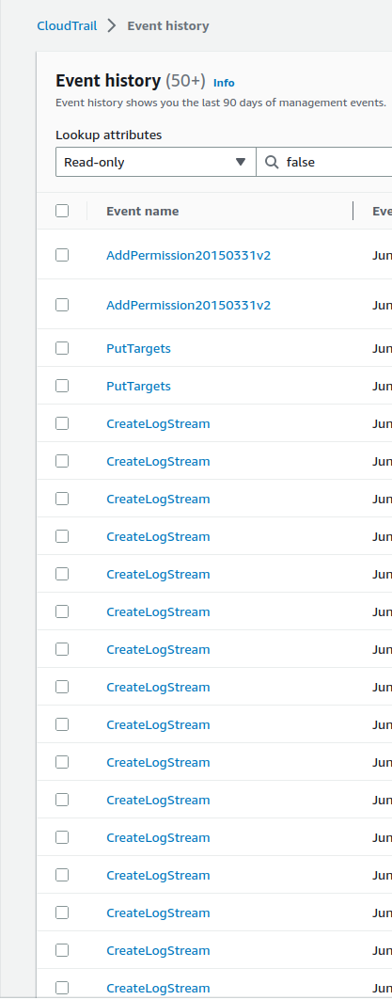
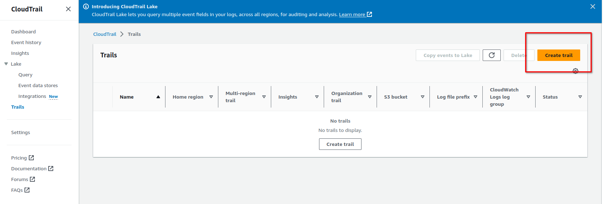
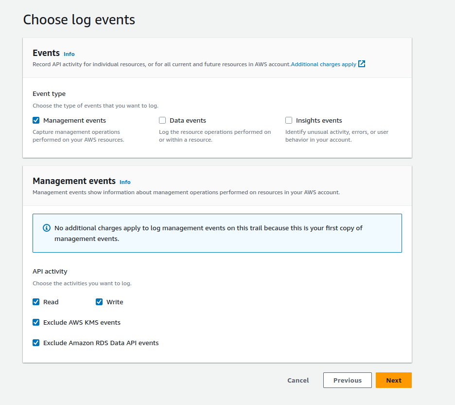
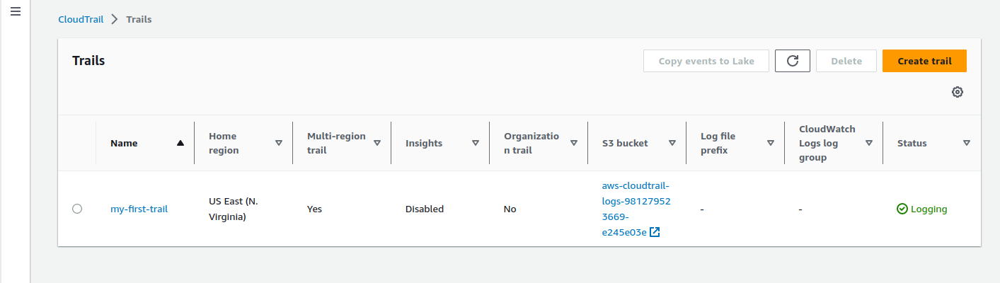
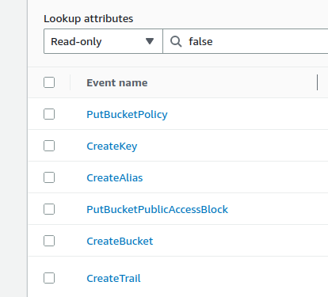
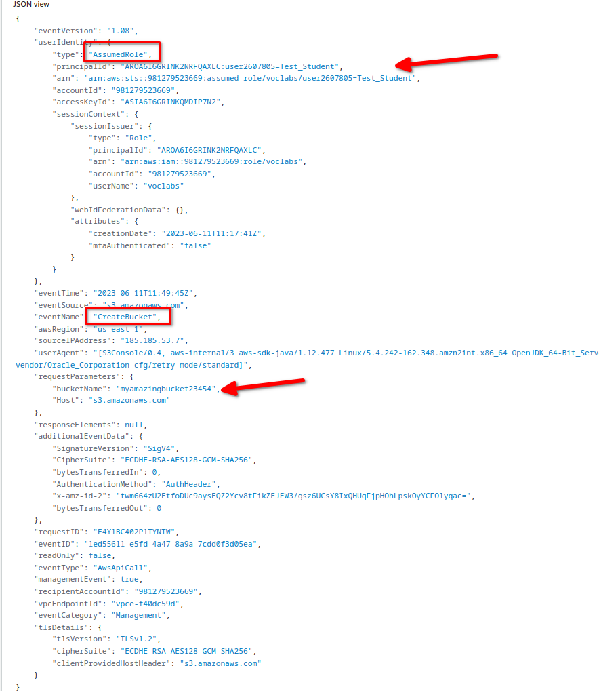
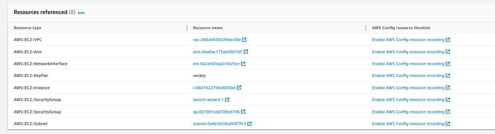

# OBJETIVO 

Vamos a aprender sobre el funcionamiento de CloudTrail y qué información podemos sacar con su ayuda. 

## Events history in CloudTrail

1. Dentro de nuestra AWS Management Console vamos a ir al servicio CloudTrail.

Desplegaremos el menú de la parte izquierda y pincharemos en **Event History**

Veremos una lista de eventos que tienen que ver con la configuración del lab. En una cuenta normal no tendríamos esa información

Recordemos que este tipo de eventos solamente se guardan 90 días. ¿Qué vamos a hacer para guardar eventos durante más tiempo? Vamos a crear un Trail.

## Creación de nuestro primer Trail

En el menú de la izquierda del Servicio CloudTrail vamos a pinchar sobre **Trails** y luego sobre **Create Trail**

Le ponemos un nombre identificativo a nuestro Trail y también:
1. Creamos un s3 nuevo para guardar los logs del trail (podemos dejar el nombre prepopulado por AWS o introducir uno propio)
2. Ciframos nuestros logs con SSE-KMS. Elegimos un KMS que ya tengamos o creamos uno nuevo. En un escenario real tendría que ser un KMS específico para cifrar nuestros logs y debería tener un alias identificativo.
3. Activamos Log file validation para que AWS nos confirme que los logs no han sido modificados ni alterados de ninguna manera.
4. No marcaremos la opción de SNS pero si quisieramos que se nos notificara cuando un archivo de logs llegase a nuestro S3 podríamos hacerlo con esta opción.
5. No vamos a activar la integración con CloudWatch ya que el rol de AWS Academy no lo permite

Al pulsar **Next** vamos a tener que configurar el tipo de eventos que vamos a querer Logear y también especificar qué tipo de eventos queremos logear para cada una de las tres opciones.

Por motivos demonstrativos vamos a crear un Trail que simplemente recoja los **Management events** que además no tendrán coste para nosotros como indica el mensaje de la configuración:

*No additional charges apply to log management events on this trail because this is your first copy of management events.* 

## Consulta de nuestro primer trail

Ahora si vamos al apartado **Trails** deberíamos ver nuestro primer Trail que está en estado activo

Si pinchamos en el nombre de nuestro trail podremos entrar en su configuración y una vez allí también nos dará la opción de parar de recopilar logs con un botón : *Stop Logging*

Si pinchamos sobre **Trail Log location** nos llevará al bucket s3 que hemos configurado antes y es el que guarda los logs de nuestro Trail.

*Nota* : si entramos en nuestro bucket ahora mismo los apartados dentro del mismo estarán creados por CloudTrail pero todavía no habrá ninguna información útil.

## Consultar actividad en Event History

Vamos a volver a Event history para ver qué ha pasado mientras estábamos creando el Trail.

Vemos que han aparecido nuevos eventos como los siguientes

Como vemos en la columna *User name* de cada evento, aparece el nombre del usuario que usamos en AWS dentro de AWS Academy y los eventos pertenecen a la creación del trail que acabamos de hacer, creación del bucket, creación del KMS para cifrar ese bucket etc.

En esta vista de Event history podemos hacer todo tipo de consultas y filtrar tanto por tipo de evento, usuario, fecha etc etc

## Creación de un S3 y una EC2

A estas alturas ya sabemos crear un bucket y una instancia simple así que vamos a proceder a hacerlo.

Les daremos un nombre identificativo y dejaremos la configuración más simple posible.

Después de unos minutos volveremos a la consola de **Event history** de CloudTrail y veremos que estas acciones ya están reflejadas en ella.

Vamos a pinchar sobre el vento **Create bucket** y vamos a estudiar el JSON del *Event Record* que veremos a continuación:

Veremos que las acciones que hemos realizado aparecen auditadas aquí de forma bastante comprensible. Podremos ver quién ha realizado la acción (nuestro usuario de AWS Academy y el rol que asume) y qué se ha hecho (la creación del bucket y el nombre del mismo).

Párate un momento a estudiar este JSON y asegúrate de que la mayoría de los campos tienen sentido para ti ya que todos los logs de CloudTrail tienen esta misma estructura.

Si hacemos el mismo proceso con el evento **RunInstances** que evidentemente referencia a la instancia que hemos lanzado hace unos minutos, veremos que el apartado de **Resources referenced** del evento es algo más completo que el de la creación del bucket. En el caso del S3 solamente se referenciaba el servicio s3 mientras que en el caso del evento **RunInstances** vemos muchas más referencias

Vemos también que de tener permisos para usar AWS Config podríamos auditar todos estos recursos que pertenecen a EC2 con ese servicio, algo que nos tiene que sonar ya de la clase de "Patching de sistemas operativos"

## Información de nuestro Trail

Si ahora, habiendo pasado unos minutos desde su creación, vamos al bucket que definimos para nuestro primer Trail, veremos que ya tiene información.

Si vamos descendiendo por los path de S3 de CloudTrail hasta llegar a la región, año y fecha de hoy veremos que ya tenemos ficheros JSON volcados con alguna información.

Si abrimos esos ficheros JSON veremos que la estrucutra es exactamente igual que la que hemos visto en los Events History.