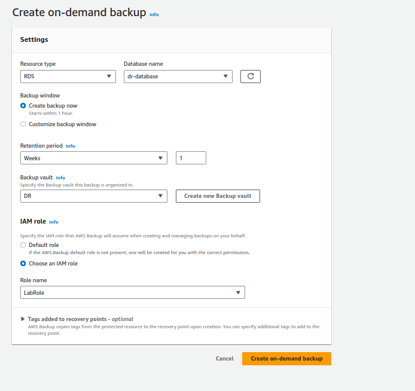

# OBJETIVO 

Vamos a aprender sobre el funcionamiento de AWS Backup y cómo podemos usarlo para un Disaster Recovery.

## Creación de Recursos necesarios 

1. Base de datos: vamos a crear una RDS con PostgreSQL simple que entre en el free tier. Vete al servicio *RDS* y allí pulsa sobre **Create database**. 

Usa el modo **Easy Create** y rellena los campos como aparecen en la imagen de abajo. Puedes ponerle el mismo nombre que consta en la imagen u otro que te resulte más identificativo. Para crear la base de datos se te va a obligar introducir una contraseña de usuario master de 8 caracteres o más. Como se trata de una BD que no vamos a usar y borraremos después, introduce una contraseña super sencilla de recordar para ti. Los demás campos los dejaremos por defecto y pulsaremos **Create database**

Nos saldrá un aviso diciendo que no podemos activar * Enhanced Monitoring* porque el usuario de Academy no tiene suficientes permisos pero podemos ignorarlo.

Nuestra BD tardará un rato en crearse y pasará de estar en estado *creating* a *running*

2. Bucket S3: también vamos a crear un bucket S3 para volcar un reporte que realizaremos más adelante. A estas alturas ya sabemos de sobra cómo crear un bucket S3 así que ¡adelante! ponle un nombre identificativo y no hagas ninguna configuración extra.

Ya podemos irnos a AWS Backup

## Creación de un backup

Una vez que estemos dentro del servicio **AWS Backup** a mano izquierda veremos un apartado llamado **Protected resources**.

Al entrar allí veremos que no tenemos nigún recurso protegido por un Backup así que vamos a realizar un Backup de nuestra RDS.

Pulsaremos sobre **Create on-demand backup** y rellenaremos los campos como muestra la imagen:

- seleccionaremos el tipo de recurso (RDS) y el nombre que le dimos a nuestra BD.
- también crearemos un nuevo Vault y le pondremos un nombre identificativo
- por último asignaremos el rol LabRol porque es el que va a darnos los permisos necesarios en AWS Academy

Una vez que hayamos lanzado la creación del backup veremos arriba un aviso de que se está haciendo el backup de la base de datos que hemos indicado:

Una vez que el backup se termine de realizar, veremos nuestra BD en el apartado **Protected Resources** del menú de la izquierda del AWS Backup y también podremos listar el Job del backup que acabamos de realizar en el apartado **Jobs**

## Creación de un reporte del backup

AWS Backup también nos da la opción de generar reportes de algunas actividades que realizamos como por ejemplo el backup que hemos hecho hace unos minutos.

En el apartado **Jobs** seleccionamos el único Job que hay que es el de nuestra BD y le damos a **Create report**

Selecionaremos el tipo de reporte que queremos (Backup) y seleccionaremos el bucket que creamos en los primeros pasos de este LAB.

Al seleccionar el bucket nos dará la opción de redirigirnos directamente a él para editar la Bucket policy y pegar la siguiente política :

{
    "Version": "2012-10-17",
    "Statement": [
        {
            "Effect": "Allow",
            "Principal": {
                "AWS": "arn:aws:iam::020644249648:role/aws-service-role/reports.backup.amazonaws.com/AWSServiceRoleForBackupReports"
            },
            "Action": "s3:PutObject",
            "Resource": "arn:aws:s3:::dr-reports-tasia/*",
            "Condition": {
                "StringEquals": {
                    "s3:x-amz-acl": "bucket-owner-full-control"
                }
            }
        }
    ]
}

Importante: cambia el nombre del bucket por uno que tengas o hayas creado para esto 

Una vez que lo validemos todo veremos que aparecerá un **Report Plan** en el apartado **Reports** dentro de **Backup Audit Manager** del menú de la izquierda.

Si seleccionamos nuestro Reporte a mano derecha debería salirnos la opción de generar un reporte on-demand:

Esto volcará la información en el bucket s3 que hemos indicado. Según las opciones que hayamos marcado al generar el reporte, cuando vayamos al S3 veremos que allí estará el reporte ya sea en JSON, CSV o ambos con toda la información relevante.

## Creación de una BD a partir de un proceso de backup

En el apartado **Jobs** pulsaremos sobre el job de backup que hemos lanzado manualmente hace unos minutos.

Esto nos llevará a una descripción de ese job que nos indicará un **Recovery point ARN** es decir, el arn del snapshot que se ha hecho de nuestra BD.

Pulsaremos sobre él y esto nos llevará al apartado **Backup Vaults** de AWS Backup y más específicamente dentro del Vault que hemos creado para nuestro job de backup.

Desde aquí, arriba a mano derecha veremos el botón de **Restore**.

Al pulsarlo nos llevará a una pantalla en la que tendremos que rellenar varios datos para lanzar nuestra nueva BD. Dejaremos todos los campos por defecto y le diremos que use una instancia *db.t3.micro* que es la misma que está usando nuestra BD activa.

Introduciremos un *DB Instance Identifier* reconocible para diferenciar esta BD de la anterior y en el apartado *Restore Role* usaremos el **LabRole** de siempre.

Ahora si nos vamos al servicio **RDS** veremos que en vez de una tenemos dos BD, la segunda de las cuales se está creando a partir del backup que se hizo de la primera.
